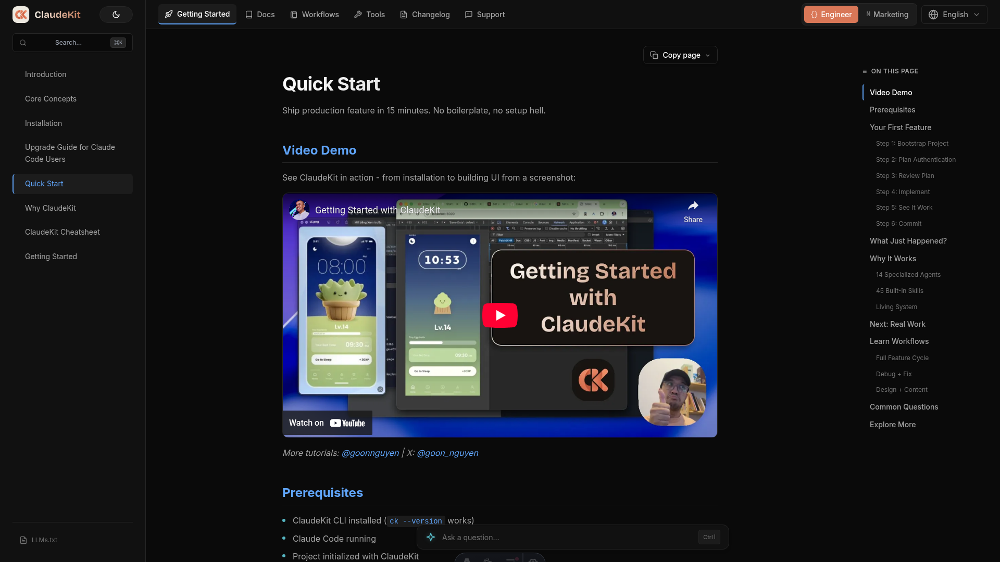
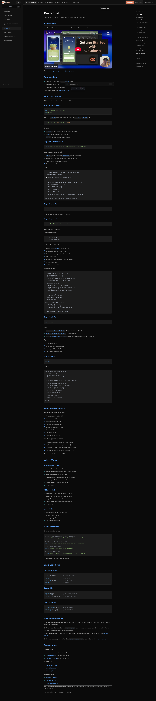

# UI Test Report: AI Assistant Two-Stage UX

**Date**: 2026-01-18 17:17
**URL**: http://localhost:4321
**Build**: 440 pages, 0 errors

---

## Critical Finding: Floating Input Bar Not Visible

### Issue
The floating AI assistant input bar is **not visible** on page load. Element exists in DOM but positioned off-screen.

### Evidence
```json
{
  "exists": true,
  "top": 1008,
  "bottom": 1056,
  "height": 48,
  "viewport": 1080
}
```

The element's `top: 1008px` places it below the viewport (1080px height). Only visible after scrolling to end of page.

### Root Cause
**CSS positioning conflict**:
- CSS: `position: sticky; bottom: var(--space-6);`
- Location: After `.content-wrapper` in `.main-wrapper`
- Problem: `sticky` with `bottom` only works when element is inside scrollable container AND there's enough content below it

### Recommended Fix
Change from `sticky` to `fixed`:
```css
.assistant-input-bar-container {
  position: fixed; /* was: sticky */
  bottom: var(--space-6);
  left: 0;
  right: 0;
}
```

Or relocate component inside `.content-area` at the end for proper sticky behavior.

---

## Components Verified

| Component | Status | Notes |
|-----------|--------|-------|
| HTML Structure | ✅ | All elements render correctly |
| CSS Loaded | ✅ | All 653 lines of assistant CSS present |
| React Hydration | ✅ | Component mounts and initializes |
| Input Bar Element | ✅ | Exists with correct classes |
| Keyboard Hint | ✅ | Cmd+I visible in markup |

---

## Screenshots

### Desktop View (1440x900)


*Floating input bar NOT visible - positioned below viewport*

### Full Page


*Input bar exists but at document bottom, not sticky at viewport bottom*

---

## Test Results

### Positioning
- [x] Element renders in DOM
- [ ] **FAIL**: Element visible at viewport bottom on page load
- [ ] **FAIL**: Sticky behavior working correctly

### Functionality (Unable to fully test due to visibility issue)
- [?] Input field accepts text
- [?] Cmd+I keyboard shortcut works
- [?] Submit triggers sidebar expansion

### Accessibility
- [x] ARIA labels present
- [x] Form elements properly labeled
- [x] Keyboard hint displayed

---

## Severity: HIGH

**Impact**: Core feature invisible to users. Two-stage UX pattern broken.

**Priority Fix**: Change `position: sticky` to `position: fixed` in `.assistant-input-bar-container`

---

## Unresolved Questions

1. Was `position: sticky` intentional for scroll-with-content behavior?
2. Should input bar be inside content area or fixed to viewport?
3. Mobile bottom sheet - does it have same positioning issue?
