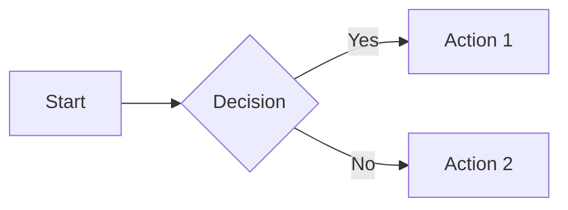
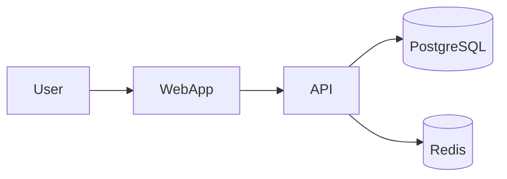
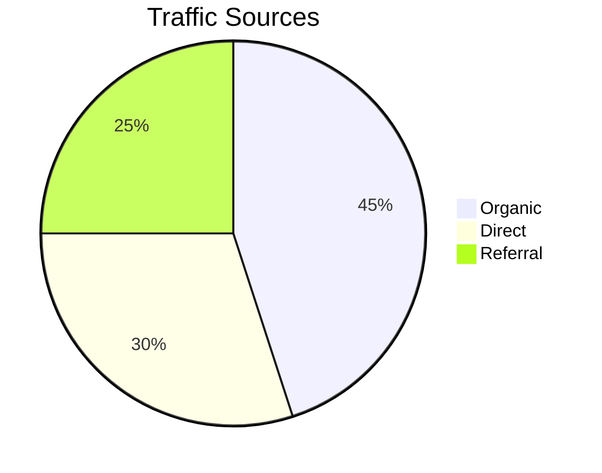
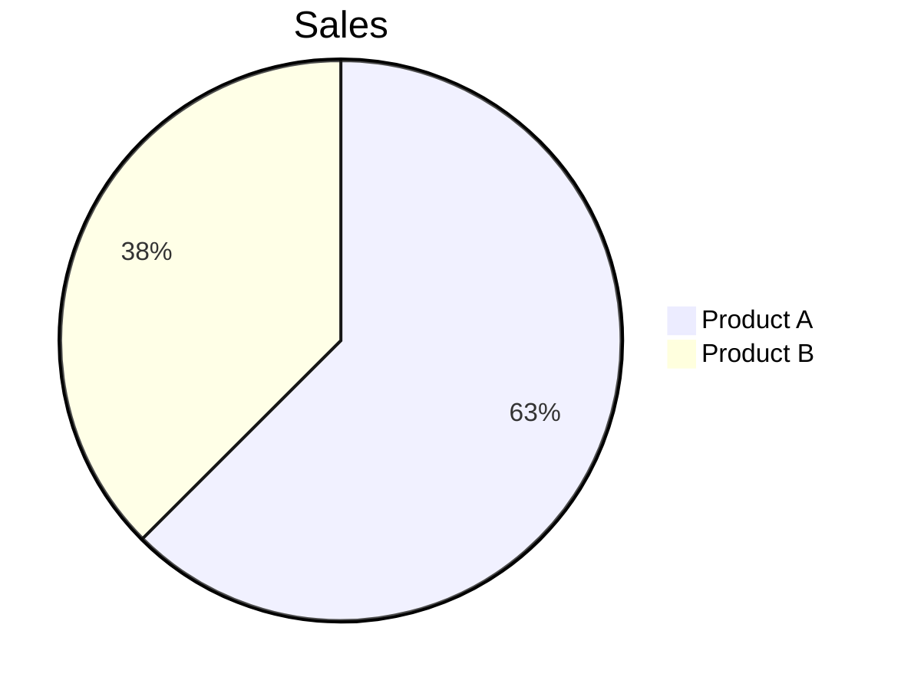
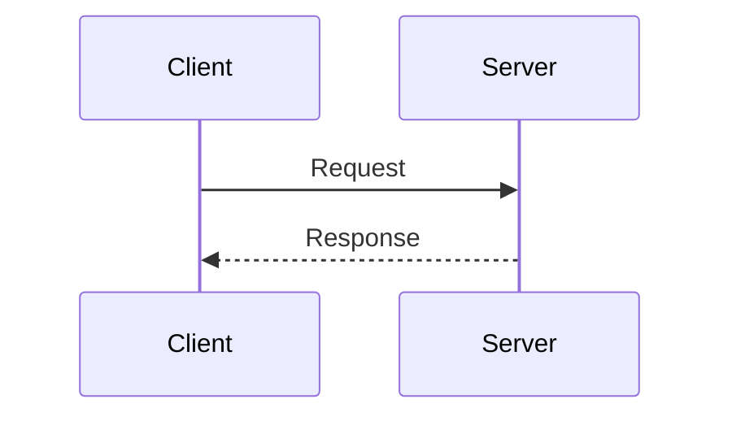

# Preview & Tạo Trực Quan

> Trình xem toàn năng cho file markdown + tạo trực quan cho giải thích, sơ đồ và slides.

Skill `/ck:preview` có hai chế độ:
1. **Chế Độ Xem** - Render file markdown với giao diện ấm áp lấy cảm hứng từ sách
2. **Chế Độ Tạo** - Tạo giải thích trực quan, sơ đồ, hoặc slides thuyết trình

## Skill Này Làm Gì

Markdown Novel Viewer là một HTTP server nền tảng render file markdown với giao diện ấm áp lấy cảm hứng từ sách, được tối ưu cho đọc văn bản dài. Nó tự động phát hiện và render sơ đồ Mermaid, cung cấp điều hướng plan cho tài liệu nhiều file, và hỗ trợ cả xem file và duyệt thư mục.

Skill này biến markdown kỹ thuật thành trải nghiệm đọc thú vị với font serif, độ dài dòng tối ưu, và syntax highlighting nhận biết theme. Hoàn hảo để xem xét plans, tài liệu, hoặc bất kỳ nội dung markdown nào xứng đáng hơn là text thô.

## Yêu Cầu Trước

**Cần Cài Đặt**:
```bash
# Tùy chọn 1: Cài đặt qua ClaudeKit CLI (khuyến nghị)
ck init  # Chạy install.sh xử lý tất cả skills

# Tùy chọn 2: Cài đặt thủ công
cd .claude/skills/markdown-novel-viewer
npm install
```

**Dependencies**: `marked`, `highlight.js`, `gray-matter`

**Không cài đặt**: Bạn sẽ gặp **Lỗi 500: Error rendering markdown**.

## Kích Hoạt

Skill này tự động kích hoạt khi:
- Người dùng muốn preview file markdown
- Người dùng đề cập đến xem plans hoặc tài liệu
- Người dùng cần duyệt cấu trúc thư mục
- Người dùng tham chiếu đến render hoặc preview markdown

Kích hoạt thủ công:
```bash
/ck:preview [file-hoặc-thư-mục]
```

## Bắt Đầu Nhanh

### Chế Độ Xem

```bash
# Xem file markdown
/ck:preview plans/my-plan/plan.md

# Duyệt thư mục
/ck:preview plans/

# Dừng server đang chạy
/ck:preview --stop
```

### Chế Độ Tạo

```bash
# Tạo giải thích trực quan (ASCII + Mermaid + văn xuôi)
/ck:preview --explain OAuth flow

# Tạo slides thuyết trình
/ck:preview --slides API architecture

# Tạo sơ đồ tập trung
/ck:preview --diagram data flow

# Tạo sơ đồ ASCII (thân thiện với terminal)
/ck:preview --ascii auth process
```

## Chế Độ Tạo (v2.10.0+)

Tạo giải thích trực quan, sơ đồ và slides về bất kỳ chủ đề nào. Đầu ra được lưu vào `{plan_dir}/visuals/` (hoặc `plans/visuals/` nếu không có plan đang hoạt động) và tự động mở trong preview server.

### --explain (Giải Thích Trực Quan)

Tạo giải thích toàn diện với sơ đồ ASCII, biểu đồ Mermaid, các khái niệm chính, và ví dụ code tùy chọn.

```bash
/ck:preview --explain OAuth 2.0 authorization code flow
```

**Cấu trúc đầu ra:**
- Phần Tổng quan
- Xem Nhanh (sơ đồ ASCII)
- Luồng Chi Tiết (Mermaid)
- Các Khái Niệm Chính
- Ví Dụ Code (nếu có)

### --slides (Định Dạng Thuyết Trình)

Tạo thuyết trình theo từng slide, một khái niệm mỗi slide. Dùng horizontal rules (`---`) làm dấu phân cách slide.

```bash
/ck:preview --slides microservices architecture
```

**Cấu trúc đầu ra:**
- Slide tiêu đề
- Slide vấn đề/ngữ cảnh
- Slides giải pháp với sơ đồ
- Tóm tắt/điểm rút ra

### --diagram (Sơ Đồ Tập Trung)

Tạo cả phiên bản ASCII và Mermaid của một sơ đồ.

```bash
/ck:preview --diagram database schema
```

**Cấu trúc đầu ra:**
- Phiên bản ASCII (có thể copy-paste vào terminal)
- Phiên bản Mermaid (được render trong trình duyệt)

### --ascii (Chỉ Thân Thiện Với Terminal)

Tạo sơ đồ ASCII thuần không có Mermaid. Lý tưởng cho đầu ra terminal hoặc môi trường không có trình duyệt.

```bash
/ck:preview --ascii CI/CD pipeline
```

**Đầu ra:** Sơ đồ hộp ASCII đơn với chú thích.

### Ví Dụ Tạo

```bash
# Giải thích các khái niệm phức tạp
/ck:preview --explain WebSocket handshake protocol
/ck:preview --explain React reconciliation algorithm
/ck:preview --explain Git rebase vs merge

# Tạo thuyết trình
/ck:preview --slides system architecture overview
/ck:preview --slides new feature proposal

# Sơ đồ nhanh
/ck:preview --diagram user authentication flow
/ck:preview --ascii file upload process
```

## Chế Độ Xem (Trình Xem File/Thư Mục)

Chức năng trình xem gốc cho file markdown và thư mục.

### Sử Dụng CLI

```bash
# Xem file markdown
node .claude/skills/markdown-novel-viewer/scripts/server.cjs \
  --file ./plans/my-plan/plan.md \
  --open

# Duyệt thư mục
node .claude/skills/markdown-novel-viewer/scripts/server.cjs \
  --dir ./plans \
  --host 0.0.0.0 \
  --open

# Chế độ nền
node .claude/skills/markdown-novel-viewer/scripts/server.cjs \
  --file ./README.md \
  --background

# Dừng tất cả server đang chạy
node $HOME/.claude/skills/markdown-novel-viewer/scripts/server.cjs --stop
```

## Tính Năng

### Giao Diện Novel

**Chế độ sáng**:
- Nền kem ấm (#faf8f3)
- Điểm nhấn nâu yên (#8b4513)
- Tối ưu cho đọc ban ngày

**Chế độ tối**:
- Nền gần đen (#1a1a1a)
- Điểm nhấn vàng ấm (#d4a574)
- Giảm mỏi mắt khi đọc đêm

**Typography**:
- Libre Baskerville serif cho tiêu đề (cổ điển, dễ đọc)
- Inter cho body text (hiện đại, sạch)
- JetBrains Mono cho code (tối ưu cho lập trình)
- Chiều rộng nội dung tối đa 720px (độ dài dòng tối ưu)

### Sơ Đồ Mermaid.js

Tự động render các khối code mermaid thành sơ đồ:

````markdown

````

**Các loại sơ đồ được hỗ trợ**:
- Flowcharts (LR, TB, TD)
- Sequence diagrams
- Pie charts
- Gantt charts
- XY charts (bar, line)
- Mindmaps
- Quadrant charts

**Xử lý lỗi**: Hiển thị thông báo lỗi với preview nguồn để debug.

### Trình Duyệt Thư Mục

Danh sách file sạch với:
- Biểu tượng emoji (📄 cho files, 📁 cho thư mục)
- File markdown liên kết đến trình xem
- Thư mục liên kết đến thư mục con
- Điều hướng thư mục cha (..)
- Hỗ trợ chế độ sáng/tối

### Điều Hướng Plan

Tự động phát hiện cấu trúc thư mục plan:
- Sidebar hiển thị tất cả phases với chỉ số trạng thái
- Các nút điều hướng Previous/Next
- Phím tắt: Mũi tên Trái/Phải
- Cuộn mượt giữa các phases

### Phím Tắt

| Phím | Hành động |
|------|-----------|
| `T` | Chuyển đổi theme (sáng/tối) |
| `S` | Chuyển đổi sidebar |
| `←` `→` | Điều hướng phases (trong chế độ xem plan) |
| `Esc` | Đóng sidebar (mobile) |

## Tùy Chọn CLI

| Tùy chọn | Mô tả | Mặc định |
|----------|-------|---------|
| `--file <path>` | File markdown để xem | - |
| `--dir <path>` | Thư mục để duyệt | - |
| `--port <number>` | Port server | 3456 |
| `--host <addr>` | Host để bind (`0.0.0.0` cho remote) | localhost |
| `--open` | Tự động mở trình duyệt | false |
| `--background` | Chạy ở nền | false |
| `--stop` | Dừng tất cả server | - |

## Kiến Trúc

```
scripts/
├── server.cjs               # Điểm vào chính
└── lib/
    ├── port-finder.cjs      # Phân bổ port động (3456-3500)
    ├── process-mgr.cjs      # Quản lý file PID
    ├── http-server.cjs      # Routing HTTP cốt lõi
    ├── markdown-renderer.cjs # Chuyển đổi MD→HTML với Mermaid
    └── plan-navigator.cjs   # Phát hiện plan & điều hướng

assets/
├── template.html            # Template trình xem markdown
├── novel-theme.css          # Theme kết hợp sáng/tối
├── reader.js                # Tương tác phía client
└── directory-browser.css    # Styles trình duyệt thư mục
```

## HTTP Routes

| Route | Mô tả |
|-------|-------|
| `/view?file=<path>` | Trình xem file markdown |
| `/browse?dir=<path>` | Trình duyệt thư mục |
| `/assets/*` | Static assets (CSS, JS, fonts) |
| `/file/*` | Phục vụ file cục bộ (cho hình ảnh) |

## Ví Dụ

### Ví Dụ 1: Preview Plan Trước Khi Nộp

```bash
# Preview plan với tất cả phases
/ck:preview plans/feature-auth/plan.md

# Mở trong trình duyệt với:
# - Giao diện đọc ấm áp
# - Tất cả sơ đồ Mermaid được render
# - Sidebar điều hướng phase
# - Chuyển đổi chế độ sáng/tối
```

### Ví Dụ 2: Duyệt Phân Cấp Tài Liệu

```bash
# Duyệt thư mục docs
/ck:preview docs/

# Hiển thị cây file:
# 📁 getting-started/
#   📄 installation.md
#   📄 quickstart.md
# 📁 guides/
#   📄 authentication.md
```

Click vào files để xem, thư mục để đi vào.

### Ví Dụ 3: Xem Xét Sơ Đồ Mermaid

````markdown
# Kiến Trúc Hệ Thống




````

Cả hai sơ đồ được render với styling phù hợp, màu sắc nhận biết theme.

## Thực Hành Tốt Nhất

**Dùng đường dẫn hình ảnh tương đối**: Hình ảnh tải đúng khi đường dẫn tương đối so với file markdown.

**Kiểm tra cú pháp Mermaid**: Xác nhận sơ đồ tại https://mermaid.live trước khi nhúng.

**Tổ chức plans theo phân cấp**: Đặt các file markdown liên quan trong cùng thư mục để tự động phát hiện điều hướng.

**Dùng chế độ nền để duy trì**: Giữ server chạy trong khi làm việc trong terminal.

**Tận dụng phím tắt**: Nhấn `T` để chuyển đổi theme nhanh, `S` cho sidebar.

**Kiểm tra tính khả dụng của port**: Server tự động tăng (3456-3500) nếu port đã dùng.

## Mẹo Sơ Đồ Mermaid

### Lỗi Thường Gặp và Cách Sửa

**Lỗi parse - Cú pháp không hợp lệ**:


**Định dạng giá trị biểu đồ tròn**:


**Participants trong sequence diagram**:


### Xác Nhận Mermaid

Dùng Mermaid Live Editor để xác nhận nhanh: https://mermaid.live

Dán code sơ đồ, xác minh render trước khi thêm vào tài liệu.

## Xử Lý Sự Cố

**Vấn đề**: Port 3456 đã được sử dụng.

**Giải pháp**: Server tự động tăng lên port tiếp theo có sẵn (3456-3500). Kiểm tra đầu ra terminal để biết port thực tế.

---

**Vấn đề**: Hình ảnh không tải trong markdown đã render.

**Giải pháp**: Đảm bảo đường dẫn hình ảnh tương đối so với vị trí file markdown. Đường dẫn tuyệt đối sẽ không hoạt động.

---

**Vấn đề**: Sơ đồ Mermaid hiển thị lỗi thay vì render.

**Giải pháp**: Trình xem hiển thị thông báo lỗi với preview nguồn. Kiểm tra cú pháp tại mermaid.live, sửa code sơ đồ, làm mới trang.

---

**Vấn đề**: Server không dừng với lệnh `--stop`.

**Giải pháp**: Kiểm tra `/tmp/md-novel-viewer-*.pid` cho các file PID cũ. Xóa thủ công các file PID hoặc kill process.

---

**Vấn đề**: Không thể truy cập từ điện thoại trên mạng.

**Giải pháp**: Dùng `--host 0.0.0.0` để bind tất cả interfaces. Dùng networkUrl từ đầu ra. Kiểm tra firewall cho phép port 3456.

---

**Vấn đề**: Theme không khớp với sở thích.

**Giải pháp**: Nhấn phím `T` để chuyển đổi theme. Sở thích được lưu vào localStorage.

## Tùy Chỉnh

### Màu Theme

Chỉnh sửa `assets/novel-theme.css`:

```css
/* Chế độ sáng */
--bg-primary: #faf8f3;      /* Kem ấm */
--accent: #8b4513;          /* Nâu yên */

/* Chế độ tối */
--bg-primary: #1a1a1a;      /* Gần đen */
--accent: #d4a574;          /* Vàng ấm */
```

### Chiều Rộng Nội Dung

```css
--content-width: 720px;  /* Độ dài dòng tối ưu để đọc */
```

### Typography

Thay thế các font families trong CSS variables để khớp với hướng dẫn thương hiệu.

## Skills Liên Quan

- [Plans Kanban](/vi/docs/engineer/skills/plans-kanban) - Xem dashboard của nhiều plans
- [AI Artist](/vi/docs/engineer/skills/ai-artist) - Tạo nội dung cho tài liệu
- [Frontend Design](/vi/docs/engineer/skills/frontend-design) - Thiết kế các trang tài liệu

## Lệnh Liên Quan

- `/ck:preview` - Truy cập nhanh vào trình xem (alias cho skill này)
- `/ck:plans-kanban` - Xem dashboard cho các thư mục plan
