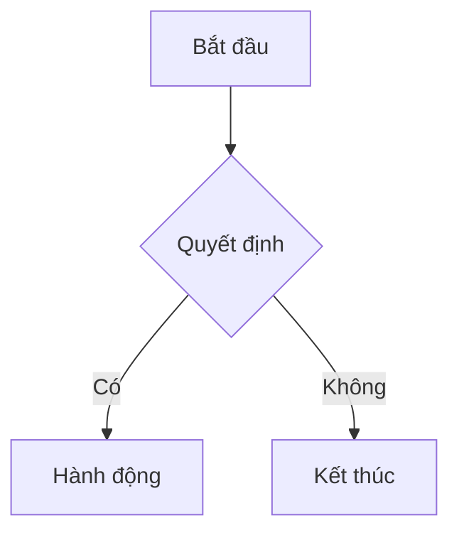

# `ck:mermaidjs-v11`

Tạo sơ đồ dựa trên văn bản sử dụng cú pháp khai báo Mermaid.js v11. Chuyển đổi code thành SVG/PNG/PDF hoặc render trong trình duyệt và markdown.

## Skill Này Làm Gì

Skill Mermaid.js cho phép bạn tạo sơ đồ chuyên nghiệp bằng cú pháp văn bản đơn giản. Từ flowcharts đến Gantt charts, sequence diagrams đến entity-relationship models — tất cả được định nghĩa trong code, kiểm soát phiên bản, và render đẹp mắt.

Hãy nghĩ về nó như diagrams-as-code. Không còn phải vật lộn với các công cụ trực quan — mô tả sơ đồ của bạn bằng văn bản và để Mermaid render nó hoàn hảo mỗi lần.

## Khả Năng Cốt Lõi

- **24+ loại sơ đồ**: Flowcharts, sequence, class, state, ER, Gantt, journey, timeline và nhiều hơn
- **Chuyển đổi CLI**: Xuất sang SVG, PNG, PDF với các theme tùy chỉnh
- **Tích hợp JavaScript**: Nhúng trong web apps với CDN hoặc npm
- **Cấu hình**: Themes (default, dark, forest, neutral, base), fonts, security levels
- **Chú thích**: Thêm tài liệu với tiền tố `%% `

## Các Loại Sơ Đồ Thông Dụng

- `flowchart` - Luồng quy trình, cây quyết định
- `sequenceDiagram` - Tương tác actor, luồng API
- `classDiagram` - Cấu trúc OOP, data models
- `stateDiagram` - State machines, workflows
- `erDiagram` - Quan hệ cơ sở dữ liệu
- `gantt` - Timeline dự án
- `journey` - Luồng trải nghiệm người dùng

## Bắt Đầu Nhanh

**Cấu Trúc Cơ Bản:**
```
{loại-sơ-đồ}
  {nội-dung-sơ-đồ}
```

**Ví Dụ Flowchart:**
````markdown

````

## Sử Dụng CLI

```bash
# Cài đặt
npm install -g @mermaid-js/mermaid-cli

# Chuyển đổi sang ảnh
mmdc -i diagram.mmd -o diagram.svg

# Với theme và nền
mmdc -i input.mmd -o output.png -t dark -b transparent
```

## Cách Dùng

Kích hoạt khi cần sơ đồ kiến trúc, trực quan hóa luồng dữ liệu, timelines, state machines, hoặc bất kỳ tài liệu trực quan nào.

## Prompt Mẫu

- "Tạo flowchart cho quy trình xác thực"
- "Tạo sequence diagram cho luồng checkout API"
- "Xây dựng ER diagram cho schema cơ sở dữ liệu"
- "Tạo Gantt chart cho roadmap Q1"
- "Tạo state diagram cho quy trình fulfillment đơn hàng"
- "Tạo class diagram cho hệ thống quản lý người dùng"

## Cấu Hình & Theme

**Tùy Chọn Thông Dụng:**
- `theme`: "default", "dark", "forest", "neutral", "base"
- `look`: "classic", "handDrawn"
- `fontFamily`: Chỉ định font tùy chỉnh
- `securityLevel`: "strict", "loose", "antiscript"

**Ví Dụ Frontmatter:**
````markdown

````

## Nhúng HTML

```html
<pre class="mermaid">
  flowchart TD
    A[Client] --> B[Server]
</pre>
<script src="https://cdn.jsdelivr.net/npm/mermaid@latest/dist/mermaid.min.js"></script>
<script>mermaid.initialize({ startOnLoad: true });</script>
```

## Điểm Khác Biệt

Sơ đồ Mermaid tồn tại trong codebase của bạn cùng với code mà chúng tài liệu. Chúng được kiểm soát phiên bản hoàn hảo, review được trong PRs, và cập nhật dễ dàng như thay đổi một dòng văn bản. Không còn sơ đồ lỗi thời trong các công cụ riêng biệt.

## Tài Nguyên Liên Quan

- Editor trực tuyến: editor.thebookofshaders.com
- Công cụ CLI: glslViewer
- Tương thích ShaderToy
