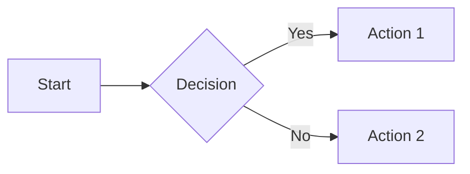
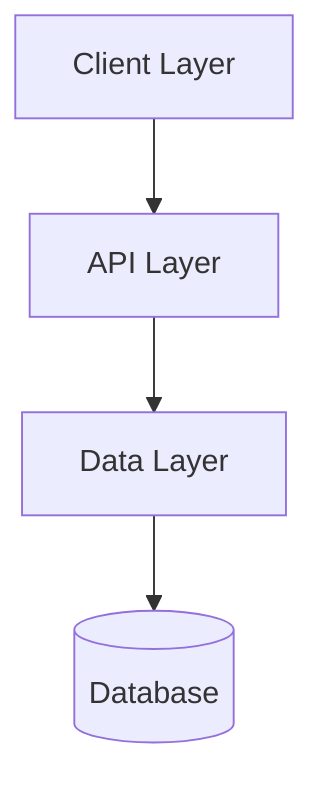
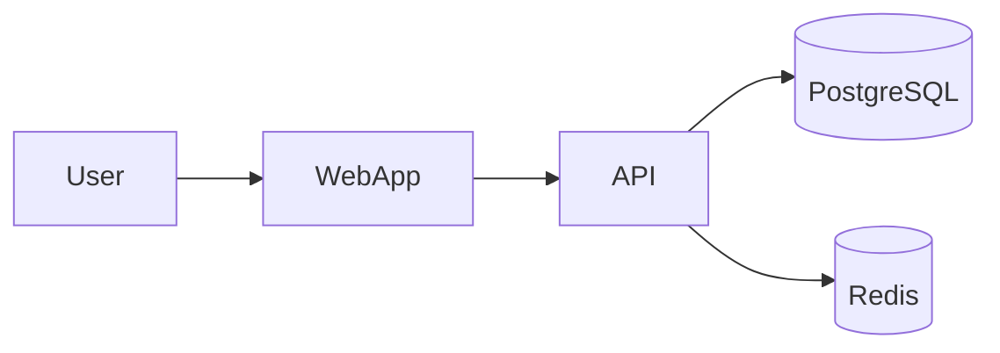
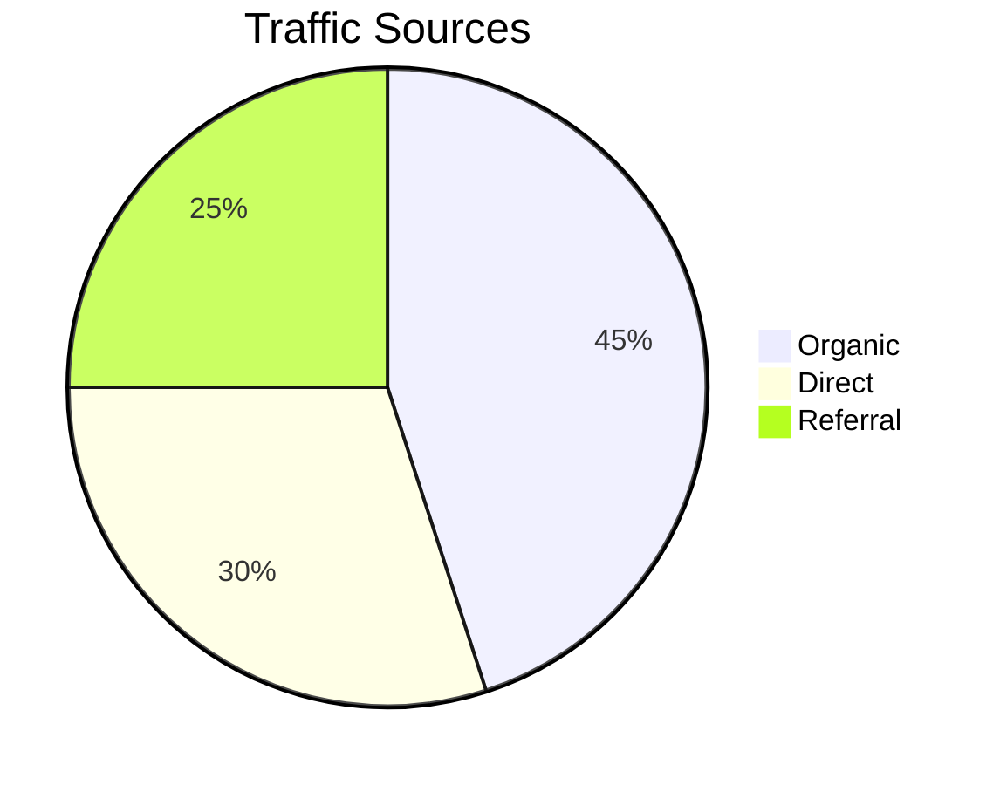
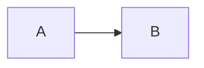
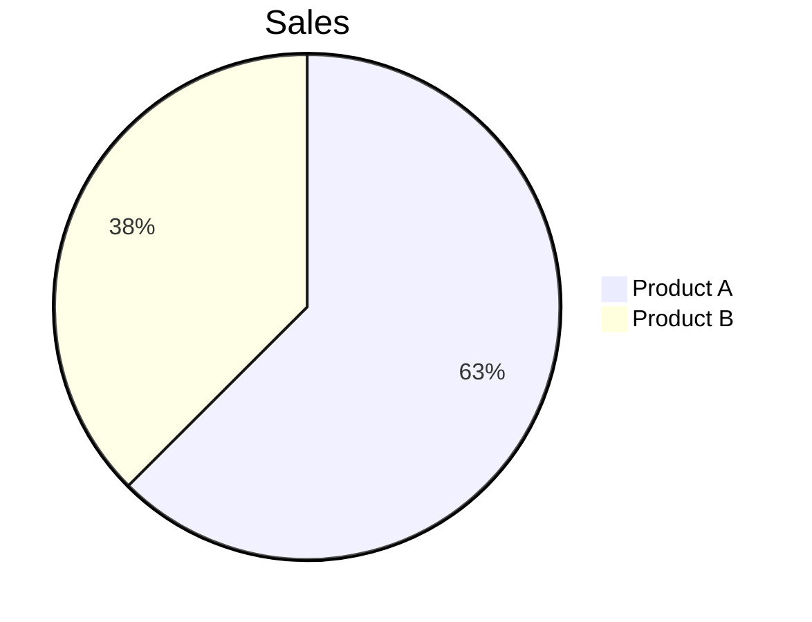
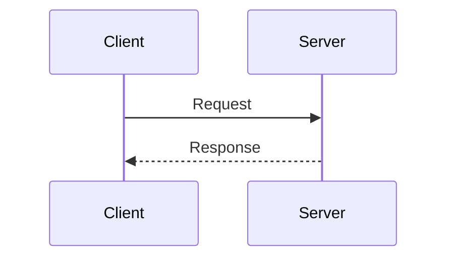

# Markdown Novel Viewer

> Universal viewer cho markdown files và directories với trải nghiệm đọc giống sách, hỗ trợ Mermaid diagram và plan navigation.

## Skill Này Làm Gì

Markdown Novel Viewer là background HTTP server render markdown files với warm, book-inspired theme được tối ưu cho đọc dài. Nó tự động phát hiện và render Mermaid diagrams, cung cấp plan navigation cho multi-file documents và hỗ trợ cả file viewing và directory browsing.

Skill này chuyển đổi technical markdown thành pleasant reading experience với serif fonts, optimal line length và theme-aware syntax highlighting. Hoàn hảo để review plans, documentation hoặc bất kỳ markdown content nào xứng đáng hơn là raw text.

## Yêu Cầu Trước

**Yêu cầu cài đặt**:
```bash
# Option 1: Cài đặt qua ClaudeKit CLI (khuyến nghị)
ck init  # Chạy install.sh xử lý tất cả skills

# Option 2: Cài đặt thủ công
cd .claude/skills/markdown-novel-viewer
npm install
```

**Dependencies**: `marked`, `highlight.js`, `gray-matter`

**Không có cài đặt**: Bạn sẽ nhận **Error 500: Error rendering markdown**.

## Kích Hoạt

Skill này tự động kích hoạt khi:
- User muốn preview markdown files
- User đề cập viewing plans hoặc documentation
- User cần browse directory structures
- User references markdown rendering hoặc preview

Kích hoạt thủ công:
```bash
/preview [file-or-directory]
```

## Bắt Đầu Nhanh

```bash
# Xem markdown file
node .claude/skills/markdown-novel-viewer/scripts/server.cjs \
  --file ./plans/my-plan/plan.md \
  --open

# Browse directory
node .claude/skills/markdown-novel-viewer/scripts/server.cjs \
  --dir ./plans \
  --host 0.0.0.0 \
  --open

# Background mode
node .claude/skills/markdown-novel-viewer/scripts/server.cjs \
  --file ./README.md \
  --background

# Stop tất cả running servers
node $HOME/.claude/skills/markdown-novel-viewer/scripts/server.cjs --stop
```

## Tính Năng

### Novel Theme

**Light mode**:
- Warm cream background (#faf8f3)
- Saddle brown accents (#8b4513)
- Tối ưu cho đọc ban ngày

**Dark mode**:
- Near black background (#1a1a1a)
- Warm gold accents (#d4a574)
- Giảm mỏi mắt khi đọc ban đêm

**Typography**:
- Libre Baskerville serif cho headings (classic, readable)
- Inter cho body text (modern, clean)
- JetBrains Mono cho code (tối ưu cho programming)
- Maximum 720px content width (optimal line length)

### Mermaid.js Diagrams

Auto-renders mermaid code blocks thành diagrams:

````markdown

````

**Các loại diagram được hỗ trợ**:
- Flowcharts (LR, TB, TD)
- Sequence diagrams
- Pie charts
- Gantt charts
- XY charts (bar, line)
- Mindmaps
- Quadrant charts

**Xử lý lỗi**: Hiển thị error message với source preview để debugging.

### Directory Browser

Clean file listing với:
- Emoji icons (📄 cho files, 📁 cho folders)
- Markdown files link tới viewer
- Folders link tới sub-directories
- Parent directory navigation (..)
- Hỗ trợ light/dark mode

### Plan Navigation

Auto-detects plan directory structure:
- Sidebar hiển thị tất cả phases với status indicators
- Previous/Next navigation buttons
- Keyboard shortcuts: Arrow Left/Right
- Smooth scrolling giữa phases

### Keyboard Shortcuts

| Phím | Hành Động |
|-----|-----------|
| `T` | Toggle theme (light/dark) |
| `S` | Toggle sidebar |
| `←` `→` | Navigate phases (trong plan view) |
| `Esc` | Close sidebar (mobile) |

## CLI Options

| Option | Mô Tả | Default |
|--------|-------|---------|
| `--file <path>` | Markdown file để xem | - |
| `--dir <path>` | Directory để browse | - |
| `--port <number>` | Server port | 3456 |
| `--host <addr>` | Host để bind (`0.0.0.0` cho remote) | localhost |
| `--open` | Auto-open browser | false |
| `--background` | Chạy ở background | false |
| `--stop` | Stop tất cả servers | - |

## Architecture

```
scripts/
├── server.cjs               # Main entry point
└── lib/
    ├── port-finder.cjs      # Dynamic port allocation (3456-3500)
    ├── process-mgr.cjs      # PID file management
    ├── http-server.cjs      # Core HTTP routing
    ├── markdown-renderer.cjs # MD→HTML conversion với Mermaid
    └── plan-navigator.cjs   # Plan detection & navigation

assets/
├── template.html            # Markdown viewer template
├── novel-theme.css          # Combined light/dark theme
├── reader.js                # Client-side interactivity
└── directory-browser.css    # Directory browser styles
```

## HTTP Routes

| Route | Mô Tả |
|-------|-------|
| `/view?file=<path>` | Markdown file viewer |
| `/browse?dir=<path>` | Directory browser |
| `/assets/*` | Static assets (CSS, JS, fonts) |
| `/file/*` | Local file serving (cho images) |

## Khả Năng

### Markdown Rendering với Mermaid

Xem technical documentation với diagrams:

````markdown
# Architecture Overview

Hệ thống gồm ba layers:



## Implementation Details
...
````

**Khi nào sử dụng**: Technical docs, architecture diagrams, process flows, data visualizations.

### Directory Browsing

Navigate documentation hierarchies:

```
docs/
├── getting-started/
│   ├── installation.md
│   └── quickstart.md
├── guides/
│   ├── authentication.md
│   └── deployment.md
└── api/
    └── reference.md
```

Browser hiển thị clickable tree structure.

**Khi nào sử dụng**: Exploring unfamiliar codebases, navigating documentation sites, browsing plan archives.

### Plan Navigation

Multi-file plan viewing với sidebar:

```
plans/feature-x/
├── plan.md
├── phase-01-research.md
├── phase-02-design.md
└── phase-03-implement.md
```

Viewer phát hiện plan structure, thêm navigation sidebar với Previous/Next buttons.

**Khi nào sử dụng**: Reviewing implementation plans, walking through multi-phase docs, presenting project timelines.

### Remote Access

Xem trên bất kỳ device nào:

```bash
node server.cjs --file ./README.md --host 0.0.0.0 --port 3456
```

Output bao gồm network URL:

```json
{
  "success": true,
  "url": "http://localhost:3456/view?file=...",
  "networkUrl": "http://192.168.2.75:3456/view?file=...",
  "port": 3456
}
```

**Khi nào sử dụng**: Đọc docs trên phone/tablet, share preview với team, demo documentation.

## Ví Dụ

### Ví Dụ 1: Preview Plan Trước Khi Submit

```bash
# Preview plan với tất cả phases
/preview plans/feature-auth/plan.md

# Mở trong browser với:
# - Warm reading theme
# - Tất cả Mermaid diagrams được rendered
# - Phase navigation sidebar
# - Light/dark mode toggle
```

### Ví Dụ 2: Browse Documentation Hierarchy

```bash
# Browse docs directory
/preview docs/

# Hiển thị file tree:
# 📁 getting-started/
#   📄 installation.md
#   📄 quickstart.md
# 📁 guides/
#   📄 authentication.md
```

Click files để xem, folders để descend.

### Ví Dụ 3: Review Mermaid Diagrams

````markdown
# System Architecture




````

Cả hai diagrams render với proper styling, theme-aware colors.

## Best Practices

**Dùng relative image paths**: Images load chính xác khi paths relative tới markdown file.

**Test Mermaid syntax**: Validate diagrams tại https://mermaid.live trước khi embedding.

**Organize plans hierarchically**: Đặt related markdown files trong cùng directory cho auto-detected navigation.

**Dùng background mode cho persistence**: Giữ server chạy trong khi working ở terminal.

**Leverage keyboard shortcuts**: Nhấn `T` để toggle theme nhanh, `S` cho sidebar.

**Kiểm tra port availability**: Server auto-increments (3456-3500) nếu port đang dùng.

## Mermaid Diagram Tips

### Common Errors và Fixes

**Parse error - Invalid syntax**:


**Pie chart value format**:


**Sequence diagram participants**:


### Validating Mermaid

Dùng Mermaid Live Editor để validate nhanh: https://mermaid.live

Paste diagram code, verify rendering trước khi add vào docs.

## Troubleshooting

**Vấn đề**: Port 3456 đã được sử dụng.

**Giải pháp**: Server auto-increments tới port available tiếp theo (3456-3500). Kiểm tra terminal output cho actual port.

---

**Vấn đề**: Images không load trong rendered markdown.

**Giải pháp**: Đảm bảo image paths relative tới markdown file location. Absolute paths sẽ không work.

---

**Vấn đề**: Mermaid diagram hiển thị error thay vì rendering.

**Giải pháp**: Viewer hiển thị error message với source preview. Kiểm tra syntax tại mermaid.live, fix diagram code, refresh page.

---

**Vấn đề**: Server không stop với `--stop` command.

**Giải pháp**: Kiểm tra `/tmp/md-novel-viewer-*.pid` cho stale PID files. Manually delete PID files hoặc kill process.

---

**Vấn đề**: Không thể access từ phone trên network.

**Giải pháp**: Dùng `--host 0.0.0.0` để bind tất cả interfaces. Dùng networkUrl từ output. Kiểm tra firewall allows port 3456.

---

**Vấn đề**: Theme không match preference.

**Giải pháp**: Nhấn `T` key để toggle theme. Preference saves vào localStorage.

## Skills Liên Quan

- [Plans Kanban](/vi/docs/engineer/skills/plans-kanban) - Dashboard view của multiple plans
- [AI Artist](/vi/docs/engineer/skills/ai-artist) - Generate content cho documentation
- [Frontend Design](/vi/docs/engineer/skills/frontend-design) - Design documentation sites

## Commands Liên Quan

- `/preview` - Quick access tới viewer (alias cho skill này)
- `/kanban` - Dashboard view cho plan directories
