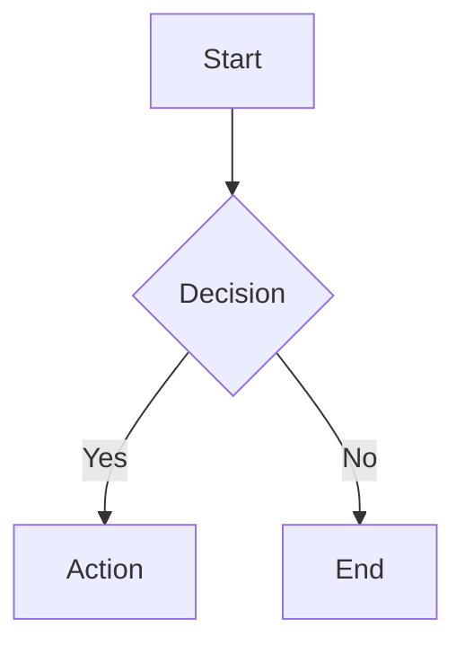
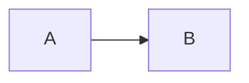

Text-based diagram creation sử dụng Mermaid.js v11 declarative syntax. Convert code thành SVG/PNG/PDF hoặc render trong browsers và markdown.

## Skill Này Làm Gì

Mermaid.js skill cho phép bạn tạo professional diagrams sử dụng simple text syntax. Từ flowcharts đến Gantt charts, sequence diagrams đến entity-relationship models—tất cả được định nghĩa trong code, version-controlled và rendered beautifully.

Hãy nghĩ về nó như diagrams-as-code. Không còn wrestling với visual tools—mô tả diagram của bạn trong text và để Mermaid render nó perfectly mỗi lần.

## Khả Năng Cốt Lõi

- **24+ diagram types**: Flowcharts, sequence, class, state, ER, Gantt, journey, timeline và nhiều hơn
- **CLI conversion**: Export sang SVG, PNG, PDF với custom themes
- **JavaScript integration**: Embed trong web apps với CDN hoặc npm
- **Configuration**: Themes (default, dark, forest, neutral, base), fonts, security levels
- **Comments**: Thêm documentation với `%% ` prefix

## Các Loại Diagram Phổ Biến

- `flowchart` - Process flows, decision trees
- `sequenceDiagram` - Actor interactions, API flows
- `classDiagram` - OOP structures, data models
- `stateDiagram` - State machines, workflows
- `erDiagram` - Database relationships
- `gantt` - Project timelines
- `journey` - User experience flows

## Bắt Đầu Nhanh

**Cấu Trúc Cơ Bản:**
```
{diagram-type}
  {diagram-content}
```

**Ví Dụ Flowchart:**
````markdown

````

## CLI Usage

```bash
# Installation
npm install -g @mermaid-js/mermaid-cli

# Convert sang image
mmdc -i diagram.mmd -o diagram.svg

# Với theme và background
mmdc -i input.mmd -o output.png -t dark -b transparent
```

## Sử Dụng

Kích hoạt khi cần architecture diagrams, data flow visualization, timelines, state machines hoặc bất kỳ visual documentation nào.

## Ví Dụ Prompts

- "Tạo flowchart hiển thị authentication process"
- "Generate sequence diagram cho API checkout flow"
- "Build ER diagram cho database schema của chúng ta"
- "Tạo Gantt chart cho Q1 roadmap"
- "Tạo state diagram cho order fulfillment workflow"
- "Generate class diagram cho user management system"

## Configuration & Theming

**Common Options:**
- `theme`: "default", "dark", "forest", "neutral", "base"
- `look`: "classic", "handDrawn"
- `fontFamily`: Custom font specification
- `securityLevel`: "strict", "loose", "antiscript"

**Frontmatter Example:**
````markdown

````

## HTML Embedding

```html
<pre class="mermaid">
  flowchart TD
    A[Client] --> B[Server]
</pre>
<script src="https://cdn.jsdelivr.net/npm/mermaid@latest/dist/mermaid.min.js"></script>
<script>mermaid.initialize({ startOnLoad: true });</script>
```

## Điểm Khác Biệt

Mermaid diagrams sống trong codebase của bạn cùng với code chúng document. Chúng version-control perfectly, review trong PRs và update dễ dàng như thay đổi một dòng text. Không còn outdated diagrams trong separate tools.

## Tài Nguyên Liên Quan

- Online Editor: editor.thebookofshaders.com
- CLI tool: glslViewer
- ShaderToy compatibility
