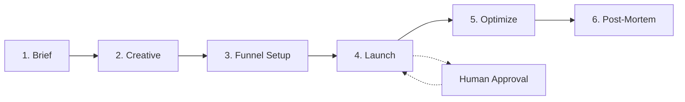

# Quy trình Chiến dịch

> **Bạn sẽ:** Ra mắt và quản lý một campaign marketing hoàn chỉnh từ brief ban đầu đến phân tích post-mortem, với AI agents xử lý phát triển sáng tạo, thiết lập phễu, tối ưu hóa và báo cáo.

## Tổng Quan

Campaign Workflow hướng dẫn bạn qua toàn bộ chu kỳ của một campaign marketing. Cho dù bạn đang ra mắt sản phẩm, chạy khuyến mãi hay xây dựng nhận thức thương hiệu, workflow này đảm bảo không có gì bị bỏ sót.

Bạn sẽ làm việc với các agents chuyên biệt ở mỗi giai đoạn - campaign managers tạo brief, content creators phát triển tài liệu, funnel architects xây dựng đường dẫn chuyển đổi, và analytics analysts đo lường kết quả. Mỗi giai đoạn bao gồm các điểm kiểm tra để xác minh thành công trước khi tiến lên.

Workflow này hoàn hảo cho việc ra mắt sản phẩm, các campaign khuyến mãi, chương trình tạo lead và các sáng kiến nhận thức thương hiệu. Thường chạy 4-8 tuần tùy thuộc vào độ phức tạp của campaign.

## Thông tin bổ sung

- **Ước Tính Thời Gian:** 4-8 tuần (thay đổi theo loại campaign)
- **Độ Khó:** Trung bình
- **Điều Kiện Tiên Quyết:**
  - ClaudeKit Marketing Kit đã cài đặt
  - Mục tiêu campaign đã xác định
  - Ngân sách đã phân bổ
  - Đối tượng mục tiêu đã xác định

## Quy trình công việc



## Hướng Dẫn Từng Bước

### Bước 1: Tạo Campaign Brief

Campaign brief là ngôi sao định hướng của bạn. Nó xác định mục tiêu, đối tượng, ngân sách, KPIs và timeline. Làm đúng điều này ngăn ngừa các pivot tốn kém giữa campaign.

```bash
# Yêu cầu campaign-manager agent tạo brief
"Create campaign brief for Black Friday 2025.
Objective: Generate $500K revenue
Budget: $50K
Timeline: Nov 1-30, 2025
Include: audience, channels, KPIs, success criteria"
```

**Điều gì xảy ra:** Campaign-manager agent phân tích mục tiêu của bạn, nghiên cứu đối tượng, đề xuất các kênh, đặt KPIs thực tế và tạo tài liệu brief toàn diện trong `plans/campaigns/`.

**Điểm Kiểm Tra:** Xem xét brief cho:
- Mục tiêu rõ ràng, có thể đo lường
- Đối tượng mục tiêu được xác định rõ
- Phân bổ ngân sách thực tế
- KPIs có thể đạt được
- Timeline chi tiết với các cột mốc

**Thời Gian:** 2-4 giờ

---

### Bước 2: Phát Triển Tài Liệu Sáng Tạo

Với brief đã được phê duyệt, content creators và copywriters phát triển tất cả tài liệu campaign - ad copy, hình ảnh, landing page và email templates.

```bash
# Tạo tài liệu sáng tạo
"Create creative assets for campaign black-friday-2025.
Channels: Facebook Ads, Google Ads, Email, Landing Page
Messaging: Limited-time 40% off, urgency-driven
Include: headlines, descriptions, CTAs, visual direction"
```

**Điều gì xảy ra:** Content creators tạo nhiều biến thể của ad copy, thiết kế các khái niệm hình ảnh, viết nội dung landing page và tạo email templates. Tất cả tài liệu tuân theo hướng dẫn thương hiệu và khung thông điệp của bạn.

**Điểm Kiểm Tra:** Xác minh:
- Tài liệu tồn tại cho tất cả các kênh
- Thông điệp nhất quán trên các kênh
- CTAs rõ ràng và hấp dẫn
- Hướng hình ảnh phù hợp với thương hiệu
- Nhiều biến thể cho A/B testing

**Thời Gian:** 3-5 ngày

---

### Bước 3: Thiết Lập Phễu Chuyển Đổi

Funnel architect thiết kế đường dẫn chuyển đổi của bạn, triển khai tracking và tạo các biến thể test. Điều này đảm bảo bạn có thể đo lường hiệu suất chính xác.

```bash
# Thiết kế phễu chuyển đổi
"Design conversion funnel for black-friday-2025.
Entry points: Facebook Ads, Google Ads, Email
Goal: Purchase completion
Include: funnel stages, tracking setup, test variants"
```

**Điều gì xảy ra:** Agent ánh xạ toàn bộ hành trình khách hàng từ lần nhấp đầu tiên đến chuyển đổi, thiết lập các tham số UTM để tracking, cấu hình attribution, tạo các biến thể A/B test và ghi chép cấu hình phễu.

**Điểm Kiểm Tra:** Xác nhận:
- Các giai đoạn phễu được xác định rõ ràng
- Tracking pixels đã cài đặt
- Tham số UTM được ghi chép
- Các biến thể A/B test đã tạo
- Mô hình attribution đã cấu hình

**Thời Gian:** 1-2 ngày

---

### Bước 4: Ra Mắt Campaign

Ra mắt là khoảnh khắc quyết định. Campaign manager chạy qua checklist cuối cùng, xuất bản nội dung, kích hoạt ad campaigns và bật tracking.

```bash
# Ra mắt campaign (yêu cầu phê duyệt)
"Launch campaign black-friday-2025.
Verify: tracking, creatives, targeting, budget.
Channels: Facebook, Google, Email, Website
Start date: November 1, 2025"
```

**Điều gì xảy ra:** Hệ thống chạy checklist toàn diện trước khi ra mắt, xác minh tracking, creatives, targeting và ngân sách. Sau khi được con người phê duyệt, nó xuất bản nội dung trên tất cả các kênh, kích hoạt ad campaigns, bắt đầu email sequences và bật tracking.

**Điểm Kiểm Tra:** Yêu cầu phê duyệt của con người. Xác minh:
- Tất cả tracking đang hoạt động
- Creatives đã được phê duyệt và tải lên
- Tham số targeting chính xác
- Giới hạn ngân sách đã đặt
- Ngày/giờ ra mắt chính xác

**Thời Gian:** 2-4 giờ

---

### Bước 5: Tối Ưu Hiệu Suất

Sau khi live, campaign debugger và analytics analyst giám sát hiệu suất hàng ngày, phân tích kết quả A/B test, điều chỉnh targeting và tối ưu hóa phân bổ ngân sách.

```bash
# Kiểm tra tối ưu hóa hàng ngày
"Optimize campaign black-friday-2025.
Current metrics: 50K impressions, 2% CTR, $25 CPA
Issues: Low conversion rate on mobile
Recommend: targeting, budget, creative changes"
```

**Điều gì xảy ra:** Agents phân tích dữ liệu hiệu suất, xác định các yếu tố hiệu suất thấp, đề xuất các thay đổi cụ thể, điều chỉnh targeting và ngân sách, và tạm dừng các biến thể không hiệu quả. Bạn nhận được báo cáo tối ưu hóa hàng ngày với các đề xuất có thể thực hiện.

**Điểm Kiểm Tra:** Xem xét hàng ngày:
- Hiệu suất so với KPIs
- Người chiến thắng A/B test
- Tốc độ chi tiêu ngân sách
- Xu hướng tỷ lệ chuyển đổi
- Các đề xuất đã triển khai

**Thời Gian:** 30 phút hàng ngày trong suốt campaign

---

### Bước 6: Tạo Báo Cáo Post-Mortem

Sau khi campaign kết thúc, analytics analyst tạo báo cáo post-mortem toàn diện với phân tích hiệu suất, tính toán ROI, các bài học chính và đề xuất.

```bash
# Tạo báo cáo cuối cùng
"Generate post-mortem for campaign black-friday-2025.
Include: performance vs KPIs, ROI, key learnings.
Recommend: improvements for next campaign"
```

**Điều gì xảy ra:** Agent biên soạn tất cả dữ liệu campaign, tính toán ROI cuối cùng, xác định những gì hoạt động và không hoạt động, trích xuất các bài học có thể thực hiện và đề xuất cải tiến cho các campaign tương lai. Báo cáo được lưu trong `plans/reports/`.

**Điểm Kiểm Tra:** Post-mortem nên bao gồm:
- Hiệu suất cuối cùng so với KPIs
- Phân tích ROI và lợi nhuận
- Phân tích hiệu suất theo kênh
- Creatives hiệu suất cao nhất
- Các bài học chính được ghi chép
- Đề xuất cho lần sau

**Thời Gian:** 4-6 giờ

---

## Ví Dụ Thực Tế

### Điểm Khởi Đầu
Bạn đang ra mắt một sản phẩm SaaS với ngân sách hạn chế và cần tạo 500 leads đủ tiêu chuẩn trong 6 tuần.

### Thực Thi

```bash
# Tuần 1: Brief
"Create campaign brief for CloudNote Launch.
Objective: 500 qualified leads
Budget: $15K
Timeline: 6 weeks
Target: B2B project managers, remote teams"

# Tuần 1-2: Creative
"Create creative assets for cloudnote-launch.
Channels: LinkedIn Ads, Content Marketing, Email
Messaging: Collaborative note-taking for remote teams
Include: ad variations, blog post, landing page, email sequence"

# Tuần 2: Funnel
"Design conversion funnel for cloudnote-launch.
Entry points: LinkedIn, Blog, Email
Goal: Demo request
Include: free trial option, demo booking, nurture path"

# Tuần 3: Launch
"Launch campaign cloudnote-launch.
Verify: LinkedIn pixel, GA4 tracking, demo booking form
Start date: March 1, 2025"

# Tuần 3-8: Tối ưu hóa hàng ngày
"Optimize campaign cloudnote-launch.
Current: 2,500 clicks, 8% demo request rate, $18 CPL
Adjust: Increase blog content budget, pause low-performing ad variants"

# Tuần 9: Post-mortem
"Generate post-mortem for cloudnote-launch.
Final: 620 leads (124% of goal), $14.2K spent, $22.90 CPL"
```

### Kết Quả
Campaign vượt mục tiêu 500 leads 24%, dưới ngân sách và tạo ra những insights có thể thực hiện cho campaign tiếp theo. Post-mortem xác định rằng blog content thúc đẩy 45% leads với chi phí mỗi lead bằng một nửa so với paid ads, thông báo phân bổ ngân sách tương lai.

---

## Các Biến Thể Phổ Biến

### Campaign Khuyến Mãi Nhanh (1-2 tuần)

Cho các khuyến mãi nhạy cảm với thời gian, rút gọn workflow:
- Kết hợp Brief và Creative thành một session
- Sử dụng landing pages có sẵn
- Bỏ qua A/B testing mở rộng
- Tập trung vào một kênh hiệu suất cao

```bash
"Create 48-hour flash sale campaign for summer-sale-2025.
Channels: Email + Social only
Assets: Email template, social posts
Launch: This Friday"
```

### Tạo Lead Liên Tục

Cho các campaign evergreen, điều chỉnh workflow:
- Tạo brief ban đầu một lần
- Phát triển thư viện nội dung theo thời gian
- Tối ưu hóa liên tục (không có ngày kết thúc)
- Mini post-mortems hàng tháng thay vì một báo cáo cuối cùng

```bash
"Setup evergreen lead gen campaign for webinar-series.
Ongoing optimization: weekly
Report cadence: monthly"
```

### Campaign Thương Hiệu Đa Kênh

Cho các campaign nhận thức phức tạp:
- Phát triển sáng tạo mở rộng (2-3 tuần)
- Phễu riêng biệt cho mỗi kênh
- Ra mắt phối hợp trên các kênh
- Tracking và attribution thống nhất

```bash
"Create brand awareness campaign for rebrand-2025.
Channels: TV, Digital, OOH, Social, PR
Coordinate: Launch events, press releases, influencer partnerships"
```

---

## Khắc Phục Sự Cố

### Vấn Đề: Campaign brief liên tục được sửa đổi

**Nguyên Nhân:** Mục tiêu không rõ ràng hoặc kỳ vọng của bên liên quan không phù hợp

**Giải Pháp:** Trước khi tạo brief, ghi chép:
- Mục tiêu cụ thể, có thể đo lường
- Bên liên quan phê duyệt mục tiêu
- Ràng buộc ngân sách
- Tiêu chí thành công

Tổ chức cuộc họp phê duyệt brief với tất cả bên liên quan có mặt.

---

### Vấn Đề: Hiệu suất thấp trong tuần đầu tiên

**Nguyên Nhân:** Giai đoạn học bình thường cho các nền tảng quảng cáo, hoặc vấn đề targeting/creative

**Giải Pháp:** Đừng hoảng sợ hoặc thực hiện thay đổi mạnh mẽ ngay lập tức. Các nền tảng quảng cáo cần 3-5 ngày để tối ưu. Giám sát các metrics sau:
- Quảng cáo có được phê duyệt và phục vụ không?
- Tracking có hoạt động chính xác không?
- Bạn có tiếp cận đúng đối tượng không?

Thực hiện các điều chỉnh nhỏ, không phải đại tu hoàn toàn.

---

### Vấn Đề: Không thể đáp ứng KPIs trong ngân sách

**Nguyên Nhân:** Mục tiêu không thực tế, kênh sai hoặc targeting kém

**Giải Pháp:** Chạy phân tích giữa campaign:
- Tính toán CPA cần thiết để đáp ứng mục tiêu
- So sánh với CPA thực tế
- Nếu khoảng cách >30%, đề xuất: kéo dài timeline, tăng ngân sách hoặc điều chỉnh mục tiêu
- Chuyển ngân sách sang các kênh hiệu suất tốt nhất

Hãy trung thực về những gì có thể đạt được với ngân sách còn lại.

---

## Phương Pháp Tốt Nhất

**Xác Định Thành Công Trước**
Đặt KPIs rõ ràng, có thể đo lường trong brief. "Tăng nhận thức" là mơ hồ. "Tạo 10,000 impressions và 500 clicks với <$5 CPC" là có thể đo lường.

**Ra Mắt Nhỏ, Mở Rộng Nhanh**
Bắt đầu với 20-30% ngân sách trong tuần một. Test, học, tối ưu. Sau đó mở rộng người chiến thắng với ngân sách còn lại. Điều này ngăn ngừa việc đốt cháy ngân sách cho các campaign hiệu suất thấp.

**Tin Tưởng Dữ Liệu, Không Phải Trực Giác**
Quảng cáo yêu thích của bạn có thể hoạt động tệ nhất. Để kết quả A/B test hướng dẫn quyết định, không phải sở thích cá nhân. Loại bỏ những gì bạn yêu thích nếu chúng không chuyển đổi.

---

## Workflows Liên Quan

- [Content Workflow](/docs/marketing/workflows/content-workflow) - Tạo tài liệu campaign với các cổng chất lượng
- [Sales Workflow](/docs/marketing/workflows/sales-workflow) - Chuyển đổi campaign leads thành khách hàng
- [Analytics Workflow](/docs/marketing/workflows/analytics-workflow) - Đo lường hiệu suất campaign
- [Marketing Workflow](/docs/marketing/workflows/marketing-workflow) - Điều phối marketing cấp cao hơn

---

## Agents Được Sử Dụng

- [campaign-manager](/vi/docs/marketing/agents/campaign-manager) - Tạo brief và quản lý ra mắt
- [content-creator](/vi/docs/marketing/agents/content-creator) - Phát triển tài liệu sáng tạo
- [copywriter](/vi/docs/marketing/agents/copywriter) - Ad copy và thông điệp
- [funnel-architect](/docs/marketing/agents/funnel-architect) - Thiết kế đường dẫn chuyển đổi
- [campaign-debugger](/vi/docs/marketing/agents/campaign-debugger) - Tối ưu hóa hiệu suất
- [analytics-analyst](/vi/docs/marketing/agents/analytics-analyst) - Báo cáo và phân tích

---

## Commands Được Sử Dụng

- `/campaign create` - Khởi tạo campaign mới
- `/campaign status` - Kiểm tra tiến độ campaign
- `/campaign analyze` - Nhận đề xuất tối ưu hóa
- `/content create` - Tạo tài liệu sáng tạo
- `/funnel design` - Xây dựng đường dẫn chuyển đổi
