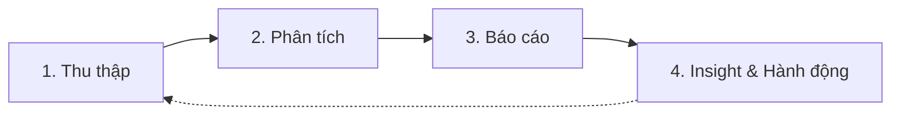

# Analytics Workflow

> **Bạn sẽ:** Chuyển đổi dữ liệu marketing thành insight có thể hành động thông qua quy trình thu thập, phân tích, báo cáo và đề xuất hệ thống, thúc đẩy cải tiến liên tục.

## Tổng quan

Analytics Workflow biến dữ liệu marketing của bạn thành các quyết định kinh doanh. Quy trình bao gồm thu thập dữ liệu từ nhiều nguồn, phân tích xu hướng, tạo báo cáo và rút ra insight để định hướng chiến lược.

Các analytics analyst thu thập dữ liệu từ Google Analytics 4, Search Console, các nền tảng mạng xã hội, công cụ email và nền tảng quảng cáo. Họ xác định xu hướng, xây dựng mô hình phân bổ, phân tích phễu và tạo báo cáo phù hợp với từng đối tượng (ban lãnh đạo, team marketing, team sales).

Quy trình này thiết yếu cho marketing dựa trên dữ liệu, tối ưu hiệu suất, phân bổ ngân sách và chứng minh ROI marketing.

## Thông tin

- **Thời gian ước tính:** Hàng tuần (2-3 giờ), Hàng tháng (4-8 giờ)
- **Độ khó:** Trung bình
- **Điều kiện tiên quyết:**
  - Đã cài ClaudeKit Marketing Kit
  - Google Analytics 4 đã cấu hình
  - Google Search Console đã kết nối
  - Các nền tảng marketing đã tích hợp
  - Đã triển khai UTM tracking

## Quy trình



## Hướng dẫn từng bước

### Bước 1: Thu thập dữ liệu

Thu thập dữ liệu hiệu suất từ tất cả các nền tảng marketing - analytics, tìm kiếm, mạng xã hội, email và quảng cáo.

```bash
"Collect analytics data for March 2025.
Sources: GA4, Google Search Console, LinkedIn, Twitter, Mailchimp, Google Ads
Metrics: traffic, conversions, engagement, ad spend, email performance
Export to: plans/reports/data/2025-03-raw-data.json"
```

**Điều gì xảy ra:** Analytics analyst kết nối với từng nền tảng qua API hoặc export, trích xuất các chỉ số liên quan (traffic, conversions, engagement, chi tiêu), chuẩn hóa định dạng dữ liệu, kết hợp vào bộ dữ liệu thống nhất và xuất để phân tích.

**Checkpoint:** Thu thập dữ liệu hoàn tất với:
- Tất cả nền tảng đều có dữ liệu
- Phạm vi ngày nhất quán giữa các nguồn
- Các chỉ số chính có đủ (traffic, conversions, engagement, spend)
- Đã kiểm tra chất lượng dữ liệu (không có lỗi hoặc thiếu rõ ràng)
- Xuất ở định dạng có thể phân tích

**Thời gian:** 1-2 giờ (hàng tháng), 30 phút (hàng tuần)

---

### Bước 2: Phân tích hiệu suất

Xác định xu hướng, phân tích phân bổ, kiểm tra phễu, so sánh phân khúc và phát hiện bất thường.

```bash
"Analyze marketing data for March 2025.
Focus areas:
- Traffic trends by source (organic, paid, social, email, direct)
- Conversion funnel performance (landing → signup → trial → paid)
- Top/bottom performing content (by traffic and conversions)
- Attribution by channel (first touch, last touch, linear)
Identify: Trends, anomalies, opportunities"
```

**Điều gì xảy ra:** Analyst tính tốc độ tăng trưởng so với kỳ trước, xây dựng mô hình phân bổ thể hiện đóng góp của từng kênh, phân tích điểm rơi trong phễu chuyển đổi, phân tích hiệu suất theo nguồn/chiến dịch/nội dung, xác định bất thường thống kê và nêu bật cơ hội.

**Checkpoint:** Phân tích bao gồm:
- Xu hướng traffic với % thay đổi so với kỳ trước
- Phễu chuyển đổi với tỷ lệ từng giai đoạn
- Phân tích phân bổ theo kênh
- Top 10 trang/chiến dịch hiệu suất cao nhất
- Bottom 10 hiệu suất kém nhất
- 3-5 insight hoặc bất thường chính

**Thời gian:** 2-3 giờ

---

### Bước 3: Tạo báo cáo

Xây dựng dashboard và báo cáo phù hợp với từng đối tượng - ban lãnh đạo, team marketing, team sales.

```bash
"Generate monthly marketing report for March 2025.
Audience: Executive team
Include:
- Key metrics overview (traffic, leads, revenue, ROI)
- Trends and month-over-month comparisons
- Top 3 wins and top 3 concerns
- Channel performance breakdown
- Visual charts (describe for implementation)
Save to: plans/reports/2025-03-executive-report.md"
```

**Điều gì xảy ra:** Analyst tổng hợp các chỉ số chính vào tóm tắt cho lãnh đạo, tạo bảng so sánh (thực tế vs mục tiêu, hiện tại vs kỳ trước), nêu bật thành tích và lo ngại kèm ngữ cảnh, phân tích hiệu suất theo kênh, mô tả các biểu đồ cần thiết (đường xu hướng, tròn phân bổ) và định dạng theo đối tượng.

**Checkpoint:** Báo cáo nên bao gồm:
- Tóm tắt lãnh đạo (3-5 câu)
- Bảng chỉ số chính với mục tiêu và thực tế
- Biểu đồ xu hướng (traffic, conversions, revenue)
- Phân tích hiệu suất theo kênh
- Top 3 thành tích và top 3 lo ngại kèm ngữ cảnh
- Đề xuất bước tiếp theo

**Thời gian:** 2-4 giờ

---

### Bước 4: Rút ra Insight và Hành động

Xác định insight có thể hành động, ưu tiên các đề xuất, xác định bước tiếp theo và đặt mục tiêu tối ưu.

```bash
"Generate insights from plans/reports/2025-03-executive-report.md.
Provide:
- Top 3 data-backed insights (with supporting metrics)
- Recommended actions (prioritized by impact)
- Expected impact of each action
- Resources needed for implementation
Format as actionable tasks with owners and timelines"
```

**Điều gì xảy ra:** Analyst rút ra các mô hình từ dữ liệu, xác định điều gì đang hoạt động và tại sao, đề xuất hành động cụ thể dựa trên insight, ước tính tác động của các đề xuất, ưu tiên theo nỗ lực vs tác động và tạo kế hoạch triển khai với người phụ trách.

**Checkpoint:** Tài liệu insight bao gồm:
- 3-5 insight cụ thể, có cơ sở dữ liệu
- 5-10 hành động đề xuất được ưu tiên
- Tác động dự kiến của mỗi hành động (tăng traffic, cải thiện conversion)
- Yêu cầu nguồn lực (thời gian, ngân sách, công cụ)
- Người phụ trách và thời hạn rõ ràng

**Thời gian:** 1-2 giờ

---

## Ví dụ thực tế

### Điểm xuất phát
Công ty SaaS chi $30K/tháng cho nhiều kênh cần tối ưu phân bổ ngân sách và cải thiện ROI.

### Thực thi

```bash
# Week 1: Collect Q1 data
"Collect analytics for Q1 2025 (Jan-Mar).
Sources: GA4, Google Ads, LinkedIn Ads, Mailchimp, Intercom
Metrics: 45K sessions, 2,200 trials, 180 paid conversions, $90K ad spend"

# Week 1: Analyze trends
"Analysis reveals:
- Organic traffic: +35% QoQ, 28% of trials, $15 CAC
- Google Ads: -5% QoQ, 18% of trials, $85 CAC
- LinkedIn Ads: +62% QoQ, 32% of trials, $42 CAC
- Email: +12% QoQ, 22% of trials, $8 CAC
Anomaly: Google Ads performance dropped significantly in March"

# Week 2: Attribution analysis
"Multi-touch attribution shows:
- First touch: Organic (45%), LinkedIn (25%), Google Ads (20%)
- Last touch: Email (35%), Organic (30%), LinkedIn (20%)
- Linear: Email (28%), Organic (27%), LinkedIn (23%), Google Ads (15%)
Insight: Email nurture heavily influences conversions even when not first touch"

# Week 2: Report to exec team
"Q1 Marketing Report:
Total trials: 2,200 (110% of goal)
Paid conversions: 180 (90% of goal)
Overall CAC: $50 (target $45)
ROI: 3.2x ($90K spend → $288K ARR)

Wins: Organic growth, LinkedIn performance, email nurture effectiveness
Concerns: Google Ads efficiency dropping, overall CAC above target, trial-to-paid rate lower than expected"

# Week 2: Action plan
"Recommended actions:
1. HIGH: Shift $8K/month from Google Ads to LinkedIn (expected +25 conversions/mo)
2. HIGH: Increase organic content budget by $3K/month (best CAC, scaling)
3. MEDIUM: Improve trial-to-paid conversion (currently 8.2%, target 10%)
4. MEDIUM: A/B test email nurture sequences (already strong, optimize further)
5. LOW: Audit Google Ads campaigns to identify drop-off cause"
```

### Kết quả
Triển khai 3 đề xuất hàng đầu. Kết quả Q2: CAC giảm xuống $43 (4% dưới mục tiêu), conversions tăng lên 215/tháng (+19%), ROI cải thiện lên 3.8x. Chuyển ngân sách từ Google Ads sang LinkedIn và organic mang lại thêm $12K ARR trong khi giảm chi tiêu $5K.

---

## Các biến thể phổ biến

### Dashboard hiệu suất hàng tuần
Kiểm tra nhanh nhịp độ:
- Chỉ 5-10 chỉ số chính
- So sánh tuần qua tuần
- Tạo tự động
- Tập trung vào các bất thường cần hành động ngay

### Phân tích chiến dịch cụ thể
Đào sâu vào một chiến dịch:
- Phân tích phễu đầy đủ
- So sánh hiệu suất creative
- Phân tích phân khúc đối tượng
- Xu hướng theo giờ hoặc theo ngày

### Đối chuẩn cạnh tranh
So sánh hiệu suất của bạn với thị trường:
- So sánh benchmark ngành
- Ước tính traffic đối thủ
- Phân tích thị phần
- Khoảng cách định vị

---

## Xử lý sự cố

### Vấn đề: Dữ liệu không khớp giữa các nền tảng

**Nguyên nhân:** Cửa sổ phân bổ khác nhau, độ trễ tracking, hoặc lọc bot

**Giải pháp:** Ghi lại phương pháp của từng nền tảng. Dùng GA4 làm nguồn sự thật cho hành vi website. Chấp nhận sai số 5-10% là bình thường. Tập trung vào xu hướng theo thời gian hơn là độ chính xác tuyệt đối.

---

### Vấn đề: Quá nhiều dữ liệu, insight không rõ ràng

**Nguyên nhân:** Cố theo dõi mọi thứ thay vì tập trung vào chỉ số chính

**Giải pháp:** Xác định 5-7 chỉ số North Star quan trọng nhất với doanh nghiệp. Theo dõi các chỉ số khác nhưng chỉ báo cáo chỉ số chính. Hỏi "Vậy thì sao?" cho mỗi chỉ số - nếu không trả lời được, đừng theo dõi nó.

---

### Vấn đề: Báo cáo được tạo nhưng không có hành động nào được thực hiện

**Nguyên nhân:** Insight không rõ ràng hoặc đề xuất quá mơ hồ

**Giải pháp:** Mỗi báo cáo phải kết thúc bằng 3-5 đề xuất cụ thể, có thể hành động với người phụ trách và thời hạn. Đừng chỉ báo cáo "tỷ lệ chuyển đổi giảm" - hãy đề xuất "A/B test tiêu đề landing page mới, người phụ trách: Sarah, thời hạn: thứ Sáu tới."

---

## Thực hành tốt nhất

**Xu hướng quan trọng hơn số liệu tại một thời điểm**
Con số traffic của một tháng không có ý nghĩa. Nó đang tăng hay giảm? So sánh với các kỳ trước, nhìn xu hướng 3-6 tháng, xác định tính mùa vụ. Ngữ cảnh là tất cả.

**Phân bổ phức tạp nhưng thiết yếu**
Không có mô hình phân bổ nào hoàn hảo. Last-touch bỏ qua nurture, first-touch bỏ qua việc đóng deal. Dùng nhiều mô hình, hiểu thiên kiến của chúng, ra quyết định dựa trên xu hướng định hướng chứ không phải con số chính xác.

**Báo cáo để hành động chứ không phải để thông tin**
Mỗi báo cáo nên thúc đẩy quyết định. Nếu một chỉ số không dẫn đến hành động, đừng đưa vào. Tốt hơn là có 5 chỉ số với bước tiếp theo rõ ràng hơn 50 chỉ số không có hành động.

---

## Quy trình liên quan

- [Campaign Workflow](/vi/docs/workflows/campaign-workflow) - Đo lường hiệu suất chiến dịch
- [SEO Workflow](/vi/docs/workflows/seo-workflow) - Theo dõi tăng trưởng traffic organic
- [Sales Workflow](/vi/docs/workflows/sales-workflow) - Phân tích phễu chuyển đổi
- [Marketing Workflow](/vi/docs/workflows/marketing-workflow) - Đo lường marketing tổng thể

---

## Agents sử dụng

- [analytics-analyst](/vi/docs/marketing/agents/analytics-analyst) - Phân tích dữ liệu và báo cáo
- [campaign-debugger](/vi/docs/marketing/agents/campaign-debugger) - Tối ưu hiệu suất chiến dịch

---

## Commands sử dụng

- `/ckm:analyze traffic` - Phân tích mô hình traffic website
- `/ckm:analyze campaigns` - Phân tích hiệu suất chiến dịch
- `/ckm:analyze conversions` - Phân tích phễu và chuyển đổi
- `/ckm:analyze:report` - Tạo báo cáo toàn diện
