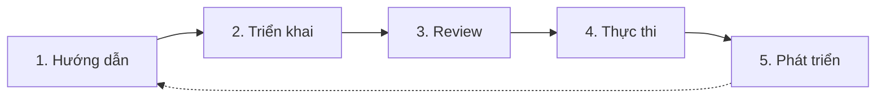

# Brand Workflow

> **Bạn sẽ:** Thiết lập và duy trì tính nhất quán thương hiệu trên tất cả kênh marketing thông qua hướng dẫn rõ ràng, kiểm tra tự động và quy trình review hệ thống.

## Tổng quan

Brand Workflow đảm bảo mọi nội dung - từ bài đăng mạng xã hội đến landing page - đều phản ánh nhất quán bản sắc thương hiệu của bạn. Quy trình bao gồm tạo hướng dẫn, review nội dung, kiểm tra tuân thủ và quản lý tài sản thương hiệu.

Quy trình này ngăn chặn tình trạng "trôi dạt thương hiệu" xảy ra khi nhiều người tạo nội dung mà không có tiêu chuẩn rõ ràng. Dù bạn đang xây dựng hướng dẫn thương hiệu lần đầu hay thực thi các tiêu chuẩn hiện có, quy trình này giữ mọi thứ đúng thương hiệu.

## Thông tin

- **Thời gian ước tính:** Thiết lập ban đầu 1-2 tuần, thực thi liên tục
- **Độ khó:** Cơ bản
- **Điều kiện tiên quyết:**
  - Đã cài ClaudeKit Marketing Kit
  - Đã định nghĩa bản sắc thương hiệu cơ bản (logo, màu sắc, font chữ)
  - Nội dung mẫu để tham khảo
  - Toàn team có thể truy cập hướng dẫn

## Quy trình



## Hướng dẫn từng bước

### Bước 1: Tạo hướng dẫn thương hiệu

Ghi lại giọng văn, tone, phong cách hình ảnh, thông điệp và tiêu chuẩn nội dung trong hướng dẫn rõ ràng, có thể hành động.

```bash
"Create comprehensive brand guidelines for CloudTask PM software.
Include:
- Voice and tone (professional yet approachable, not corporate-stiff)
- Visual style (colors: #1E40AF primary, #F59E0B accent; fonts: Inter, Geist Mono)
- Messaging framework (positioning, key messages, value props)
- Content standards (grammar rules, formatting, terminology)
- Examples (do's and don'ts with side-by-side comparisons)
- Usage rules (logo, imagery, social media)
Save to: .claude/brand-guidelines.md"
```

**Điều gì xảy ra:** Team nội dung tổng hợp các yếu tố thương hiệu hiện có, định nghĩa đặc điểm giọng văn kèm ví dụ, ghi lại tiêu chuẩn hình ảnh, tạo cấu trúc phân cấp thông điệp, viết tiêu chuẩn nội dung, cung cấp ví dụ cụ thể và định dạng thành tài liệu tham khảo dễ tiếp cận.

**Checkpoint:** Hướng dẫn hoàn tất với định nghĩa giọng văn (3-5 đặc điểm kèm ví dụ), tiêu chuẩn hình ảnh (màu sắc, font, sử dụng logo), khung thông điệp, nên và không nên trong nội dung, ví dụ thực tế.

**Thời gian:** 1-2 tuần cho hướng dẫn toàn diện

---

### Bước 2: Triển khai hướng dẫn

Tích hợp hướng dẫn thương hiệu vào quy trình tạo nội dung và đào tạo thành viên team.

```bash
"Implement brand guidelines in ClaudeKit workflows.
Actions:
- Add brand-guidelines-reminder hook to content creation workflows
- Configure content-reviewer agent with brand standards
- Create brand checklist for manual reviews
- Train team on guidelines (async doc + live Q&A session)
- Set up brand asset library (logos, images, templates)
Test: Create sample content and verify guideline adherence"
```

**Điều gì xảy ra:** Hướng dẫn được tích hợp vào quy trình tự động để kích hoạt nhắc nhở trước khi tạo nội dung, cấu hình agent review để kiểm tra tuân thủ thương hiệu, team được đào tạo về hướng dẫn, tài sản thương hiệu được tổ chức trong thư viện dễ truy cập và nội dung thử nghiệm được tạo để xác minh triển khai.

**Checkpoint:** Triển khai hoàn tất với hướng dẫn được tích hợp trong quy trình, team được đào tạo, thư viện tài sản đã tạo, nội dung mẫu vượt qua kiểm tra thương hiệu.

**Thời gian:** 2-3 ngày

---

### Bước 3: Review nội dung

Kiểm tra tất cả nội dung so với hướng dẫn thương hiệu trước khi xuất bản bằng cách review tự động và thủ công.

```bash
"Review blog post for brand compliance.
Content: content/drafts/pm-best-practices.md
Check against guidelines:
- Voice: Professional yet approachable (not too casual or corporate)
- Tone: Helpful and empowering (not condescending)
- Terminology: Use 'tasks' not 'to-dos', 'team members' not 'users'
- Formatting: Oxford comma, sentence case headers, no exclamation marks
- Messaging: Emphasize collaboration and efficiency
Report: Issues and recommendations"
```

**Điều gì xảy ra:** Content reviewer phân tích nội dung theo tiêu chuẩn thương hiệu đã ghi lại, xác định sự không nhất quán về giọng văn và tone, gắn cờ thuật ngữ không chính xác, kiểm tra tuân thủ định dạng, xác minh sự phù hợp thông điệp và cung cấp đề xuất sửa chữa cụ thể.

**Checkpoint:** Review hoàn tất với điểm tuân thủ thương hiệu, các vấn đề cụ thể được xác định, đề xuất sửa chữa được cung cấp, phê duyệt hoặc cần chỉnh sửa.

**Thời gian:** 15-30 phút mỗi nội dung

---

### Bước 4: Thực thi tiêu chuẩn

Sử dụng kiểm tra tự động và giám sát thủ công để duy trì ứng dụng thương hiệu nhất quán.

```bash
"Run automated brand compliance check on all content in content/Q2-campaign/.
Automatically flag:
- Off-brand terminology (blacklist words/phrases)
- Incorrect color codes in designs
- Logo misuse (stretched, wrong colors, low resolution)
- Tone violations (overly casual or formal language)
Generate report with violations and suggested fixes"
```

**Điều gì xảy ra:** Hệ thống tự động quét nội dung để tìm thuật ngữ bị cấm, kiểm tra tài sản hình ảnh về màu sắc thương hiệu và sử dụng logo chính xác, phân tích tone theo hướng dẫn, gắn cờ vi phạm tiềm năng, tạo báo cáo tuân thủ và đề xuất sửa chữa cụ thể.

**Checkpoint:** Thực thi đang hoạt động với kiểm tra tự động, vi phạm được gắn cờ, báo cáo tuân thủ định kỳ được tạo, team nắm được các vấn đề thường gặp.

**Thời gian:** Tự động liên tục, 1 giờ hàng tuần để review

---

### Bước 5: Phát triển hướng dẫn

Thường xuyên cập nhật hướng dẫn dựa trên sự phát triển thương hiệu, thay đổi thị trường và phản hồi team.

```bash
"Review and update brand guidelines (quarterly).
Analyze:
- Common brand compliance issues (what gets flagged repeatedly?)
- New content types not covered (TikTok, podcasts, webinars)
- Market changes (competitor positioning shifts)
- Team feedback (guidelines unclear or restrictive?)
Update: Add clarity, expand coverage, refine examples
Document: What changed and why"
```

**Điều gì xảy ra:** Brand manager review báo cáo tuân thủ để xác định các vấn đề thường gặp, phân tích các loại nội dung mới cần hướng dẫn, theo dõi thay đổi thị trường và cạnh tranh, thu thập phản hồi team, cập nhật hướng dẫn với các cải tiến và truyền đạt thay đổi cho team.

**Checkpoint:** Hướng dẫn được cập nhật với làm rõ cho các vấn đề thường gặp, mở rộng phạm vi cho các định dạng mới, team được thông báo về thay đổi, changelog được ghi lại.

**Thời gian:** 4-6 giờ mỗi quý

---

## Ví dụ thực tế

### Điểm xuất phát
Startup đang phát triển với 5 thành viên team marketing tạo nội dung không nhất quán - một số quá thân mật, một số quá doanh nghiệp, không nhất quán hình ảnh.

### Thực thi

```bash
# Week 1-2: Create guidelines
"Document CloudTask brand guidelines:
Voice: Professional yet friendly (like a knowledgeable colleague, not a professor)
Tone varies: Social media more casual, website more professional, support empathetic
Visual: Primary #1E40AF (blue), Accent #F59E0B (orange), Neutral grays
Fonts: Inter (headings + body), Geist Mono (code examples)
Terminology: 'workspace' not 'dashboard', 'project' not 'folder', 'assign' not 'tag'
Grammar: Oxford comma always, sentence case headers, contractions okay
Examples: 10 before/after comparisons showing off-brand vs on-brand"

# Week 3: Implement
"Integrate guidelines:
- Add to .claude/brand-guidelines.md
- Configure content-reviewer agent with standards
- Create Notion brand hub with assets
- Run team training session (1 hour, recorded)
- Test with 5 sample pieces (blog, social, email, landing page, ad)"

# Week 3-8: Enforce
"Weekly brand compliance checks:
Week 1: 12 violations found (mostly terminology)
Week 3: 7 violations (improving)
Week 6: 3 violations (mostly edge cases)
Week 8: 1 violation (new team member onboarding)"

# Month 3: First evolution
"Update guidelines based on learnings:
- Clarify when contractions are/aren't appropriate
- Add video/podcast voice guidelines
- Expand color palette with usage rules (backgrounds, accents, CTAs)
- Add 5 new before/after examples from actual team content"
```

### Kết quả
Tính nhất quán thương hiệu được cải thiện rõ rệt - khảo sát khách hàng cho thấy điểm "thương hiệu cảm thấy nhất quán" tăng 43%. Vi phạm tuân thủ nội bộ giảm 85% trong 8 tuần đầu. Team phản hồi rằng sự rõ ràng giúp giảm thời gian ra quyết định và tăng sự tự tin khi tạo nội dung.

---

## Các biến thể phổ biến

### Tập trung thương hiệu hình ảnh
Cho các thương hiệu nặng thiết kế:
- Hướng dẫn hình ảnh mở rộng (lưới bố cục, phong cách ảnh, biểu tượng)
- Design system với các components
- Hướng dẫn chụp ảnh thương hiệu
- Hướng dẫn phong cách minh họa

### Nhấn mạnh giọng văn và tone
Cho các thương hiệu định hướng nội dung:
- Phổ giọng văn chi tiết (chính thức đến thân mật theo ngữ cảnh)
- Hướng dẫn điều chỉnh tone (thích nghi theo đối tượng, tình huống)
- Hướng dẫn phong cách viết (ngữ pháp, dấu câu, cấu trúc)
- Bảng thuật ngữ thương hiệu

### Quản lý đa thương hiệu
Cho công ty có sub-brands:
- Mối quan hệ thương hiệu chính + sub-brand
- Yếu tố thương hiệu chung vs riêng
- Quy tắc nhất quán giữa các thương hiệu
- Tài liệu kiến trúc thương hiệu

---

## Xử lý sự cố

### Vấn đề: Team thấy hướng dẫn quá hạn chế

**Nguyên nhân:** Hướng dẫn tập trung vào quy tắc thay vì nguyên tắc, thiếu tính linh hoạt

**Giải pháp:** Đóng khung lại hướng dẫn là "nguyên tắc và ví dụ" thay vì "quy tắc và hạn chế". Giải thích lý do hướng dẫn tồn tại (tính nhất quán xây dựng niềm tin) chứ không chỉ là phải làm gì. Cho phép linh hoạt trong giới hạn. Cập nhật các quy tắc hạn chế dựa trên phản hồi team.

---

### Vấn đề: Hướng dẫn bị bỏ qua hoặc quên

**Nguyên nhân:** Không được tích hợp vào quy trình, khó truy cập hoặc quá phức tạp

**Giải pháp:** Tích hợp nhắc nhở thương hiệu vào công cụ tạo nội dung. Làm cho hướng dẫn có thể tìm kiếm dễ dàng (ctrl+F để tham khảo nhanh). Đơn giản hóa thành các nguyên tắc cốt lõi (1 trang tham khảo nhanh) với tài liệu chi tiết cho các trường hợp biên. Tự động hóa kiểm tra khi có thể.

---

### Vấn đề: Hướng dẫn nhanh chóng lỗi thời

**Nguyên nhân:** Thị trường thay đổi nhanh, không có quy trình cập nhật

**Giải pháp:** Lên lịch review hướng dẫn hàng quý. Phân công brand owner theo dõi xu hướng và thay đổi cạnh tranh. Tạo quy trình cập nhật nhẹ nhàng (không phải thiết kế lại hoàn toàn). Ghi lại những gì đã thay đổi và tại sao để xây dựng kiến thức tổ chức.

---

## Thực hành tốt nhất

**Cho thấy thay vì chỉ nói**
Mỗi hướng dẫn nên có ví dụ trước/sau. "Chuyên nghiệp nhưng gần gũi" rất mơ hồ. Hãy chỉ ra ví dụ quá thân mật, quá doanh nghiệp và vừa đúng. Ví dụ hình ảnh hiệu quả hơn mô tả văn bản 10 lần.

**Tích hợp chứ không bắt buộc**
Đừng tạo hướng dẫn như tài liệu riêng biệt mà team phải nhớ. Tích hợp kiểm tra vào quy trình nơi nội dung được tạo. Nhắc nhở và kiểm tra tự động hoạt động tốt hơn tuân thủ thủ công.

**Phát triển có mục đích**
Hướng dẫn nên phát triển cùng thương hiệu nhưng không thay đổi tùy tiện. Ghi lại lý do thay đổi. Xây dựng trên những gì hiệu quả thay vì tái tạo định kỳ. Sự ổn định tạo ra tính nhất quán.

---

## Quy trình liên quan

- [Content Workflow](/vi/docs/workflows/content-workflow) - Áp dụng tiêu chuẩn thương hiệu cho nội dung
- [Social Workflow](/vi/docs/workflows/social-workflow) - Nhất quán thương hiệu trên mạng xã hội
- [Email Workflow](/vi/docs/workflows/email-workflow) - Thương hiệu trong giao tiếp email
- [Campaign Workflow](/vi/docs/workflows/campaign-workflow) - Thương hiệu nhất quán trong các chiến dịch

---

## Agents sử dụng

- [content-reviewer](/vi/docs/marketing/agents/content-reviewer) - Kiểm tra tuân thủ thương hiệu
- [content-creator](/vi/docs/marketing/agents/content-creator) - Tạo nội dung tuân thủ hướng dẫn
- [copywriter](/vi/docs/marketing/agents/copywriter) - Áp dụng giọng văn thương hiệu

---

## Commands sử dụng

- `/brand check` - Xác minh tuân thủ thương hiệu
- `/brand guidelines` - Truy cập tiêu chuẩn thương hiệu
- `/ckm:content review` - Kiểm tra nội dung theo hướng dẫn
