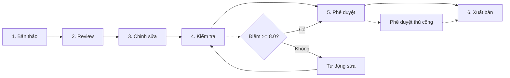

# Content Workflow

> **Bạn sẽ:** Tạo ra nội dung marketing chất lượng cao nhất quán đạt điểm 8.0+ thông qua quy trình 6 giai đoạn hệ thống với kiểm tra tự động, kiểm tra tuân thủ thương hiệu và tối ưu hóa.

## Tổng quan

Content Workflow là hệ thống đảm bảo chất lượng nội dung marketing của bạn. Nó đưa nội dung từ bản thảo thô đến tác phẩm được đánh bóng và xuất bản qua sáu giai đoạn: Bản thảo, Review, Chỉnh sửa, Kiểm tra, Phê duyệt và Xuất bản.

Điều làm cho quy trình này mạnh mẽ là các cổng kiểm soát chất lượng tự động. Mỗi nội dung được chấm điểm theo bốn chiều - Copywriting, SEO, Tối ưu nền tảng và Tuân thủ thương hiệu. Nếu điểm thấp hơn 8.0, hệ thống tự động đề xuất cải tiến trước khi bạn nhìn thấy nó.

Quy trình này xử lý bài blog, landing page, email, bài đăng mạng xã hội và copy quảng cáo. Dù bạn đang tạo một nội dung đơn lẻ hay quản lý lịch nội dung với hàng chục tài liệu, quy trình này đảm bảo tính nhất quán và chất lượng.

**Lợi thế vượt trội**: ClaudeKit Marketing có toàn quyền truy cập vào codebase của bạn, cho phép tạo nội dung nhận thức sản phẩm với ảnh chụp màn hình được trích xuất tự động, mô tả tính năng được xác minh bằng triển khai và các claim marketing được xác thực theo code thực tế. Xem [Marketing Overview](/vi/docs/marketing/) để biết thêm chi tiết.

## Thông tin

- **Thời gian ước tính:** 2-5 ngày mỗi nội dung (tùy theo loại và độ dài)
- **Độ khó:** Cơ bản
- **Điều kiện tiên quyết:**
  - Đã cài ClaudeKit Marketing Kit
  - Đã chuẩn bị content brief
  - Đã xác định target keywords
  - Đã ghi lại brand guidelines

## Quy trình



## Hướng dẫn từng bước

### Bước 1: Tạo bản thảo

Bắt đầu với bản thảo thô. Tập trung vào việc nắm bắt ý tưởng, đừng lo về sự hoàn hảo. Agent content-creator xử lý nền tảng SEO, tích hợp từ khóa và cấu trúc cơ bản.

```bash
# Create initial draft
"Create blog post draft.
Topic: How to Build a Marketing Dashboard
Keywords: marketing dashboard, analytics tracking, KPI visualization
Audience: Marketing managers at B2B SaaS companies
Word count: 2000
Save to: content/drafts/marketing-dashboard-guide.md"
```

**Điều gì xảy ra:** Agent content-creator nghiên cứu chủ đề, cấu trúc nội dung với tiêu đề H2/H3, tích hợp target keywords tự nhiên, viết cho đối tượng cụ thể của bạn và lưu bản thảo vào vị trí được chỉ định.

**Checkpoint:** Bản thảo nên có:
- Chủ đề và góc nhìn rõ ràng
- Target keywords có mặt (nhưng không nhồi nhét)
- Cấu trúc logic với tiêu đề
- Viết cho đối tượng được chỉ định
- Gần với số từ mục tiêu

**Thời gian:** 1-2 giờ

---

### Bước 2: Review nội dung

Agent content-reviewer thực hiện kiểm tra chất lượng toàn diện bao gồm giọng văn thương hiệu, độ chính xác thực tế, ngữ pháp, tối ưu SEO và các yếu tố chuyển đổi.

```bash
# Run content review
"Review content at content/drafts/marketing-dashboard-guide.md.
Check:
- Brand voice alignment
- Factual accuracy
- Grammar/spelling
- SEO optimization
- CTA effectiveness
Report issues and recommendations."
```

**Điều gì xảy ra:** Reviewer phân tích nội dung của bạn theo brand guidelines, kiểm tra thực tế các claim, xác định vấn đề ngữ pháp, xác nhận các yếu tố SEO (title tags, headers, sử dụng từ khóa) và đánh giá CTAs. Bạn nhận được báo cáo chi tiết với các vấn đề và đề xuất cụ thể.

**Checkpoint:** Báo cáo review nên xác định:
- Sự không nhất quán giọng văn thương hiệu
- Lỗi thực tế hoặc claim không có cơ sở
- Lỗi ngữ pháp/chính tả
- Cơ hội tối ưu SEO
- CTAs thiếu hoặc yếu

**Thời gian:** 30 phút

---

### Bước 3: Chỉnh sửa và tinh chỉnh

Sử dụng phản hồi review, content-creator chỉnh sửa bản thảo để giải quyết tất cả vấn đề trong khi duy trì giọng văn thương hiệu và tối ưu SEO.

```bash
# Apply review feedback
"Edit content at content/drafts/marketing-dashboard-guide.md.
Address feedback:
- Strengthen introduction hook
- Add data sources for statistics
- Fix passive voice in section 3
- Improve CTA specificity
Maintain: brand voice, SEO keywords
Save revised version."
```

**Điều gì xảy ra:** Content-creator xử lý có hệ thống từng phản hồi, tinh chỉnh thông điệp, tối ưu cho SEO và đánh bóng copy. Phiên bản được chỉnh sửa ghi đè lên bản thảo.

**Checkpoint:** Bản thảo được chỉnh sửa nên:
- Giải quyết tất cả phản hồi review
- Duy trì giọng văn thương hiệu nhất quán
- Giữ target keywords được tích hợp
- Thể hiện cải thiện có thể đo lường
- Sẵn sàng cho kiểm tra tự động

**Thời gian:** 1-2 giờ

---

### Bước 4: Kiểm tra tự động

Đây là nơi điều kỳ diệu xảy ra. Lệnh `/write/audit` chấm điểm nội dung của bạn theo bốn chiều và lệnh `/write/publish` tự động sửa các vấn đề nếu điểm thấp hơn 8.0.

```bash
# Automated audit triggers after content creation
# But you can also run manually:
"Run /write/audit on content/drafts/marketing-dashboard-guide.md.
If score <8.0, run /write/publish to auto-fix.
Present final version with before/after scores."
```

**Điều gì xảy ra:** Lệnh kiểm tra phân tích nội dung của bạn và chấm điểm:
- **Copywriting:** Sức mạnh hook, khả năng đọc, flow, tính thuyết phục
- **SEO:** Tối ưu từ khóa, meta tags, cấu trúc, liên kết
- **Platform:** Phù hợp định dạng, tối ưu kỹ thuật
- **Brand:** Nhất quán giọng văn, tuân thủ phong cách, thông điệp

Nếu bất kỳ chiều nào điểm thấp hơn 8.0, `/write/publish` tự động cải thiện hooks, thêm hashtags (cho mạng xã hội), tăng cường CTAs và cải thiện khả năng đọc.

**Checkpoint:** Sau khi kiểm tra:
- Điểm tổng thể nên >= 8.0
- Tất cả bốn chiều >= 8.0
- Điểm trước/sau được ghi lại
- Các cải tiến cụ thể được liệt kê
- Nội dung sẵn sàng để phê duyệt

**Thời gian:** 10-15 phút (tự động)

---

### Bước 5: Phê duyệt cuối cùng

Content-reviewer thực hiện kiểm tra chất lượng cuối cùng và con người phê duyệt nội dung để xuất bản.

```bash
# Final review before publishing
"Final review of content/drafts/marketing-dashboard-guide.md.
Verify audit score >=8.0.
Confirm ready for publication.
If approved, schedule for March 15, 2025 at 9am EST."
```

**Điều gì xảy ra:** Reviewer xác nhận điểm kiểm tra, thực hiện kiểm tra chất lượng cuối cùng, xác minh tất cả các yếu tố có đủ và chuẩn bị nội dung để xuất bản. Cần phê duyệt của con người trước khi xuất bản.

**Checkpoint:** Phê duyệt cuối cùng yêu cầu:
- Đã xác minh điểm kiểm tra >= 8.0
- Đáp ứng tất cả tiêu chí chất lượng
- Đã đặt ngày/giờ xuất bản
- Đã xác nhận kênh phân phối
- Đã nhận phê duyệt của con người

**Thời gian:** 15-30 phút

---

### Bước 6: Xuất bản và phân phối

Sau khi phê duyệt, social media managers hoặc email wizards xuất bản nội dung lên các nền tảng phù hợp, kích hoạt tracking và theo dõi hiệu suất ban đầu.

```bash
# Publish approved content
"Publish approved content at content/drafts/marketing-dashboard-guide.md.
Channels: Blog, LinkedIn, Twitter, Email newsletter
Tracking: campaign-id-Q1-content
Monitor for 48 hours."
```

**Điều gì xảy ra:** Nội dung được xuất bản lên blog của bạn, phân phối đến các kênh mạng xã hội, đưa vào email newsletter, thêm tracking parameters và theo dõi hiệu suất ban đầu trong 48 giờ.

**Checkpoint:** Sau khi xuất bản:
- Nội dung trực tiếp trên tất cả kênh
- Tracking hoạt động chính xác
- Bài đăng mạng xã hội đã được lên lịch
- Email đã gửi (nếu có)
- Theo dõi mức độ tương tác ban đầu

**Thời gian:** 1-2 giờ

---

## Ví dụ thực tế

### Điểm xuất phát
Bạn cần tạo bài blog về "AI Marketing Automation" để thu hút traffic organic và tạo leads cho sản phẩm SaaS của bạn.

### Thực thi

```bash
# Day 1: Draft
"Create blog post draft.
Topic: AI Marketing Automation: Complete 2025 Guide
Keywords: AI marketing automation, marketing AI tools, automated marketing campaigns
Audience: Marketing directors at mid-size companies
Word count: 2500
Save to: content/drafts/ai-marketing-automation-guide.md"

# Day 1: Review
"Review content at content/drafts/ai-marketing-automation-guide.md.
Check: brand voice, accuracy, grammar, SEO, CTAs
Report issues."

# Day 2: Edit
"Edit content at content/drafts/ai-marketing-automation-guide.md.
Address feedback:
- Add case study examples
- Strengthen statistics with sources
- Improve introduction hook
- Add comparison table
- Enhance CTA with free trial mention"

# Day 2: Audit (automatically triggers)
# Score: Copywriting 7.8, SEO 8.5, Platform 8.2, Brand 8.1
# System automatically runs /write/publish to fix copywriting score
# New score: Copywriting 8.3, SEO 8.5, Platform 8.2, Brand 8.1

# Day 3: Final approval
"Final review of content/drafts/ai-marketing-automation-guide.md.
Score: 8.3/10 overall. Approved for publishing.
Schedule: March 20, 2025, 9am EST"

# Day 3: Publish
"Publish content/drafts/ai-marketing-automation-guide.md.
Channels: Blog, LinkedIn (article), Twitter (thread), Newsletter
Tracking: Q1-organic-content-campaign"
```

### Kết quả
Bài blog được xuất bản với điểm 8.3/10, ra mắt đúng lịch, thu hút 2,400 lượt truy cập organic trong tháng đầu, tạo 47 leads qua CTA được nhúng và trở thành nguồn traffic #3 trên website.

---

## Các biến thể phổ biến

### Bài đăng mạng xã hội nhanh (1-2 giờ)

Với nội dung mạng xã hội nhanh, nén quy trình:

```bash
"Create LinkedIn post about our new product feature.
Topic: Real-time collaboration updates
Include: Hook, 3 benefits, CTA
Run /write/audit and /write/publish automatically.
Publish today at 2pm EST."
```

Tất cả 6 giai đoạn diễn ra trong một phiên với kiểm tra tự động trước khi xuất bản.

---

### Chiến dịch email (2-3 ngày)

Với chuỗi email, xử lý nhiều nội dung cùng lúc:

```bash
# Day 1: Draft all emails
"Create 5-email welcome sequence.
Audience: New trial users
Topics: Welcome, Feature tour, Use case, Social proof, Conversion
Save to: content/emails/welcome-sequence/"

# Day 1-2: Batch review and edit
"Review all emails in content/emails/welcome-sequence/.
Apply edits to all based on feedback."

# Day 2: Batch audit
"Audit all emails in welcome-sequence folder.
Auto-fix any scores <8.0."

# Day 3: Schedule sequence
"Publish welcome sequence.
Schedule: Day 0, 2, 4, 6, 8 after signup"
```

Xử lý toàn bộ chuỗi theo lô để đạt hiệu quả.

---

### Nội dung dài (1-2 tuần)

Với các hướng dẫn toàn diện hoặc ebook, thêm các chu kỳ lặp:

```bash
# Week 1: Structure and draft
"Create ebook outline: The Complete Marketing Automation Playbook
10 chapters, 50+ pages
Create drafts for chapters 1-3"

# Week 1-2: Rolling review and edit
"Review chapters 1-3, edit based on feedback
Draft chapters 4-6"

# Week 2: Comprehensive audit
"Audit complete ebook.
Focus: Consistency across chapters, SEO for each section, cohesive CTAs"

# Week 2: Design and publish
"Finalize ebook with design team.
Create landing page and promotion plan."
```

Chia dự án lớn thành các phần có thể quản lý với review liên tục.

---

## Xử lý sự cố

### Vấn đề: Điểm kiểm tra kẹt dưới 8.0 sau khi tự động sửa

**Nguyên nhân:** Nội dung có vấn đề cấu trúc hoặc vấn đề thông điệp cơ bản mà tự động sửa không thể giải quyết

**Giải pháp:** Review báo cáo từng chiều kiểm tra để xem chiều nào thấp nhất:
- **Copywriting thấp:** Viết lại phần giới thiệu và kết luận với hooks/CTAs mạnh hơn
- **SEO thấp:** Thêm target keywords vào tiêu đề, H2s và đoạn đầu; thêm internal links
- **Platform thấp:** Điều chỉnh định dạng, thêm hình ảnh, tối ưu cho mobile
- **Brand thấp:** Căn chỉnh tone và giọng văn với brand guidelines; xóa ngôn ngữ không đúng thương hiệu

Thực hiện sửa chữa thủ công, sau đó chạy lại kiểm tra.

---

### Vấn đề: Phản hồi review mâu thuẫn với brand guidelines

**Nguyên nhân:** Content-reviewer cần cập nhật brand guidelines hoặc có ngữ cảnh không chính xác

**Giải pháp:** Cập nhật tài liệu brand guidelines trong `.claude/brand-guidelines.md`. Bao gồm:
- Ví dụ giọng văn và tone
- Cụm từ được phê duyệt/không được phê duyệt
- Sở thích phong cách
- Thuật ngữ đặc thù ngành

Chạy lại review sau khi cập nhật guidelines.

---

### Vấn đề: Nội dung xuất bản hiển thị định dạng khác

**Nguyên nhân:** Giới hạn nền tảng hoặc vấn đề render HTML

**Giải pháp:** Tạo phiên bản dành riêng cho nền tảng:
```bash
"Adapt content for LinkedIn native article format.
Adjust: Line breaks, formatting, link handling.
Test in LinkedIn preview before publishing."
```

Xem trước trên nền tảng thực trước khi lên lịch.

---

## Thực hành tốt nhất

**Không bao giờ bỏ qua kiểm tra**
15 phút dành cho kiểm tra/tự động sửa tiết kiệm hàng giờ chỉnh sửa thủ công và ngăn xuất bản nội dung chất lượng thấp. Luôn chạy `/write/audit` trước khi tuyên bố nội dung "hoàn thành".

**Xử lý nội dung tương tự theo lô**
Tạo 10 bài đăng mạng xã hội? Tạo bản thảo tất cả 10, review tất cả 10, kiểm tra tất cả 10. Xử lý theo lô nhanh hơn 3-5 lần so với xử lý từng cái và cải thiện tính nhất quán giữa các nội dung.

**Xây dựng thư viện nội dung**
Lưu nội dung có điểm cao làm templates. Bài blog đạt 8.5+ trở thành template cho các chủ đề tương tự. Tái sử dụng cấu trúc, sao chép các mô hình thành công, duy trì chất lượng.

---

## Quy trình liên quan

- [Campaign Workflow](/vi/docs/workflows/campaign-workflow) - Tạo nội dung như một phần của chiến dịch lớn hơn
- [SEO Workflow](/vi/docs/workflows/seo-workflow) - Tối ưu nội dung cho xếp hạng tìm kiếm
- [Social Workflow](/vi/docs/workflows/social-workflow) - Phân phối nội dung trên các nền tảng mạng xã hội
- [Brand Workflow](/vi/docs/workflows/brand-workflow) - Đảm bảo tính nhất quán thương hiệu

---

## Agents sử dụng

- [content-creator](/vi/docs/marketing/agents/content-creator) - Tạo bản thảo và chỉnh sửa
- [content-reviewer](/vi/docs/marketing/agents/content-reviewer) - Kiểm tra chất lượng và phê duyệt
- [seo-specialist](/vi/docs/marketing/agents/seo-specialist) - Tối ưu SEO
- [social-media-manager](/vi/docs/marketing/agents/social-media-manager) - Xuất bản mạng xã hội
- [email-wizard](/vi/docs/marketing/agents/email-wizard) - Phân phối email

---

## Commands sử dụng

- `/ckm:write:blog` - Tạo bản thảo bài blog
- `/ckm:write:cro` - Tạo landing page tối ưu chuyển đổi
- `/write/audit` - Chấm điểm chất lượng nội dung (tự động kích hoạt)
- `/write/publish` - Tự động sửa vấn đề nội dung (tự động kích hoạt)
- Dùng skill `copywriting` để tạo nội dung chất lượng cao
- `/ckm:youtube:blog` - Chuyển đổi video YouTube thành bài blog
- `/ckm:youtube:social` - Chuyển đổi video YouTube thành bài đăng mạng xã hội
