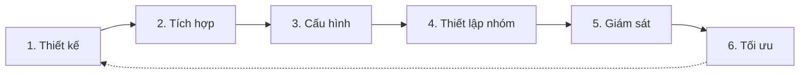

# Dashboard Workflow

> **Bạn sẽ:** Thiết lập và duy trì dashboard marketing thời gian thực cung cấp khả năng nhìn thấy ngay lập tức về chiến dịch, hiệu suất và hoạt động nhóm trên tất cả các kênh marketing.

## Tổng quan

Dashboard Workflow giúp bạn tạo một trung tâm chỉ huy tập trung cho các hoạt động marketing. Quy trình bao gồm thiết kế dashboard, tích hợp nguồn dữ liệu, lựa chọn chỉ số, thiết lập trực quan hóa và cấu hình quyền truy cập nhóm.

Thay vì kiểm tra nhiều công cụ về trạng thái chiến dịch, dữ liệu traffic và tiến độ nhóm, dashboard cung cấp một nguồn sự thật duy nhất. Dù bạn đang theo dõi chiến dịch đang hoạt động, theo dõi KPIs hay điều phối công việc nhóm, dashboard giữ mọi người cùng hướng.

**Tích hợp quản lý tài sản**: Lệnh `/ckm:dashboard` cũng đóng vai trò là giao diện trực quan cho hệ thống [Asset Management](/vi/docs/marketing/skills/content-hub) (Content Hub), cung cấp khả năng duyệt, xem trước và tìm kiếm cho tất cả tài sản marketing (copy, storyboards, slides, infographics, hướng dẫn thương hiệu, bài đăng mạng xã hội).

## Thông tin

- **Thời gian ước tính:** Thiết lập 2-4 giờ, giám sát hàng ngày 5-10 phút
- **Độ khó:** Cơ bản
- **Điều kiện tiên quyết:**
  - Đã cài ClaudeKit Marketing Kit
  - Đã kết nối công cụ marketing (GA4, nền tảng quảng cáo, email, mạng xã hội)
  - Đã xác định vai trò nhóm
  - Đã xác định các chỉ số chính

## Quy trình



## Hướng dẫn từng bước

### Bước 1: Thiết kế cấu trúc dashboard

Xác định các phần dashboard, chỉ số chính, nhu cầu đối tượng và phân cấp thông tin.

```bash
"Design marketing dashboard for CloudTask team.
Audience: Marketing manager (daily), Exec team (weekly), Marketing team (ongoing)
Sections:
- Campaign overview (active campaigns, status, spend vs budget)
- Traffic metrics (sessions, sources, conversions)
- Lead pipeline (MQLs, SQLs, conversion rates)
- Content performance (top pages, recent posts)
- Team activity (tasks, deliverables, blockers)
Layout: Most important metrics above fold, drill-downs below"
```

**Điều gì xảy ra:** Dashboard designer phân tích nhu cầu các bên liên quan, xác định các chỉ số quan trọng theo đối tượng, cấu trúc thông tin hợp lý, thiết kế phân cấp hình ảnh nhấn mạnh dữ liệu quan trọng, lên kế hoạch khả năng drill-down và tạo wireframe hoặc mockup.

**Checkpoint:** Thiết kế bao gồm các phần được xác định, danh sách chỉ số được ưu tiên, chế độ xem theo đối tượng, phân cấp hình ảnh, mockup hoặc đặc tả chi tiết.

**Thời gian:** 2-3 giờ

---

### Bước 2: Tích hợp nguồn dữ liệu

Kết nối các nền tảng marketing với dashboard để luồng dữ liệu thời gian thực.

```bash
"Integrate data sources for marketing dashboard.
Connect:
- Google Analytics 4 (traffic, conversions, behavior)
- Google Ads (campaigns, spend, conversions)
- LinkedIn Ads (B2B campaign performance)
- Mailchimp (email metrics, list growth)
- HubSpot CRM (leads, pipeline, deals)
- ClaudeKit (agent activity, task status)
Authenticate: OAuth for each platform
Sync frequency: Real-time where possible, hourly minimum"
```

**Điều gì xảy ra:** Hệ thống kết nối với từng nền tảng qua API hoặc tích hợp gốc, xác thực với quyền phù hợp, cấu hình tần suất đồng bộ dữ liệu, kiểm tra luồng dữ liệu, xác nhận độ chính xác chỉ số và thiết lập theo dõi lỗi.

**Checkpoint:** Tất cả nền tảng đã kết nối và đồng bộ, dữ liệu chảy chính xác, chỉ số khớp với nền tảng nguồn (kiểm tra ngẫu nhiên), theo dõi lỗi đang hoạt động.

**Thời gian:** 1-2 giờ

---

### Bước 3: Cấu hình chỉ số và chế độ xem

Thiết lập KPIs, mục tiêu, cảnh báo và chế độ xem tùy chỉnh cho các thành viên nhóm khác nhau.

```bash
"Configure dashboard metrics and views.
KPIs with targets:
- Monthly traffic: 15K sessions (target), alert if <80% by day 20
- Lead generation: 500 MQLs (target), alert if <75% by day 25
- Campaign ROI: 3.5x minimum, alert if any campaign <2x
- Email engagement: 25% open rate minimum
Custom views:
- Manager view: High-level KPIs + alerts
- Exec view: Monthly trends + ROI summary
- Team view: Campaign status + task assignments
Configure: Auto-refresh every 15 minutes, mobile responsive"
```

**Điều gì xảy ra:** Dashboard được cấu hình với chỉ số mục tiêu và ngưỡng, quy tắc cảnh báo được đặt cho các vấn đề hiệu suất, chế độ xem tùy chỉnh được tạo cho các vai trò khác nhau, tự động làm mới được kích hoạt, tối ưu mobile được áp dụng và tùy chọn thông báo được đặt.

**Checkpoint:** KPIs được cấu hình với mục tiêu, cảnh báo được đặt và kiểm tra, chế độ xem tùy chỉnh được tạo, dashboard tự động làm mới, hiển thị mobile được xác minh.

**Thời gian:** 2-3 giờ

---

### Bước 4: Thiết lập và đào tạo nhóm

Cung cấp quyền truy cập nhóm, cấu hình quyền và đào tạo về cách sử dụng dashboard.

```bash
"Setup team access to marketing dashboard.
Team members:
- Marketing Manager: Full access (view + edit)
- Marketing Team (4): Campaign view (view only)
- Exec Team (3): Summary view (view only)
Training:
- Record 10-minute walkthrough video
- Create quick reference guide (1 page)
- Schedule live Q&A session
- Set up Slack alerts for critical metrics
Test: Each team member logs in and confirms their view is correct"
```

**Điều gì xảy ra:** Tài khoản người dùng được tạo với quyền phù hợp, nhóm nhận thông tin xác thực, tài liệu đào tạo được chuẩn bị (video + hướng dẫn), phiên đào tạo trực tiếp được tổ chức, thông báo Slack được cấu hình và quyền truy cập được kiểm tra bởi từng thành viên nhóm.

**Checkpoint:** Tất cả thành viên nhóm có quyền truy cập, quyền được xác minh, đào tạo hoàn thành, cảnh báo Slack hoạt động, nhóm thoải mái sử dụng dashboard.

**Thời gian:** 2-3 giờ

---

### Bước 5: Giám sát hàng ngày

Kiểm tra dashboard để tìm vấn đề hiệu suất, trạng thái chiến dịch và các bất thường cần hành động.

```bash
"Daily dashboard monitoring routine (5-10 minutes).
Morning check:
- Campaign status: Any paused or out-of-budget campaigns?
- Traffic trends: Major increases or drops vs yesterday?
- Conversion rates: Any significant changes?
- Alerts: Review and triage any triggered alerts
- Team tasks: Any blockers or overdue deliverables?
Action: Address critical issues immediately, note trends for weekly review"
```

**Điều gì xảy ra:** Manager review dashboard để tìm cảnh báo quan trọng, kiểm tra sức khỏe chiến dịch và tiến độ ngân sách, theo dõi xu hướng traffic và chuyển đổi, xác định bất thường cần điều tra và phân loại các trở ngại hoặc vấn đề của nhóm.

**Checkpoint:** Kiểm tra hàng ngày hoàn tất với các vấn đề quan trọng được giải quyết, xu hướng được ghi chú, nhóm không bị chặn, tin tưởng vào hiệu suất hiện tại.

**Thời gian:** 5-10 phút hàng ngày

---

### Bước 6: Tối ưu và lặp lại

Thường xuyên review hiệu quả dashboard và điều chỉnh chỉ số, chế độ xem hoặc tích hợp.

```bash
"Monthly dashboard optimization review.
Analyze:
- Which metrics get checked most often? (prioritize visibility)
- Which sections rarely viewed? (remove or simplify)
- New data sources needed? (added tools or channels)
- Alert accuracy? (too many false positives? missing real issues?)
- Team feedback? (what's missing or confusing?)
Implement: Top 3 improvements based on usage and feedback
Document: What changed and why"
```

**Điều gì xảy ra:** Analytics dashboard được review để xem mẫu sử dụng, nhóm được khảo sát để nhận phản hồi, các phần ít dùng được đơn giản hóa hoặc xóa, các chỉ số được kiểm tra thường xuyên nhất được tăng độ nổi bật hơn, quy tắc cảnh báo được tinh chỉnh và các cải tiến được triển khai dựa trên dữ liệu.

**Checkpoint:** Sử dụng được phân tích, phản hồi được thu thập, các cải tiến hàng đầu được xác định và triển khai, nhóm được thông báo về thay đổi.

**Thời gian:** 2-3 giờ hàng tháng

---

## Ví dụ thực tế

### Điểm xuất phát
Team marketing 5 người kiểm tra 8 công cụ khác nhau suốt ngày, bỏ lỡ vấn đề cho đến khi quá muộn, không có tầm nhìn chung về trạng thái chiến dịch.

### Thực thi

```bash
# Day 1: Design
"Design unified marketing dashboard:
Top section: Traffic today, Leads today, Active campaigns (3 metrics, large numbers)
Campaign section: 6 active campaigns with status, spend, performance vs goal
Traffic section: Sources breakdown, top pages, conversion funnel
Lead section: Pipeline by stage, recent conversions, lead score distribution
Team section: Task kanban, deliverables due this week, blockers
Mobile: Focus on top section + alerts"

# Day 1: Integration
"Connect 6 platforms:
- GA4: Traffic, behavior, conversions (real-time API)
- Google Ads: 2 campaigns, $12K/month spend (hourly sync)
- LinkedIn: 3 campaigns, $8K/month spend (hourly sync)
- Mailchimp: Weekly newsletter, 8K subscribers (hourly sync)
- HubSpot: 1,200 leads in pipeline (real-time)
- ClaudeKit: Team tasks and agent activity (real-time)"

# Day 2: Configure
"Setup KPIs and alerts:
- Traffic: 500/day target, alert if <400 by 5pm
- Leads: 25/day target, alert if <20 by 5pm
- Campaign spend: Alert if any campaign exceeds daily budget by 20%
- Campaign performance: Alert if CPA >$60 (target $50)
Created 3 views: Manager (full), Exec (summary), Team (campaigns + tasks)"

# Day 2: Team setup
"Provided access to 8 team members:
- Recorded 8-minute walkthrough showing each section
- Created 1-page quick reference with screenshots
- Held 30-minute live training with Q&A
- Configured Slack alerts to #marketing-alerts channel
All team members logged in successfully"

# Daily: Monitoring
"Daily 7-minute morning routine:
Check top metrics (traffic, leads normal ranges)
Review campaign performance (all on track)
Check alerts (1 alert: LinkedIn CPA spiked to $68 yesterday)
Action: Investigated LinkedIn campaign, paused underperforming ad variant
Team section: 2 tasks overdue, followed up in Slack"

# Month 1: Optimization
"Dashboard usage analysis:
- Campaign section viewed 12x/day (most important)
- Traffic section viewed 5x/day
- Lead pipeline viewed 3x/day
- Team tasks viewed 8x/day
- Exec summary viewed 1x/week
Changes: Made campaign section larger, moved exec summary to separate tab"
```

### Kết quả
Team nay dành 10 phút hàng ngày trên dashboard thay vì 60+ phút trên 8 công cụ. Phát hiện vấn đề trung bình nhanh hơn 4 giờ (chiến dịch vượt chi được phát hiện lúc 11am thay vì cuối ngày). Tầm nhìn của lãnh đạo được cải thiện - các buổi check-in hàng tuần giờ dựa trên dữ liệu thay vì "bạn nghĩ mọi thứ đang thế nào?" cuộc trò chuyện.

---

## Các biến thể phổ biến

### Phòng chiến dịch thời gian thực
Để theo dõi chiến dịch đang hoạt động:
- Màn hình lớn trong văn phòng
- Làm mới trực tiếp mỗi 60 giây
- Hiệu suất từng giờ
- Thông báo cảnh báo ngay lập tức
- Tính năng cộng tác nhóm

### Dashboard tóm tắt lãnh đạo
Để tầm nhìn lãnh đạo:
- Chỉ KPIs cấp cao
- Xu hướng hàng tháng/hàng quý
- Chỉ số ROI và hiệu quả
- Không có chi tiết vận hành
- Xuất PDF cho cuộc họp ban

### Dashboard khách hàng agency
Để báo cáo khách hàng:
- Giao diện mang thương hiệu khách hàng
- Chế độ xem theo chiến dịch cụ thể
- Báo cáo hàng tuần tự động
- Quyền truy cập tự phục vụ của khách hàng
- Trình bày white-label

---

## Xử lý sự cố

### Vấn đề: Dữ liệu không đồng bộ hoặc hiển thị lỗi

**Nguyên nhân:** Xác thực API hết hạn, đạt giới hạn tốc độ hoặc thay đổi nền tảng

**Giải pháp:** Kiểm tra trạng thái xác thực API cho mỗi tích hợp. Xác thực lại nếu cần. Review việc sử dụng API theo giới hạn tốc độ. Kiểm tra các thay đổi hoặc deprecations API nền tảng. Thiết lập theo dõi lỗi và thông báo.

---

### Vấn đề: Dashboard quá chậm hoặc timeout

**Nguyên nhân:** Quá nhiều truy vấn thời gian thực, tìm nạp dữ liệu không hiệu quả hoặc phạm vi ngày lớn

**Giải pháp:** Giảm truy vấn thời gian thực (không phải mọi thứ đều cần dữ liệu trực tiếp). Cache dữ liệu được truy cập thường xuyên. Giới hạn phạm vi ngày mặc định (30 ngày gần nhất thay vì toàn thời gian). Tối ưu truy vấn cơ sở dữ liệu. Xem xét tổng hợp dữ liệu cho dữ liệu lịch sử.

---

### Vấn đề: Nhóm không sử dụng dashboard nhất quán

**Nguyên nhân:** Không được tích hợp vào quy trình, quá phức tạp hoặc thiếu thông tin quan trọng

**Giải pháp:** Làm cho dashboard là điểm bắt đầu của mỗi cuộc họp nhóm. Thêm vào trang chủ trình duyệt. Đơn giản hóa chỉ còn các chỉ số thiết yếu. Khảo sát nhóm về những gì còn thiếu. Tích hợp với các công cụ họ đã sử dụng (thông báo Slack, digest email).

---

## Thực hành tốt nhất

**Chỉ số quan trọng trên màn hình**
Các con số quan trọng nhất nên hiển thị mà không cần cuộn. Nhóm nên thấy trạng thái trong <3 giây. Nếu bạn cần cuộn để xem chiến dịch có đúng hướng không, thiết kế dashboard cần cải thiện.

**Chỉ cảnh báo những gì có thể hành động**
Đừng cảnh báo mọi thứ. Chỉ cảnh báo về các chỉ số yêu cầu hành động ngay lập tức. Cảnh báo sai đào tạo nhóm bỏ qua cảnh báo. Tốt hơn là bỏ lỡ 1 cảnh báo hơn là nhận 10 cảnh báo sai mỗi ngày.

**Thiết kế để nhìn nhanh**
Sử dụng màu sắc chiến lược (xanh lá=tốt, đỏ=cần hành động). Số lớn cho chỉ số chính. Sparklines cho thấy xu hướng nhanh. Tránh lộn xộn - khoảng trắng là tính năng chứ không phải lãng phí.

---

## Quy trình liên quan

- [Campaign Workflow](/vi/docs/workflows/campaign-workflow) - Theo dõi chiến dịch trong dashboard
- [Analytics Workflow](/vi/docs/workflows/analytics-workflow) - Dashboard như công cụ báo cáo
- [Marketing Workflow](/vi/docs/workflows/marketing-workflow) - Điều phối trung tâm qua dashboard

---

## Agents sử dụng

- [analytics-analyst](/vi/docs/marketing/agents/analytics-analyst) - Thiết lập dashboard và cấu hình chỉ số
- [campaign-manager](/vi/docs/marketing/agents/campaign-manager) - Theo dõi trạng thái chiến dịch
- [project-manager](/vi/docs/marketing/agents/project-manager) - Theo dõi hoạt động nhóm

---

## Commands sử dụng

- `/ckm:dashboard setup` - Khởi tạo dashboard
- `/ckm:dashboard configure` - Thêm chỉ số và cảnh báo
- `/ckm:dashboard view` - Truy cập giao diện dashboard
- `/ckm:analyze` - Kéo dữ liệu vào dashboard
