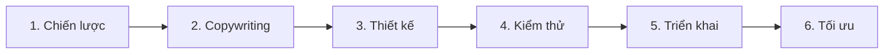

# Email Workflow

> **Bạn sẽ:** Tạo các chiến dịch email hiệu suất cao từ chiến lược đến thiết kế, kiểm thử và triển khai với cá nhân hóa tự động, phân khúc và tối ưu.

## Tổng quan

Email Workflow hướng dẫn bạn qua việc tạo các chiến dịch email được mở, nhấp và chuyển đổi. Quy trình bao gồm chiến lược, copywriting, thiết kế, kiểm thử, triển khai và tối ưu.

Email wizards xử lý mọi thứ từ tạo subject line đến tối ưu thời gian gửi. Dù bạn đang xây dựng chuỗi chào mừng, chiến dịch khuyến mãi hay chương trình newsletter, quy trình này đảm bảo chất lượng và hiệu suất nhất quán.

## Thông tin

- **Thời gian ước tính:** 1-3 ngày mỗi chiến dịch
- **Độ khó:** Cơ bản
- **Điều kiện tiên quyết:**
  - Đã cài ClaudeKit Marketing Kit
  - Nền tảng email đã kết nối (Mailchimp, SendGrid, v.v.)
  - Danh sách email đã phân khúc
  - Brand guidelines sẵn có

## Quy trình



## Hướng dẫn từng bước

### Bước 1: Chiến lược email

Xác định mục tiêu chiến dịch, đối tượng mục tiêu, góc độ thông điệp và chỉ số thành công.

```bash
"Create email campaign strategy for product launch.
Objective: Generate 500 demo requests
Audience: Trial users (days 3-7)
Campaign type: 3-email sequence
Timeline: Deploy starting March 15
Include: Key messages, CTAs, success metrics"
```

**Điều gì xảy ra:** Email wizard xác định mục tiêu chiến dịch rõ ràng, xác định phân khúc mục tiêu, xác định cấu trúc chuỗi email, lên kế hoạch thông điệp chính cho mỗi email, đặt CTA và mục tiêu chuyển đổi, và thiết lập các chỉ số thành công (tỷ lệ mở, tỷ lệ nhấp, tỷ lệ chuyển đổi).

**Checkpoint:** Chiến lược bao gồm mục tiêu chiến dịch, phân khúc đối tượng, số lượng email và thời gian, thông điệp chính cho mỗi email, CTA chính, chỉ số thành công.

**Thời gian:** 1-2 giờ

---

### Bước 2: Viết copy email

Tạo subject lines hấp dẫn, preview text, nội dung body và CTAs rõ ràng.

```bash
"Write email copy for demo request campaign (Email 1 of 3).
Subject line: Generate 5 variations for A/B testing
Body: Highlight top 3 product benefits, address common objection, include social proof
CTA: 'Schedule Your Demo' (button + text link)
Tone: Professional but conversational
Length: 150-250 words"
```

**Điều gì xảy ra:** Copywriter tạo 5 biến thể subject line được tối ưu để tăng tỷ lệ mở, viết preview text hấp dẫn, phát triển nội dung body thuyết phục theo các công thức email đã được chứng minh, tích hợp biến cá nhân hóa, bao gồm bằng chứng xã hội hoặc urgency, và tạo CTA rõ ràng, hướng đến hành động.

**Checkpoint:** Copy hoàn tất với các tùy chọn subject line (5), preview text, nội dung body (đúng thương hiệu, thuyết phục, dễ quét), nội dung CTA và các biến cá nhân hóa được ánh xạ.

**Thời gian:** 2-3 giờ mỗi email

---

### Bước 3: Thiết kế template email

Tạo thiết kế responsive trên mobile làm nổi bật nội dung chính và CTAs.

```bash
"Design email template for demo request campaign.
Layout: Single column, mobile-first
Elements: Logo, hero text, 3-benefit icons, testimonial quote, CTA button, footer
Brand: Use company colors and fonts from brand guidelines
Ensure: CTA above fold on mobile, alt text for images, plain text version"
```

**Điều gì xảy ra:** Designer tạo HTML email template theo các thực hành tốt nhất, đảm bảo responsive trên mobile, triển khai styling thương hiệu, tối ưu vị trí và kích thước CTA, thêm alt text để đảm bảo khả năng tiếp cận và tạo phiên bản văn bản thuần túy để tương thích.

**Checkpoint:** Thiết kế sẵn sàng với bố cục responsive trên mobile, styling đúng thương hiệu, CTA nổi bật, hình ảnh có alt text, phiên bản văn bản thuần túy, preview được kiểm tra trên nhiều email client.

**Thời gian:** 2-4 giờ cho template mới, 30 phút cho template hiện có

---

### Bước 4: Kiểm thử trước khi gửi

Xác nhận copy, thiết kế, liên kết, cá nhân hóa và khả năng giao nhận.

```bash
"Test email campaign before deployment.
Check:
- Subject lines and preview text display correctly
- All links work and track properly
- Personalization variables populate correctly
- Images display with alt text fallbacks
- Mobile rendering on iOS and Android
- Spam score and deliverability prediction
Send test to: team@company.com"
```

**Điều gì xảy ra:** Hệ thống xác nhận tất cả liên kết hoạt động và được theo dõi, kiểm thử cá nhân hóa với dữ liệu mẫu, kiểm tra render email trên các client, phân tích spam score, xác minh liên kết hủy đăng ký có mặt, gửi email kiểm thử cho nhóm và tạo danh sách kiểm tra trước khi gửi.

**Checkpoint:** Tất cả bài kiểm thử vượt qua - liên kết hoạt động, cá nhân hóa chính xác, mobile render đúng, spam score < 3, đã nhận phê duyệt của nhóm.

**Thời gian:** 30-60 phút

---

### Bước 5: Triển khai chiến dịch

Lên lịch và gửi email với thời gian tối ưu và cài đặt giao nhận.

```bash
"Deploy demo request email sequence.
Audience: Trial users (segment: days-3-to-7)
Schedule:
- Email 1: March 15, 10am EST
- Email 2: March 17, 10am EST
- Email 3: March 20, 2pm EST
Send-time optimization: Yes (adjust per recipient timezone)
Tracking: Enable open tracking, link tracking, conversion tracking"
```

**Điều gì xảy ra:** Nền tảng lên lịch email theo thời gian được chỉ định, kích hoạt tối ưu thời gian gửi cho người nhận, kích hoạt tracking pixels và UTM parameters, thiết lập conversion tracking và bắt đầu gửi theo lịch hoặc triggers.

**Checkpoint:** Chiến dịch trực tiếp với email được lên lịch, tracking đang hoạt động, phân khúc đối tượng được xác nhận, tối ưu thời gian gửi được kích hoạt.

**Thời gian:** 30 phút

---

### Bước 6: Tối ưu hiệu suất

Theo dõi chỉ số, xác định cải tiến, kiểm thử biến thể và tinh chỉnh cho các chiến dịch tương lai.

```bash
"Analyze email campaign performance after 7 days.
Campaign: demo-request-sequence
Metrics: Open rate, click rate, conversion rate, unsubscribe rate
Benchmark vs: Industry average and our historical campaigns
Identify: Best performing subject lines, optimal send times, winning copy elements
Recommend: Optimizations for next campaign"
```

**Điều gì xảy ra:** Analyst review chỉ số chiến dịch so với benchmarks, xác định các biến thể hiệu suất cao nhất, phân tích hiệu suất thời gian gửi, kiểm tra mẫu nhấp vào liên kết, tính tỷ lệ chuyển đổi và đề xuất các tối ưu dựa trên kinh nghiệm.

**Checkpoint:** Phân tích bao gồm tóm tắt hiệu suất chiến dịch, người chiến thắng bài kiểm thử A/B, kinh nghiệm cho các chiến dịch tương lai, đề xuất cụ thể.

**Thời gian:** 1-2 giờ

---

## Ví dụ thực tế

### Điểm xuất phát
Công ty SaaS cần cải thiện chuyển đổi trial-to-paid bằng chuỗi email nurture tự động.

### Thực thi

```bash
# Day 1: Strategy
"Create trial nurture email sequence strategy.
Objective: Convert 12% of trials to paid (currently 8%)
Audience: New trial signups
Sequence: 5 emails over 14 days
Messages: Welcome, quick start guide, use case, social proof, conversion offer"

# Day 1-2: Write all 5 emails
"Write 5-email trial nurture sequence.
Email 1: Welcome + setup checklist
Email 2: Quick start guide (top 3 features)
Email 3: Use case story (customer success)
Email 4: Social proof (testimonials + stats)
Email 5: Conversion offer (discount expires)
Each email: 150-200 words, clear CTA, 5 subject line variations for testing"

# Day 2: Design template
"Design trial nurture email template.
Single column, mobile-first
Elements per email vary but consistent structure
Prominent CTA button (changes per email: Setup Now, Watch Tutorial, Read Story, See Pricing)"

# Day 3: Test
"Test trial nurture sequence:
All links working, personalization (name, company, signup date)
Mobile rendering tested
Spam score: 1.8 (excellent)
Team approval received"

# Day 3: Deploy
"Deploy trial nurture automation.
Trigger: New trial signup
Send schedule:
- Day 0: Welcome (immediate)
- Day 1: Quick start (10am recipient timezone)
- Day 4: Use case (10am)
- Day 7: Social proof (10am)
- Day 12: Conversion offer (2pm)
Subject line A/B test: 50/50 split first 500 sends, winner to remainder"
```

### Kết quả
Chuyển đổi trial-to-paid cải thiện từ 8% lên 13.2% (cải thiện 65%). Email 3 (câu chuyện use case) có tương tác cao nhất (45% mở, 18% nhấp). Kiểm thử subject line cho thấy câu hỏi vượt trội hơn câu khẳng định 12%. Chuỗi tạo thêm $47K MRR trong quý đầu.

---

## Các biến thể phổ biến

### Quy trình Newsletter
Email nội dung thường xuyên:
- Tần suất hàng tuần/hàng tháng
- Tập trung vào tuyển chọn nội dung
- Nhiều liên kết bài viết
- Ít tập trung vào chuyển đổi hơn
- Mục tiêu tương tác dài hạn

### Chiến dịch khuyến mãi
Ưu đãi có thời hạn:
- Copy tạo urgency
- Đồng hồ đếm ngược
- Thông điệp về số lượng giới hạn
- Nhiều email nhắc nhở
- Tần suất cao (hàng ngày trong khuyến mãi)

### Chuỗi Onboarding
Giáo dục khách hàng mới:
- Tập trung vào giáo dục sản phẩm
- Mục tiêu áp dụng tính năng
- Nội dung hướng dẫn
- Chuỗi dài (30-90 ngày)
- Được kích hoạt bởi hành động người dùng

---

## Xử lý sự cố

### Vấn đề: Tỷ lệ mở thấp (<15%)

**Nguyên nhân:** Subject lines kém, vấn đề danh tiếng người gửi hoặc thời gian gửi sai

**Giải pháp:** A/B test các kiểu subject line (câu hỏi vs câu khẳng định, cá nhân hóa, emoji). Kiểm tra spam score. Xác minh xác thực người gửi (SPF, DKIM). Kiểm thử thời gian gửi (thường 10am ngày làm việc tốt nhất cho B2B).

---

### Vấn đề: Tỷ lệ mở tốt nhưng tỷ lệ nhấp thấp

**Nguyên nhân:** Copy yếu, CTA không rõ ràng hoặc vấn đề render trên mobile

**Giải pháp:** Kiểm tra email trên thiết bị mobile. CTA có hiển thị mà không cần cuộn không? Có rõ ràng cần thực hiện hành động gì không? Đơn giản hóa copy, tăng cường nội dung CTA, tăng kích thước nút, giảm các liên kết cạnh tranh.

---

### Vấn đề: Tỷ lệ hủy đăng ký cao (>0.5%)

**Nguyên nhân:** Gửi quá thường xuyên, nội dung không liên quan hoặc không khớp kỳ vọng

**Giải pháp:** Review tần suất gửi - tôn trọng kỳ vọng của người đăng ký. Phân khúc danh sách và cá nhân hóa nội dung. Khảo sát người hủy đăng ký để hiểu lý do. Triển khai trung tâm tùy chọn để kiểm soát tần suất.

---

## Thực hành tốt nhất

**Mobile trước tiên**
65%+ email được mở trên mobile. Thiết kế cho màn hình nhỏ trước. CTA phải hiển thị và có thể nhấn mà không cần cuộn. Giữ copy dễ quét với các đoạn ngắn.

**Kiểm thử subject lines có hệ thống**
Tạo 5 biến thể dùng các công thức khác nhau: câu hỏi, tò mò, lợi ích, urgency, cá nhân hóa. A/B test 500-1000 lần gửi đầu tiên, người chiến thắng cho phần còn lại. Ghi lại những gì hiệu quả với đối tượng của bạn.

**Một email một mục tiêu**
Mỗi email nên có MỘT mục tiêu chính và MỘT CTA chính. Nhiều CTAs làm loãng sự tập trung và giảm chuyển đổi. Nếu bạn cần truyền đạt nhiều thứ, hãy gửi nhiều email.

---

## Quy trình liên quan

- [Content Workflow](/vi/docs/workflows/content-workflow) - Tạo nội dung email với cổng kiểm soát chất lượng
- [Sales Workflow](/vi/docs/workflows/sales-workflow) - Chuỗi email nurture lead
- [Campaign Workflow](/vi/docs/workflows/campaign-workflow) - Email như kênh chiến dịch
- [Analytics Workflow](/vi/docs/workflows/analytics-workflow) - Đo lường hiệu suất email

---

## Agents sử dụng

- [email-wizard](/vi/docs/marketing/agents/email-wizard) - Chiến lược, copy và tối ưu email
- [copywriter](/vi/docs/marketing/agents/copywriter) - Copy email thuyết phục
- [content-reviewer](/vi/docs/marketing/agents/content-reviewer) - Đảm bảo chất lượng
- [analytics-analyst](/vi/docs/marketing/agents/analytics-analyst) - Phân tích hiệu suất

---

## Commands sử dụng

- `/ckm:email create` - Tạo chiến dịch email
- `/ckm:email sequence` - Xây dựng chuỗi tự động
- `/ckm:email test` - Xác nhận trước khi gửi
- `/ckm:email analyze` - Phân tích hiệu suất
