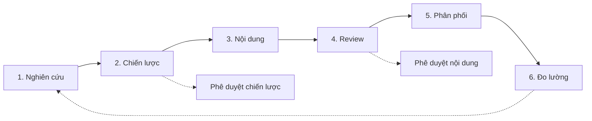

# Marketing Workflow

> **Bạn sẽ:** Điều phối toàn bộ hoạt động marketing từ nghiên cứu ban đầu đến chiến lược, tạo nội dung, phân phối và đo lường hiệu suất với các AI agents được phối hợp.

## Tổng quan

Marketing Workflow là trung tâm chỉ huy của bạn để điều phối tất cả hoạt động marketing. Khác với các quy trình tập trung xử lý các nhiệm vụ cụ thể, quy trình này điều phối toàn bộ quy trình marketing qua nghiên cứu, chiến lược, nội dung, phân phối và đo lường.

Hãy nghĩ đây là bản tổng phổ cho dàn nhạc marketing của bạn. Nhiều agents làm việc hài hòa - researchers thu thập insights, planners tạo chiến lược, content creators phát triển tài sản, và analysts đo lường kết quả. Mỗi giai đoạn cung cấp dữ liệu và quyết định quan trọng cho giai đoạn tiếp theo.

Quy trình này phù hợp với các chương trình marketing toàn diện, chu kỳ lập kế hoạch hàng quý và quản lý hoạt động marketing liên tục.

## Thông tin

- **Thời gian ước tính:** Liên tục (với các chu kỳ hàng tháng/hàng quý)
- **Độ khó:** Nâng cao
- **Điều kiện tiên quyết:**
  - Đã cài ClaudeKit Marketing Kit
  - Đã xác định mục tiêu marketing
  - Đã phân công vai trò nhóm
  - Đã phân bổ ngân sách

## Quy trình



## Hướng dẫn từng bước

### Bước 1: Nghiên cứu và Insights

Thu thập thông tin cạnh tranh, insights đối tượng, xu hướng thị trường và cơ hội từ khóa để định hướng chiến lược.

```bash
"Research B2B SaaS market for Q2 marketing campaign.
Include: competitor analysis, audience insights, trends.
Save report to plans/reports/2025-Q2-research.md"
```

**Điều gì xảy ra:** Agent researcher phân tích đối thủ cạnh tranh, nghiên cứu hành vi đối tượng mục tiêu, xác định xu hướng thị trường, tìm cơ hội từ khóa và tổng hợp kết quả thành báo cáo toàn diện.

**Checkpoint:** Báo cáo nghiên cứu bao gồm:
- 3-5 hồ sơ đối thủ với điểm mạnh/yếu
- Điểm đau và động lực của đối tượng mục tiêu
- 5-10 xu hướng thị trường liên quan đến doanh nghiệp của bạn
- Từ khóa cơ hội cao với lượng tìm kiếm
- Insights có thể hành động

**Thời gian:** 4-8 giờ

---

### Bước 2: Chiến lược và Lập kế hoạch

Sử dụng insights nghiên cứu, tạo chiến lược marketing xác định mục tiêu, kênh, KPIs và timeline.

```bash
"Create marketing strategy for Q2 2025.
Based on research: plans/reports/2025-Q2-research.md
Include: channels, KPIs, timeline.
Save to plans/2025-Q2-marketing-strategy.md"
```

**Điều gì xảy ra:** Agent planner xác định mục tiêu rõ ràng, chọn kênh tối ưu dựa trên nghiên cứu, đặt KPIs có thể đo lường, tạo timeline chi tiết và phân bổ ngân sách cho các hoạt động.

**Checkpoint:** Tài liệu chiến lược yêu cầu phê duyệt của con người. Xác minh:
- Mục tiêu SMART (Cụ thể, Có thể đo lường, Có thể đạt được, Liên quan, Có thời hạn)
- Lựa chọn kênh được lý giải bởi nghiên cứu
- KPIs phù hợp với mục tiêu kinh doanh
- Timeline thực tế với các milestones
- Phân bổ ngân sách theo kênh

**Thời gian:** 1-2 ngày

---

### Bước 3: Tạo nội dung

Tạo tất cả tài sản nội dung cần thiết cho chiến lược - bài blog, quảng cáo, landing pages, emails và nội dung mạng xã hội.

```bash
"Create content for Q2-product-launch campaign.
Target audience: Marketing managers at B2B companies
Tone: Professional yet approachable
Include: blog posts (3), landing page, email sequence (5), social posts (20)"
```

**Điều gì xảy ra:** Content creators phát triển tất cả tài sản được chỉ định theo brand guidelines, tối ưu cho SEO, tạo biến thể để A/B test và tổ chức nội dung theo kênh và thời gian.

**Checkpoint:** Thư viện nội dung nên có:
- Tất cả tài sản được liệt kê trong chiến lược
- Giọng văn thương hiệu nhất quán trên các nội dung
- Tối ưu SEO được áp dụng
- Biến thể được tạo để kiểm thử
- Tài sản được tổ chức theo kênh/ngày

**Thời gian:** 1-2 tuần

---

### Bước 4: Review và Phê duyệt

Content reviewers kiểm tra tất cả tài sản về tuân thủ thương hiệu, độ chính xác, SEO và tiềm năng chuyển đổi trước khi phân phối.

```bash
"Review all content in content/Q2-product-launch/.
Check: brand alignment, accuracy, SEO, conversion potential.
Report issues and recommendations."
```

**Điều gì xảy ra:** Reviewers phân tích mỗi tài sản theo brand guidelines, kiểm tra thực tế các claim, xác nhận tối ưu SEO, đánh giá CTAs và tổng hợp các vấn đề cần sửa.

**Checkpoint:** Cần phê duyệt của con người sau review. Tất cả nội dung nên:
- Vượt qua kiểm tra tuân thủ thương hiệu
- Đã xác minh thực tế
- Đáp ứng tiêu chuẩn SEO
- Bao gồm CTAs rõ ràng
- Sẵn sàng để phân phối

**Thời gian:** 2-3 ngày

---

### Bước 5: Phân phối

Xuất bản và phân phối nội dung đã được phê duyệt trên tất cả kênh - mạng xã hội, email, blog và quảng cáo - theo timeline chiến lược.

```bash
"Distribute approved Q2-product-launch content.
Channels: Blog, LinkedIn, Twitter, Email, Google Ads
Schedule: Per timeline in plans/2025-Q2-marketing-strategy.md
Track with campaign ID: Q2-2025-launch"
```

**Điều gì xảy ra:** Agents lên lịch bài đăng mạng xã hội, khởi chạy chiến dịch email, xuất bản nội dung blog, kích hoạt chiến dịch quảng cáo và kích hoạt tracking trên tất cả touchpoints.

**Checkpoint:** Phân phối hoàn tất khi:
- Tất cả kênh được kích hoạt theo lịch
- Tracking parameters hoạt động
- Chuỗi email được kích hoạt
- Quảng cáo đã được phê duyệt và đang phục vụ
- Bài blog đã được xuất bản

**Thời gian:** 2-4 giờ để thiết lập, tự động liên tục

---

### Bước 6: Đo lường và Tối ưu

Theo dõi chỉ số hiệu suất, phân tích phân bổ, tạo báo cáo và đề xuất các tối ưu để cải thiện kết quả.

```bash
"Analyze Q2-2025-launch campaign performance.
Metrics: traffic, conversions, engagement, ROI.
Compare to KPIs. Recommend next steps."
```

**Điều gì xảy ra:** Analytics analysts thu thập dữ liệu từ tất cả nguồn, phân tích xu hướng và phân bổ, tính ROI, xác định hiệu suất tốt/kém và cung cấp đề xuất có thể hành động.

**Checkpoint:** Báo cáo hàng tuần/hàng tháng nên cho thấy:
- Hiệu suất so với KPIs theo kênh
- Phân tích phân bổ qua các touchpoints
- ROI và lợi nhuận
- Nội dung/kênh hiệu suất tốt nhất
- Đề xuất tối ưu cụ thể

**Thời gian:** 2-4 giờ hàng tuần, 4-8 giờ hàng tháng

---

## Ví dụ thực tế

### Điểm xuất phát
Công ty SaaS B2B quy mô vừa cần tạo 500 leads có chất lượng trong Q2 trong khi duy trì nhận thức thương hiệu.

### Thực thi

```bash
# Week 1: Research
"Research B2B marketing automation market for Q2.
Focus: Competitors, audience pain points, keyword opportunities.
Industries: SaaS, Tech, Consulting"

# Week 2: Strategy (await approval)
"Create Q2 marketing strategy.
Objectives: 500 MQLs, 50K website visitors, 5% blog growth
Channels: Content marketing, LinkedIn Ads, Email, SEO
Budget: $45K"

# Weeks 3-4: Content creation
"Create content for Q2 strategy:
- 8 blog posts (SEO-optimized)
- 2 lead magnets (ebook, template)
- 2 landing pages (trial, demo)
- 3 email sequences (welcome, nurture, promotional)
- 40 social posts (LinkedIn, Twitter)"

# Week 4: Review (await approval)
"Review all Q2 content for brand, SEO, conversion optimization."

# Week 5: Distribution launch
"Publish Q2 content schedule.
Blog: 2 posts/week
Email: Weekly newsletter + nurture sequences
Social: Daily posts
Ads: LinkedIn campaigns for both lead magnets"

# Weeks 5-18: Ongoing optimization
"Weekly: Analyze performance, optimize budget, adjust targeting.
Monthly: Comprehensive reports, strategy adjustments."
```

### Kết quả
Tạo 647 MQLs (129% mục tiêu), thu hút 68K khách truy cập (136%), tăng danh sách email thêm 2,400 người đăng ký và duy trì tỷ lệ chuyển đổi 42% cho lead magnets. Thư viện nội dung được tạo trong Q2 tiếp tục tạo leads trong Q3-Q4.

---

## Các biến thể phổ biến

### Chu kỳ lập kế hoạch hàng quý
Chạy Nghiên cứu → Chiến lược → Nội dung hàng quý. Phân phối và Đo lường liên tục.

### Marketing luôn hoạt động
Nghiên cứu liên tục, sản xuất nội dung liên tục, tối ưu liên tục. Review chiến lược hàng tháng thay vì lập kế hoạch hàng quý.

### Tập trung vào ra mắt sản phẩm
Nén timeline, tập trung nguồn lực, điều phối PR/events/content cho một khoảnh khắc ra mắt duy nhất.

---

## Xử lý sự cố

### Vấn đề: Chiến lược liên tục thay đổi trong quá trình thực thi

**Nguyên nhân:** Mục tiêu không rõ ràng hoặc áp lực bên ngoài buộc phải xoay trục

**Giải pháp:** Khóa chiến lược sau khi phê duyệt. Tạo quy trình quản lý thay đổi yêu cầu lý giải dựa trên dữ liệu cho các xoay trục. Cho phép các tối ưu nhỏ, các thay đổi lớn yêu cầu chu kỳ lập kế hoạch mới.

---

### Vấn đề: Tắc nghẽn sản xuất nội dung

**Nguyên nhân:** Quá nhiều nội dung được lập kế hoạch hoặc chu kỳ review quá chậm

**Giải pháp:** Ưu tiên nội dung theo tác động. Tạo quy tắc 80/20 - 20% nội dung tạo ra 80% kết quả. Tập trung vào các nội dung có tác động cao trước. Tổng hợp chu kỳ review hàng tuần thay vì từng nội dung.

---

### Vấn đề: Đo lường cho thấy ROI kém

**Nguyên nhân:** Kênh sai, nhắm mục tiêu kém hoặc KPIs không thực tế

**Giải pháp:** Chạy phân tích phân bổ để tìm kênh nào thúc đẩy chuyển đổi. Chuyển ngân sách sang người chiến thắng. Nếu tất cả kênh đều kém, hãy xem xét lại chiến lược và nghiên cứu đối tượng.

---

## Thực hành tốt nhất

**Nghiên cứu là nền tảng của mọi thứ**
Không bao giờ bỏ qua hoặc vội vàng nghiên cứu. Đầu tư 1-2 tuần để tránh nhiều tháng thực thi không hiệu quả. Nghiên cứu tốt = chiến lược rõ ràng = chiến dịch thành công.

**Tích hợp chứ không cô lập**
Marketing workflow điều phối Campaign, Content, SEO và Social workflows. Hãy nghĩ về tích hợp chứ không phải cô lập. Một bài blog đồng thời phục vụ mạng xã hội, email và SEO.

**Đo lường những gì quan trọng**
Theo dõi chỉ số phù phiếm (impressions, followers) nhưng tối ưu cho chỉ số kinh doanh (leads, doanh thu, ROI). Báo cáo cả hai nhưng ra quyết định dựa trên tác động kinh doanh.

---

## Quy trình liên quan

- [Campaign Workflow](/vi/docs/workflows/campaign-workflow) - Thực thi chiến dịch riêng lẻ
- [Content Workflow](/vi/docs/workflows/content-workflow) - Quy trình sản xuất nội dung
- [SEO Workflow](/vi/docs/workflows/seo-workflow) - Tăng trưởng traffic organic
- [Analytics Workflow](/vi/docs/workflows/analytics-workflow) - Đo lường hiệu suất

---

## Agents sử dụng

- [researcher](/vi/docs/marketing/agents/researcher) - Nghiên cứu thị trường và đối tượng
- [planner](/vi/docs/marketing/agents/planner) - Chiến lược và lập kế hoạch
- [content-creator](/vi/docs/marketing/agents/content-creator) - Phát triển nội dung
- [content-reviewer](/vi/docs/marketing/agents/content-reviewer) - Đảm bảo chất lượng
- [social-media-manager](/vi/docs/marketing/agents/social-media-manager) - Phân phối mạng xã hội
- [email-wizard](/vi/docs/marketing/agents/email-wizard) - Chiến dịch email
- [analytics-analyst](/vi/docs/marketing/agents/analytics-analyst) - Phân tích hiệu suất

---

## Commands sử dụng

- `/ck:research` - Tiến hành nghiên cứu thị trường/cạnh tranh
- `/strategy create` - Tạo kế hoạch marketing
- `/ckm:content create` - Sản xuất tài sản nội dung
- `/ckm:campaign launch` - Kích hoạt chiến dịch
- `/ckm:analyze` - Đo lường hiệu suất
