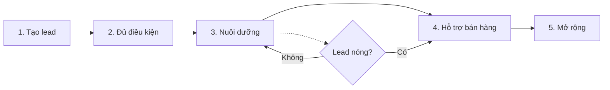

# Sales Workflow

> **Bạn sẽ:** Xây dựng và tự động hóa hệ thống chuyển đổi lead-to-customer hoàn chỉnh với tạo lead, đủ điều kiện, chuỗi nurture, hỗ trợ bán hàng và chiến lược upsell được hỗ trợ bởi AI.

## Tổng quan

Sales Workflow biến người lạ thành khách hàng và khách hàng thành người ủng hộ. Quy trình bao gồm toàn bộ hành trình từ capture lead ban đầu đến đủ điều kiện, nuôi dưỡng, hỗ trợ bán hàng, chốt deal và mở rộng tài khoản.

Năm agents chuyên biệt làm việc cùng nhau - attraction specialists tạo leads, lead qualifiers chấm điểm và phân khúc, email wizards nuôi dưỡng prospects, sale enablers tạo tài liệu và upsell maximizers xác định cơ hội mở rộng. Mỗi giai đoạn được tự động hóa nhưng vẫn cá nhân hóa.

Quy trình này thiết yếu cho sales B2B, chuyển đổi free-to-paid SaaS, B2C giá cao và bất kỳ doanh nghiệp nào có quy trình bán hàng đa chạm.

## Thông tin

- **Thời gian ước tính:** Liên tục (thiết lập 1-2 tuần, thực thi liên tục)
- **Độ khó:** Trung bình
- **Điều kiện tiên quyết:**
  - Đã cài ClaudeKit Marketing Kit
  - Hệ thống CRM đã kết nối
  - Đã xác định tiêu chí chấm điểm lead
  - Đã lập bản đồ quy trình bán hàng

## Quy trình



## Hướng dẫn từng bước

### Bước 1: Tạo lead

Tạo lead magnets, nội dung SEO, landing pages và form capture thu hút và chuyển đổi các prospects lý tưởng của bạn.

```bash
"Create lead generation assets for CloudHR SaaS product.
Target: HR managers at 50-500 employee companies
Include: lead magnet concept, landing page copy, SEO keywords.
Lead magnet: '2025 HR Compliance Checklist' (downloadable PDF)"
```

**Điều gì xảy ra:** Attraction specialist nghiên cứu điểm đau của đối tượng, tạo khái niệm lead magnet hấp dẫn, viết copy landing page tỷ lệ chuyển đổi cao, xác định các từ khóa SEO cho traffic organic và thiết kế form capture lead.

**Checkpoint:** Tài sản tạo lead hoàn tất khi:
- Lead magnet giải quyết điểm đau thực sự
- Landing page có đề xuất giá trị rõ ràng
- Form chỉ hỏi những câu hỏi thiết yếu
- Trang cảm ơn với các bước tiếp theo
- Tracking pixels đã cài đặt

**Thời gian:** 2-3 ngày để thiết lập

---

### Bước 2: Đủ điều kiện lead

Chấm điểm leads dựa trên tín hiệu nhân khẩu học và hành vi, phân khúc theo mức độ ý định và xác định các prospects sẵn sàng mua.

```bash
"Qualify leads from CloudHR-landing source.
Scoring criteria: Company size (0-30 pts), Role (0-25 pts), Engagement (0-45 pts)
Segment into: cold (0-30), warm (31-60), hot (61-100)
Flag high-value prospects for immediate human follow-up."
```

**Điều gì xảy ra:** Lead qualifier phân tích mỗi lead theo tiêu chí chấm điểm, tính tổng điểm, gán phân khúc (lạnh/ấm/nóng), xác định các prospects có giá trị cao dựa trên mức độ phù hợp với công ty và định tuyến leads nóng đến team sales ngay lập tức.

**Checkpoint:** Đủ điều kiện hoạt động khi:
- Mỗi lead được chấm điểm trong 5 phút
- Phân khúc phù hợp với tỷ lệ chuyển đổi (leads nóng chuyển đổi cao hơn 10x)
- Leads có giá trị cao kích hoạt thông báo
- Chấm điểm phản ánh cả sự phù hợp và ý định

**Thời gian:** 1 ngày để thiết lập, tự động sau đó

---

### Bước 3: Chuỗi nuôi dưỡng

Thiết kế và triển khai các chiến dịch drip được cá nhân hóa giáo dục prospects, xây dựng niềm tin và đưa họ đến quyết định mua hàng.

```bash
"Create nurture sequence for warm segment leads.
Journey: awareness → consideration → decision
Length: 6 emails over 21 days
Topics: Problem education, solution overview, case study, objection handling, demo offer, trial incentive
Include: subject lines, body copy, CTAs"
```

**Điều gì xảy ra:** Email wizard tạo chuỗi 6 email với nội dung được cá nhân hóa cho từng giai đoạn, viết subject lines hấp dẫn, bao gồm nội dung/tài nguyên liên quan, thêm CTAs rõ ràng, đặt thời gian gửi tối ưu và xây dựng automation triggers.

**Checkpoint:** Chuỗi nuôi dưỡng sẵn sàng khi:
- Mỗi email có một mục tiêu rõ ràng
- Nội dung tiến triển hợp lý qua hành trình
- CTAs phù hợp với giai đoạn của prospect
- Biến thể A/B test được tạo
- Automation triggers được cấu hình

**Thời gian:** 2-3 ngày để thiết lập

---

### Bước 4: Hỗ trợ bán hàng

Tạo pitch decks, xử lý phản đối, case studies và proposals giúp team sales chốt deals hiệu quả.

```bash
"Create sales materials for CloudHR enterprise prospects.
Include: pitch deck, objection responses for top 5 objections, 2 relevant case studies (tech industry).
Customize for: Data security concerns, integration complexity, ROI timeframe"
```

**Điều gì xảy ra:** Sale enabler xây dựng pitch deck toàn diện làm nổi bật các value props, ghi lại các phản hồi đã được chứng minh cho các phản đối thường gặp, viết case studies trình bày các câu chuyện thành công liên quan, tạo template proposal và chuẩn bị demo script.

**Checkpoint:** Tài liệu bán hàng hoàn tất với:
- Pitch deck (10-15 slides) bao gồm problem/solution/proof
- Phản hồi phản đối cho 5-10 mối quan ngại thường gặp
- 3-5 case studies theo ngành
- Template proposal có thể tùy chỉnh
- ROI calculator hoặc môi trường demo

**Thời gian:** 3-5 ngày cho thư viện ban đầu

---

### Bước 5: Upsell và Mở rộng

Xác định cơ hội mở rộng trong tệp khách hàng hiện có, đề xuất thêm sản phẩm/tính năng và tạo các chiến dịch nâng cấp.

```bash
"Create upsell strategy for CloudHR basic plan customers.
Current product: Basic (1-50 employees)
Expansion targets: Professional (51-200 employees), Enterprise features
Analyze: Usage patterns, company growth signals, engagement scores
Include: messaging, offers, timing, success metrics"
```

**Điều gì xảy ra:** Upsell maximizer phân tích dữ liệu khách hàng để tìm tín hiệu mở rộng, xác định khách hàng sẵn sàng nâng cấp, tạo thông điệp nâng cấp được cá nhân hóa, thiết kế các đề nghị ưu đãi, đặt thời gian tiếp cận tối ưu và xây dựng chiến dịch upsell.

**Checkpoint:** Chương trình mở rộng bao gồm:
- Danh sách khách hàng được phân khúc (sẵn sàng nâng cấp vs nuôi dưỡng)
- Thông điệp được cá nhân hóa cho từng phân khúc
- Các đề nghị ưu đãi hấp dẫn
- Chiến lược thời gian (các cột mốc sử dụng, ngày gia hạn)
- Chỉ số thành công (tỷ lệ nâng cấp, doanh thu mở rộng)

**Thời gian:** 1-2 ngày cho chiến lược, thực thi liên tục

---

## Ví dụ thực tế

### Điểm xuất phát
Công ty SaaS B2B bán công cụ quản lý dự án cần tạo 200 leads có chất lượng mỗi tháng và chuyển đổi 10% thành khách hàng trả tiền.

### Thực thi

```bash
# Week 1: Lead generation setup
"Create lead gen system for TaskFlow PM tool.
Lead magnet: 'Project Management Templates Library' (15 templates)
Landing page targeting: Project managers, team leads, startup founders
SEO keywords: project management templates, task tracking tools, team collaboration"

# Week 1: Qualification rules
"Setup lead scoring for TaskFlow.
Fit signals: Company size 10-200 employees (20 pts), PM/Leadership role (25 pts), Tech industry (15 pts)
Intent signals: Downloaded templates (20 pts), Visited pricing (30 pts), Watched demo video (25 pts), Returned 3+ times (20 pts)
Hot threshold: 80+ points = immediate sales alert"

# Week 2: Nurture sequences
"Create 3 nurture tracks:
1. Cold (0-30 pts): 8 emails, 6 weeks - Education focused
2. Warm (31-79 pts): 6 emails, 3 weeks - Solution + social proof
3. Hot (80+ pts): 3 emails, 1 week - Demo + trial offers"

# Week 2: Sales materials
"Build sales enablement library:
- Demo script showcasing top 3 features
- Case studies: Startup (2-week ROI), Agency (team efficiency), Tech company (scaling)
- Objection responses: Price, switching cost, learning curve, integration
- ROI calculator showing time saved vs cost"

# Ongoing: Expansion
"Monthly analysis of customers on Basic plan showing:
- Team size growth (upgrade signal)
- Storage usage >80% (upgrade need)
- Advanced feature attempts (upgrade intent)
Auto-send personalized upgrade offers to high-signal accounts"
```

### Kết quả
Tạo 245 leads có chất lượng mỗi tháng (123% mục tiêu), đạt tỷ lệ chuyển đổi trial-to-paid 14%, 22% khách hàng trả tiền nâng cấp lên gói cao hơn trong 6 tháng và giảm chu kỳ bán hàng từ 45 xuống 28 ngày nhờ tài liệu hỗ trợ bán hàng tốt hơn.

---

## Các biến thể phổ biến

### Bán hàng Enterprise cần nhiều tương tác
- Tập trung vào Bước 4 (Hỗ trợ) với tài liệu tùy chỉnh cho từng prospect
- Chuỗi nuôi dưỡng dài hơn (3-6 tháng)
- Đủ điều kiện thủ công thay thế chấm điểm tự động
- Phương pháp account-based marketing

### SaaS tự phục vụ
- Tự động hóa Bước 1-3, Bước 4 tối thiểu
- Tập trung vào product-led growth (free trial → paid)
- Nuôi dưỡng trong ứng dụng thay thế chuỗi email
- Điểm đủ điều kiện dựa trên sử dụng

### E-commerce giá cao
- Chu kỳ nuôi dưỡng ngắn (7-14 ngày)
- Tập trung mạnh vào bằng chứng xã hội và urgency
- Chiến dịch retargeting thay thế nurture email
- Phục hồi giỏ hàng bị bỏ ở Bước 3

---

## Xử lý sự cố

### Vấn đề: Lượng lead cao nhưng điểm đủ điều kiện thấp

**Nguyên nhân:** Nguồn traffic sai hoặc lead magnet thu hút đối tượng sai

**Giải pháp:** Kiểm tra nguồn traffic. Kiểm tra định vị lead magnet - có quá rộng không? Siết chặt nhắm mục tiêu để thu hút leads phù hợp hơn. Tốt hơn là có 50 leads chất lượng hơn 200 leads không phù hợp.

---

### Vấn đề: Leads không tương tác với email nuôi dưỡng

**Nguyên nhân:** Nội dung không liên quan, thời gian không phù hợp hoặc vấn đề khả năng giao nhận

**Giải pháp:** Kiểm tra tỷ lệ mở (khả năng giao nhận), tỷ lệ nhấp (liên quan), tỷ lệ hủy đăng ký (tần suất). A/B test subject lines, thời gian gửi và chủ đề nội dung. Phân khúc thêm dựa trên chức danh công việc hoặc điểm đau.

---

### Vấn đề: Team sales không sử dụng tài liệu hỗ trợ

**Nguyên nhân:** Tài liệu không phù hợp với các cuộc trò chuyện bán hàng thực tế hoặc quá phức tạp để sử dụng

**Giải pháp:** Phỏng vấn team sales về các phản đối và câu hỏi thực tế. Tạo tài liệu trực tiếp giải quyết các cuộc trò chuyện thực. Làm cho tài liệu dễ tìm và chia sẻ (đặt tên, tổ chức, tích hợp CRM).

---

## Thực hành tốt nhất

**Chấm điểm theo cả Sự phù hợp VÀ Ý định**
Sự phù hợp nhân khẩu học (quy mô công ty, vai trò, ngành) + ý định hành vi (downloads, lượt truy cập, tương tác) = đủ điều kiện chính xác. Đừng chỉ chấm điểm theo một chiều.

**Nuôi dưỡng cung cấp giá trị trước**
Mỗi email nên giáo dục, giải quyết vấn đề hoặc cung cấp tài nguyên. Đừng chỉ "check in" hoặc pitch. Cho đi trước khi yêu cầu.

**Hỗ trợ phản ánh thực tế**
Tài liệu bán hàng nên giải quyết các phản đối thực tế từ prospects thực, không phải lo ngại tưởng tượng. Cập nhật hàng quý dựa trên phân tích win/loss.

---

## Quy trình liên quan

- [Campaign Workflow](/vi/docs/workflows/campaign-workflow) - Tạo leads qua chiến dịch
- [Email Workflow](/vi/docs/workflows/email-workflow) - Xây dựng chuỗi nuôi dưỡng
- [Content Workflow](/vi/docs/workflows/content-workflow) - Tạo nội dung hỗ trợ bán hàng
- [Analytics Workflow](/vi/docs/workflows/analytics-workflow) - Theo dõi chỉ số chuyển đổi

---

## Agents sử dụng

- [attraction-specialist](/vi/docs/marketing/agents/attraction-specialist) - Tạo lead
- [lead-qualifier](/vi/docs/marketing/agents/lead-qualifier) - Chấm điểm và phân khúc lead
- [email-wizard](/vi/docs/marketing/agents/email-wizard) - Chiến dịch nuôi dưỡng
- [sale-enabler](/vi/docs/marketing/agents/sale-enabler) - Tài liệu bán hàng
- [upsell-maximizer](/vi/docs/marketing/agents/upsell-maximizer) - Chiến lược mở rộng

---

## Commands sử dụng

- `/ckm:funnel design` - Xây dựng phễu chuyển đổi
- `/lead score` - Thiết lập quy tắc đủ điều kiện
- `/ckm:email create` - Xây dựng chuỗi nuôi dưỡng
- `/sales materials` - Tạo nội dung hỗ trợ bán hàng
- `/upsell analyze` - Tìm cơ hội mở rộng
