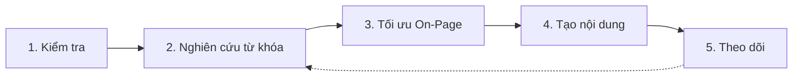

# SEO Workflow

> **Bạn sẽ:** Xây dựng tăng trưởng traffic organic bền vững thông qua kiểm tra SEO hệ thống, nghiên cứu từ khóa chiến lược, tối ưu on-page, tạo nội dung và theo dõi hiệu suất liên tục.

## Tổng quan

SEO Workflow là lộ trình của bạn để thống lĩnh các thứ hạng tìm kiếm. Quy trình bao gồm mọi thứ từ nền tảng kỹ thuật đến chiến lược nội dung và tối ưu liên tục.

Khác với các "sửa nhanh" SEO nhanh chóng mờ đi, quy trình này xây dựng traffic organic dài hạn thông qua cải tiến có hệ thống. Các SEO specialists kiểm tra trang web của bạn, xác định cơ hội, tối ưu các trang, tạo nội dung chiến lược và theo dõi thứ hạng liên tục.

Quy trình này phù hợp với các doanh nghiệp muốn giảm phụ thuộc vào quảng cáo trả tiền, xây dựng tài sản traffic dài hạn và thiết lập thẩm quyền trong thị trường của họ.

## Thông tin

- **Thời gian ước tính:** Thiết lập ban đầu 2-4 tuần, tối ưu liên tục
- **Độ khó:** Trung bình
- **Điều kiện tiên quyết:**
  - Đã cài ClaudeKit Marketing Kit
  - Quyền truy cập website để thực hiện thay đổi kỹ thuật
  - Google Search Console đã kết nối
  - Google Analytics 4 đã cài đặt
  - Nghiên cứu từ khóa cơ bản đã hoàn thành

## Quy trình



## Hướng dẫn từng bước

### Bước 1: Kiểm tra SEO toàn diện

Phân tích sức khỏe SEO kỹ thuật, chất lượng nội dung, bối cảnh cạnh tranh và thứ hạng hiện tại để xác định cơ hội cải tiến.

```bash
"Perform SEO audit for cloudsoftware.com.
Include:
- Technical issues (crawl errors, speed, mobile, Core Web Vitals)
- Content gaps vs competitors
- Top 3 competitor comparison (features they rank for, we don't)
- Current keyword rankings (top 20 keywords)
Save to: plans/reports/2025-03-seo-audit.md"
```

**Điều gì xảy ra:** SEO specialist thu thập website của bạn để tìm các vấn đề kỹ thuật, phân tích tốc độ trang và tính dễ dùng trên mobile, xác định crawl errors và liên kết hỏng, so sánh nội dung của bạn với các đối thủ hàng đầu, kiểm tra thứ hạng từ khóa hiện tại và tổng hợp báo cáo kiểm tra toàn diện với các sửa chữa được ưu tiên.

**Checkpoint:** Báo cáo kiểm tra nên bao gồm:
- 10-20 vấn đề kỹ thuật cụ thể với mức độ nghiêm trọng
- Phân tích khoảng cách nội dung (chủ đề đối thủ đề cập, bạn không có)
- Ma trận so sánh từ khóa đối thủ
- Baseline thứ hạng hiện tại để theo dõi
- Danh sách đề xuất được ưu tiên

**Thời gian:** 4-8 giờ

---

### Bước 2: Nghiên cứu từ khóa chiến lược

Xác định các từ khóa cơ hội cao dựa trên lượng tìm kiếm, độ khó, ý định và khoảng cách cạnh tranh.

```bash
"Research keywords for B2B project management SaaS.
Include:
- Primary keywords (high intent, competitive)
- Long-tail opportunities (lower competition)
- Question-based keywords (for blog content)
- Competitor keyword gaps (they rank, we don't)
Prioritize by: search volume, difficulty, business intent
Target: 50-100 keywords across topic clusters"
```

**Điều gì xảy ra:** Agents phân tích lượng tìm kiếm và xu hướng, đánh giá điểm độ khó từ khóa, ánh xạ ý định tìm kiếm (thông tin vs giao dịch), xác định khoảng cách đối thủ, tổ chức từ khóa thành topic clusters và ưu tiên dựa trên điểm cơ hội.

**Checkpoint:** Tài liệu chiến lược từ khóa bao gồm:
- 5-10 từ khóa chính (lượng tìm kiếm cao, ý định cao)
- 20-30 từ khóa phụ (chủ đề hỗ trợ)
- 30-50 từ khóa long-tail (dễ thắng hơn)
- Từ khóa được tổ chức theo topic cluster
- Xếp hạng ưu tiên kèm lý giải

**Thời gian:** 1-2 ngày

---

### Bước 3: Tối ưu On-Page

Tối ưu các trang hiện có với tiêu đề tốt hơn, meta descriptions, cấu trúc header, internal linking và schema markup.

```bash
"Optimize on-page SEO for /product/features page.
Target keyword: project management features
Include:
- Title tag suggestion (50-60 chars, keyword-optimized)
- Meta description (150-160 chars, compelling + keyword)
- Header optimization (H1, H2s with keyword variations)
- Internal link opportunities (3-5 relevant pages)
- Schema markup (JSON-LD for SoftwareApplication)"
```

**Điều gì xảy ra:** SEO specialist phân tích trang hiện tại, viết title tag tối ưu bao gồm target keyword, soạn meta description hấp dẫn, tái cấu trúc headers hợp lý với từ khóa, xác định cơ hội internal linking, tạo code schema markup và cung cấp hướng dẫn triển khai.

**Checkpoint:** Trang được tối ưu nên có:
- Title tag với từ khóa chính (vị trí 1-3)
- Meta description với từ khóa + call to action
- H1 với từ khóa chính
- H2-H3 với biến thể từ khóa và các thuật ngữ liên quan
- 3-5 internal links đến nội dung liên quan
- Schema markup phù hợp được triển khai

**Thời gian:** 30 phút mỗi trang

---

### Bước 4: Tạo nội dung SEO được tối ưu

Phát triển nội dung mới nhắm đến các từ khóa ưu tiên với phạm vi toàn diện, tối ưu tự nhiên và giá trị người dùng mạnh.

```bash
"Create SEO content for keyword 'agile project management tools'.
Search intent: Informational + commercial comparison
Include:
- Optimized title with keyword
- Comprehensive header structure (H2-H3) with keyword variations
- Target and related keywords (natural integration)
- Internal links to product pages and related guides
- Schema markup (Article + HowTo)
Word count: 2500-3000 (based on top 3 competitor length)"
```

**Điều gì xảy ra:** Content creator nghiên cứu nội dung xếp hạng cao nhất cho từ khóa, cấu trúc outline toàn diện bao gồm tất cả chủ đề phụ, viết nội dung chuyên sâu (phù hợp hoặc vượt qua độ sâu của đối thủ), tích hợp từ khóa tự nhiên, thêm internal links đến các trang liên quan, bao gồm schema markup và tối ưu cho featured snippets.

**Checkpoint:** Nội dung SEO hoàn tất với:
- Từ khóa trong tiêu đề, đoạn đầu và 2-3 H2s
- Phạm vi toàn diện phù hợp với độ sâu đối thủ hàng đầu
- Mật độ từ khóa tự nhiên (1-2%, không nhồi nhét)
- 5-10 internal links đến nội dung liên quan
- Hình ảnh có alt text bao gồm từ khóa
- Schema markup cho kết quả giàu có

**Thời gian:** 4-8 giờ mỗi nội dung

---

### Bước 5: Theo dõi và Lặp lại

Theo dõi thứ hạng từ khóa, phân tích xu hướng traffic organic, xác định cơ hội mới và liên tục tối ưu dựa trên dữ liệu.

```bash
"Monitor SEO performance for cloudsoftware.com.
Metrics:
- Keyword ranking changes (track 50 priority keywords)
- Organic traffic trends (sessions, users, top pages)
- Top performing pages (traffic + conversions)
- CTR improvements (impressions vs clicks)
Period: Last 30 days vs previous 30 days
Recommend: Next optimizations based on data"
```

**Điều gì xảy ra:** Analytics analyst kéo dữ liệu thứ hạng cho các từ khóa được theo dõi, phân tích traffic organic trong Google Analytics, xác định các trang thu hút traffic hàng đầu, tính CTR từ Search Console, phát hiện cải thiện hoặc giảm thứ hạng, xác định cơ hội từ khóa mới và đề xuất các ưu tiên tối ưu tiếp theo.

**Checkpoint:** Báo cáo SEO hàng tháng bao gồm:
- Thay đổi thứ hạng từ khóa (thắng và thua)
- Xu hướng traffic organic (tăng/giảm/ổn định)
- Top 10 trang theo traffic organic
- Các trang có thứ hạng được cải thiện
- Đề xuất cụ thể cho tháng tiếp theo

**Thời gian:** 2-3 giờ hàng tháng

---

## Ví dụ thực tế

### Điểm xuất phát
Công ty SaaS B2B nhận 500 lượt truy cập organic/tháng muốn đạt 5,000/tháng trong 6 tháng.

### Thực thi

```bash
# Month 1: Foundation
"SEO audit for projecthub.io identifying:
- 23 technical issues (slow mobile speed, missing alt text, broken links)
- Content gaps: Missing comparison pages, no how-to guides, thin product pages
- Top 3 competitors ranking for 15 keywords we don't"

"Keyword research generating:
- 8 primary keywords (project management, task tracking, team collaboration)
- 25 secondary keywords (specific features and use cases)
- 45 long-tail keywords (how to, best practices, comparisons)"

# Month 1-2: Technical + quick wins
"Fix critical technical issues: Mobile speed, broken links, missing meta descriptions
Optimize 10 existing pages with new keywords"

# Month 2-4: Content creation
"Create 12 SEO blog posts targeting:
- 4 how-to guides (long-tail keywords)
- 4 comparison articles (vs competitors)
- 4 best practices guides (question keywords)
Each 2000-2500 words, fully optimized"

# Month 4-6: Advanced content
"Create 4 comprehensive guides (3500-5000 words):
- Complete Project Management Guide
- Agile vs Waterfall Comparison
- Remote Team Collaboration Best Practices
- Project Management Tools Buyer's Guide"

# Ongoing: Monthly monitoring
"Month 1: 500 visits, Month 2: 750, Month 3: 1,200, Month 4: 2,100, Month 5: 3,500, Month 6: 5,200"
```

### Kết quả
Vượt qua mục tiêu 5,000 lượt truy cập, đạt 5,200 lượt truy cập organic vào tháng 6. 3 bài blog đạt thứ hạng trang 1, thu hút 40% traffic organic. Cải tiến kỹ thuật tăng điểm tốc độ mobile từ 45 lên 82, giảm bounce rate 25%.

---

## Các biến thể phổ biến

### Tập trung SEO địa phương
Thêm tối ưu địa phương:
- Tối ưu Google Business Profile
- Xây dựng local citation
- Landing pages theo địa điểm cụ thể
- Schema markup địa phương (LocalBusiness)
- Nhất quán NAP trên web

### SEO thương mại điện tử
Thêm tối ưu theo sản phẩm:
- Schema markup sản phẩm
- Tối ưu trang danh mục
- Tổng hợp đánh giá sản phẩm
- FAQ schema cho trang sản phẩm
- Internal linking từ blog đến sản phẩm

### SEO lập trình (pSEO)
Mở rộng với templates:
- Tạo templates trang cho các mẫu (trang thành phố, trang so sánh, trang thay thế)
- Tự động hóa tạo nội dung với biến
- Xây dựng cấu trúc internal linking có lập trình
- Quản lý hàng nghìn trang một cách có hệ thống

---

## Xử lý sự cố

### Vấn đề: Thứ hạng giảm đột ngột

**Nguyên nhân:** Cập nhật thuật toán Google, vấn đề kỹ thuật hoặc đối thủ cải thiện

**Giải pháp:** Kiểm tra Search Console để tìm các hành động thủ công hoặc vấn đề bảo mật. Review các thay đổi trang gần đây (bạn có làm hỏng gì không?). Phân tích các trang đối thủ đang vượt qua bạn - điều gì đã thay đổi? Nếu là cập nhật thuật toán, hãy chờ 2-4 tuần trước khi thực hiện thay đổi lớn.

---

### Vấn đề: Tạo nội dung nhưng không cải thiện thứ hạng

**Nguyên nhân:** Nội dung không khớp ý định tìm kiếm, thiếu chiều sâu hoặc SEO on-page kém

**Giải pháp:** Phân tích top 3 kết quả cho target keyword của bạn. Định dạng của chúng là gì (danh sách, hướng dẫn, so sánh)? Chúng dài bao nhiêu? Chúng đề cập những gì mà bạn không có? Phù hợp hoặc vượt qua độ sâu và định dạng của chúng. Đảm bảo tối ưu on-page vững chắc.

---

### Vấn đề: Thứ hạng cao nhưng traffic thấp

**Nguyên nhân:** Từ khóa có lượng tìm kiếm thấp hoặc CTR kém từ kết quả tìm kiếm

**Giải pháp:** Xác minh lượng tìm kiếm cho các từ khóa được xếp hạng - có thể đang xếp hạng cho các thuật ngữ sai. Nếu lượng tìm kiếm tốt nhưng CTR thấp, hãy tối ưu title tags và meta descriptions để hấp dẫn hơn. Thêm số, câu hỏi hoặc power words để tăng lượt nhấp.

---

## Thực hành tốt nhất

**Khớp ý định tìm kiếm trước, tối ưu sau**
Thứ hạng vô dụng nếu bạn không khớp điều người tìm kiếm muốn. Nếu kết quả hàng đầu là bài so sánh, đừng viết hướng dẫn how-to. Khớp định dạng và ý định trước, sau đó tối ưu.

**Xây dựng topic clusters thay vì bài đăng cô lập**
Tạo pillar content (hướng dẫn toàn diện) được liên kết đến cluster content (chủ đề phụ cụ thể). Cấu trúc internal linking này báo hiệu thẩm quyền chủ đề cho Google và cung cấp trải nghiệm người dùng tốt hơn.

**Chất lượng hơn số lượng**
Một hướng dẫn toàn diện 3,000 chữ vượt trội hơn năm bài 500 chữ nông cạn. Google thưởng cho độ sâu, toàn diện và chuyên môn. Tốt hơn là xuất bản 2 nội dung tuyệt vời mỗi tháng hơn 10 nội dung tầm thường.

---

## Quy trình liên quan

- [Content Workflow](/vi/docs/workflows/content-workflow) - Tạo nội dung SEO với cổng kiểm soát chất lượng
- [Marketing Workflow](/vi/docs/workflows/marketing-workflow) - Tích hợp SEO vào chiến lược tổng thể
- [Analytics Workflow](/vi/docs/workflows/analytics-workflow) - Theo dõi hiệu suất SEO

---

## Agents sử dụng

- [seo-specialist](/vi/docs/marketing/agents/seo-specialist) - Kiểm tra, tối ưu, theo dõi
- [content-creator](/vi/docs/marketing/agents/content-creator) - Tạo nội dung SEO
- [attraction-specialist](/vi/docs/marketing/agents/attraction-specialist) - Nghiên cứu từ khóa và chiến lược
- [analytics-analyst](/vi/docs/marketing/agents/analytics-analyst) - Theo dõi hiệu suất

---

## Commands sử dụng

- `/ckm:seo:audit` - Phân tích SEO toàn diện
- `/ckm:seo keywords` - Nghiên cứu từ khóa
- `/ckm:seo optimize` - Tối ưu on-page
- Dùng skill `copywriting` để tạo nội dung được tối ưu SEO
- `/ckm:analyze traffic` - Theo dõi hiệu suất organic
