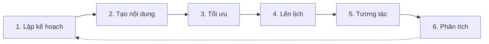

# Social Workflow

> **Bạn sẽ:** Tạo và phân phối nội dung mạng xã hội hấp dẫn trên các nền tảng với lập kế hoạch có hệ thống, tạo theo lô, lên lịch tối ưu và tối ưu dựa trên hiệu suất.

## Tổng quan

Social Workflow giúp bạn duy trì sự hiện diện mạng xã hội nhất quán, hấp dẫn mà không tốn hàng giờ mỗi ngày. Quy trình bao gồm lập kế hoạch nội dung, tạo theo lô, tối ưu nền tảng, lên lịch và phân tích hiệu suất.

Social media managers tạo nội dung theo từng nền tảng cụ thể, tối ưu cho thuật toán của mỗi mạng, lên lịch vào thời điểm tối ưu và phân tích những gì thu hút đối tượng của bạn. Quy trình này hỗ trợ LinkedIn, Twitter, Facebook, Instagram và TikTok.

## Thông tin

- **Thời gian ước tính:** 2-4 giờ hàng tuần (tạo theo lô), 15 phút hàng ngày (tương tác)
- **Độ khó:** Cơ bản
- **Điều kiện tiên quyết:**
  - Đã cài ClaudeKit Marketing Kit
  - Tài khoản mạng xã hội đã kết nối
  - Template lịch nội dung
  - Hướng dẫn giọng văn thương hiệu

## Quy trình



## Hướng dẫn từng bước

### Bước 1: Lập kế hoạch nội dung

Lập kế hoạch lịch nội dung mạng xã hội hàng tuần/hàng tháng phù hợp với mục tiêu marketing và chiến dịch.

```bash
"Create social content calendar for April 2025.
Platforms: LinkedIn, Twitter
Posting frequency: LinkedIn 5x/week, Twitter 3x/day
Content mix:
- 40% educational (tips, how-tos, insights)
- 30% promotional (product features, offers)
- 20% engagement (questions, polls, discussions)
- 10% company (culture, team, behind-scenes)
Include: Key campaigns, product launches, industry events"
```

**Điều gì xảy ra:** Social media manager tạo cấu trúc lịch nội dung, phân bổ bài đăng theo các loại nội dung, căn chỉnh với các chiến dịch marketing và ra mắt sản phẩm, xác định các ngày và sự kiện chính và cân bằng nội dung khuyến mãi với nội dung có giá trị.

**Checkpoint:** Lịch bao gồm ngày và giờ đăng bài, chủ đề/chủ điểm nội dung, tỷ lệ mix loại nội dung, căn chỉnh chiến dịch, phân công nền tảng.

**Thời gian:** 2-3 giờ hàng tháng

---

### Bước 2: Tạo nội dung theo lô

Tạo 1-2 tuần bài đăng mạng xã hội trong một phiên để đạt hiệu quả.

```bash
"Create 2 weeks of social content (20 posts total).
Platforms: 10 LinkedIn, 10 Twitter
Topics from content calendar: Project management tips, product features, customer success stories, industry trends
For each post:
- Hook (first line must grab attention)
- Value/insight (educational or entertaining)
- CTA (engage, click, comment)
- Relevant hashtags (3-5 per platform)
Tone: Professional yet approachable"
```

**Điều gì xảy ra:** Content creator soạn thảo tất cả bài đăng theo chủ đề lịch, viết hooks theo nền tảng cụ thể, tạo nội dung hấp dẫn, thêm CTAs phù hợp, bao gồm hashtags liên quan và tổ chức theo ngày xuất bản.

**Checkpoint:** Tất cả bài đăng được tạo với hooks mạnh, giá trị rõ ràng, độ dài phù hợp nền tảng, CTAs, hashtags, được tổ chức theo ngày.

**Thời gian:** 3-4 giờ mỗi lô (10-15 bài)

---

### Bước 3: Tối ưu theo nền tảng

Điều chỉnh nội dung cho định dạng, đối tượng và sở thích thuật toán của từng nền tảng.

```bash
"Optimize social posts for platform-specific best practices.
LinkedIn posts: Add line breaks for readability, use 3-5 hashtags, tag relevant people/companies
Twitter posts: Keep under 280 chars, use 2-3 hashtags, consider thread format for longer content
Ensure: Native content (no links in initial posts), first-person voice, conversation starters"
```

**Điều gì xảy ra:** Agent định dạng lại bài đăng theo thông số nền tảng, điều chỉnh độ dài và phong cách, tối ưu sử dụng hashtag, thêm các tính năng đặc thù của nền tảng (polls LinkedIn, threads Twitter) và đảm bảo tuân theo các thực hành tốt nhất.

**Checkpoint:** Mỗi bài đăng được tối ưu với định dạng nền tảng (ngắt dòng, độ dài), hashtags phù hợp, tính năng tương tác, phương pháp nội dung gốc.

**Thời gian:** 1-2 giờ mỗi lô

---

### Bước 4: Lên lịch bài đăng

Xếp hàng các bài đăng vào thời điểm tối ưu dựa trên mẫu hoạt động của đối tượng.

```bash
"Schedule social content for next 2 weeks.
LinkedIn: Mon-Fri at 9am, 12pm EST (peak B2B engagement times)
Twitter: Daily at 9am, 1pm, 5pm EST (catch multiple time zones)
Use: Social media scheduling tool (Buffer, Hootsuite, or native)
Enable: First comment with link (for LinkedIn), thread continuation (for Twitter)"
```

**Điều gì xảy ra:** Social media manager tải bài đăng vào công cụ lên lịch, đặt thời gian xuất bản dựa trên cửa sổ tương tác tối ưu, xếp hàng comment đầu tiên có liên kết, thiết lập bài đăng thread và kích hoạt lịch.

**Checkpoint:** Tất cả bài đăng được lên lịch với thời gian tối ưu, comments đầu tiên đã được xếp hàng, preview đã kiểm tra, theo dõi analytics đã kích hoạt.

**Thời gian:** 30-60 phút mỗi lô

---

### Bước 5: Tương tác hàng ngày

Phản hồi comments, tương tác với đối tượng và theo dõi đề cập thương hiệu.

```bash
"Daily social engagement routine (15 minutes):
1. Respond to comments on our posts (within 1-2 hours)
2. Engage with target audience posts (like, comment on 5-10 relevant posts)
3. Monitor brand mentions and respond
4. Identify trending topics relevant to our brand
5. Note high-performing content for analysis"
```

**Điều gì xảy ra:** Community manager phản hồi comments và tin nhắn, tương tác chân thực với nội dung của đối tượng, theo dõi đề cập thương hiệu, xác định các cuộc trò chuyện đang trending và ghi lại các mẫu tương tác.

**Checkpoint:** Tương tác hàng ngày hoàn tất với comments được trả lời, tương tác chủ động đã thực hiện, đề cập đã được theo dõi, xu hướng đã được ghi chú.

**Thời gian:** 15-30 phút hàng ngày

---

### Bước 6: Phân tích hiệu suất

Phân tích hiệu suất bài đăng, xác định các mẫu nội dung thắng và tối ưu nội dung tương lai.

```bash
"Analyze social media performance for April 2025.
Metrics by platform: Impressions, engagement rate, clicks, follower growth
Identify:
- Top 5 performing posts (by engagement rate)
- Content types that resonate (educational vs promotional)
- Optimal posting times (actual engagement vs scheduled times)
- Hashtag effectiveness
Recommend: Content adjustments for May calendar"
```

**Điều gì xảy ra:** Analytics analyst review dữ liệu hiệu suất trên các nền tảng, xác định các loại và chủ đề nội dung hiệu suất cao nhất, phân tích thời gian đăng bài tối ưu, đánh giá hiệu suất hashtag và đề xuất các tối ưu cho kỳ tiếp theo.

**Checkpoint:** Phân tích bao gồm các bài đăng hiệu suất cao nhất, insights loại nội dung, tối ưu thời gian, đề xuất cụ thể cho tháng tiếp theo.

**Thời gian:** 1-2 giờ hàng tháng

---

## Ví dụ thực tế

### Điểm xuất phát
Công ty SaaS B2B đăng bài rải rác trên LinkedIn, muốn có sự hiện diện nhất quán để tăng traffic và nhận thức thương hiệu.

### Thực thi

```bash
# Week 1: Plan Q2 content
"Create LinkedIn content calendar Q2 2025.
Goal: Build thought leadership, drive 500 monthly clicks to website
Frequency: 5 posts/week (M, Tu, W, Th, F)
Content pillars:
- Product management tips (educational)
- Platform feature highlights (promotional)
- Customer success stories (social proof)
- Industry trends and commentary (thought leadership)"

# Week 1: Batch create Month 1
"Create 20 LinkedIn posts for April:
- 8 PM tips (carousel posts with actionable advice)
- 5 feature highlights (video demos + text explanation)
- 4 customer stories (quote + results)
- 3 industry trends (hot takes + discussion prompts)
Each with hook, value, CTA, 3-5 relevant hashtags"

# Week 1: Optimize and schedule
"Optimize all posts for LinkedIn algorithm:
- Line breaks every 1-2 sentences for readability
- Native video uploads (not YouTube links)
- First comment with article link (not in main post)
- Tag customers in their success stories
Schedule: Mon-Fri, 9am EST (peak engagement time for our audience)"

# Daily: 15-minute engagement
"Respond to all comments within 2 hours
Engage with 10 posts from target audience (project managers, product leaders)
Document which posts generate most discussion"

# Month end: Analysis
"April LinkedIn analysis:
- 22 posts published, 45K impressions, 3.8% engagement rate (above 2.5% avg)
- Top performers: PM tips carousels (5.2% engagement), customer stories (4.9%)
- Worst performers: Direct feature promotions (1.8%)
- Optimal time: 9am posts perform 30% better than 12pm
- Follower growth: +240 (15% month over month)"
```

### Kết quả
Đăng bài nhất quán tăng followers 35% trong 3 tháng, tỷ lệ tương tác cải thiện từ 1.2% lên 3.8%, lượt truy cập website tăng lên 680/tháng (136% mục tiêu). Bài đăng carousel giáo dục trở thành định dạng đặc trưng thu hút 60% tương tác.

---

## Các biến thể phổ biến

### Chiến lược đa nền tảng
Điều chỉnh nội dung trên các nền tảng:
- Tạo nội dung master
- Thích nghi cho từng nền tảng (bài LinkedIn → thread Twitter → carousel Instagram)
- Tối ưu thời gian theo từng nền tảng
- Theo dõi hiệu suất riêng biệt

### Phương pháp Video-first
Tập trung vào nội dung video:
- Video dạng ngắn (TikTok, Reels, YouTube Shorts)
- Tái sử dụng video dài thành clip ngắn
- Định dạng và tính năng theo nền tảng
- Phụ đề để đảm bảo khả năng tiếp cận

### Tập trung xây dựng cộng đồng
Tương tác hơn là phát sóng:
- Ít bài đăng khuyến mãi hơn
- Nhiều câu hỏi khởi động cuộc trò chuyện hơn
- Phiên hỏi đáp thường xuyên
- Các chiến dịch nội dung do người dùng tạo

---

## Xử lý sự cố

### Vấn đề: Tương tác thấp dù đăng bài đều đặn

**Nguyên nhân:** Nội dung không thu hút, thời gian không đúng hoặc thiếu hành vi tương tác

**Giải pháp:** Phân tích các đối thủ hiệu suất cao - định dạng và chủ đề nào hoạt động? Kiểm thử các loại nội dung khác nhau (văn bản vs video vs carousel). Tương tác chủ động với nội dung của người khác trước khi mong đợi tương tác trên bài của bạn. Đặt câu hỏi, dùng polls, tạo thảo luận.

---

### Vấn đề: Bài đăng tiếp cận ít người (impressions thấp)

**Nguyên nhân:** Thuật toán ưu tiên thấp hơn, hashtags sai hoặc đăng vào giờ ít hoạt động

**Giải pháp:** Dùng các tính năng gốc của nền tảng (polls LinkedIn, threads Twitter). Tránh liên kết ngoài trong bài đăng ban đầu. Kiểm thử thời gian đăng. Dùng hashtags có 10K-100K bài đăng (điểm ngọt - có thể khám phá nhưng không quá cạnh tranh). Tương tác trong giờ đầu sau khi đăng.

---

### Vấn đề: Có lượt nhấp nhưng không có chuyển đổi

**Nguyên nhân:** Sự không khớp giữa nội dung mạng xã hội và landing page

**Giải pháp:** Đảm bảo landing page khớp với lời hứa của bài đăng. Nếu bài nói về "10 mẹo PM," hãy liên kết đến bài viết có những mẹo đó, không phải trang chủ chung chung. Dùng UTM tracking để xem bài đăng nào thu hút traffic chất lượng.

---

## Thực hành tốt nhất

**Tạo theo lô nhưng đăng tự nhiên**
Tạo 2 tuần nội dung trong một phiên để đạt hiệu quả, nhưng lên lịch để trông tự nhiên và kịp thời. Tham chiếu các sự kiện hiện tại, tương tác với các chủ đề đang trending, không trông máy móc.

**Hook trước tiên**
Dòng đầu tiên quyết định người ta có đọc tiếp không. Làm cho nó gây chú ý - câu hỏi, tuyên bố táo bạo, sự thật bất ngờ, điểm đau dễ cảm thông. Phần giới thiệu chung chung bị bỏ qua.

**Tương tác là hai chiều**
Muốn có comments trong bài của bạn? Hãy comment vào bài của người khác trước. Muốn được chia sẻ? Hãy chia sẻ nội dung của người khác. Mạng xã hội thưởng cho sự đáp lại. Dành 50% thời gian để tương tác, 50% để đăng bài.

---

## Quy trình liên quan

- [Content Workflow](/vi/docs/workflows/content-workflow) - Tạo nội dung mạng xã hội với cổng kiểm soát chất lượng
- [Campaign Workflow](/vi/docs/workflows/campaign-workflow) - Mạng xã hội như kênh chiến dịch
- [Brand Workflow](/vi/docs/workflows/brand-workflow) - Đảm bảo tính nhất quán thương hiệu
- [Analytics Workflow](/vi/docs/workflows/analytics-workflow) - Theo dõi hiệu suất mạng xã hội

---

## Agents sử dụng

- [social-media-manager](/vi/docs/marketing/agents/social-media-manager) - Lập kế hoạch và lên lịch nội dung
- [content-creator](/vi/docs/marketing/agents/content-creator) - Tạo bài đăng
- [community-manager](/vi/docs/marketing/agents/community-manager) - Tương tác và phản hồi
- [analytics-analyst](/vi/docs/marketing/agents/analytics-analyst) - Phân tích hiệu suất

---

## Commands sử dụng

- `/ckm:social create` - Tạo bài đăng mạng xã hội
- `/ckm:social schedule` - Xếp hàng bài đăng để xuất bản
- `/ckm:social analyze` - Phân tích hiệu suất
- `/ckm:youtube:social` - Chuyển đổi video thành nội dung mạng xã hội
