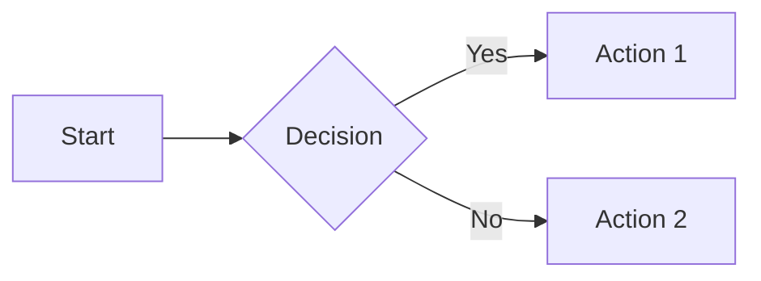
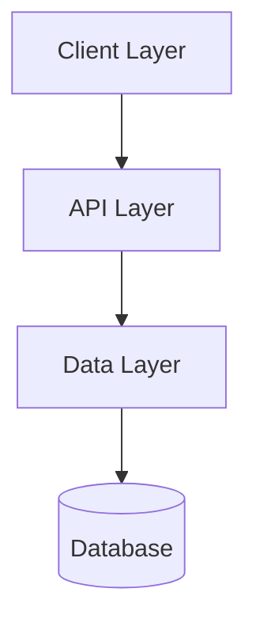
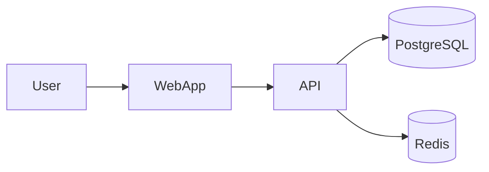
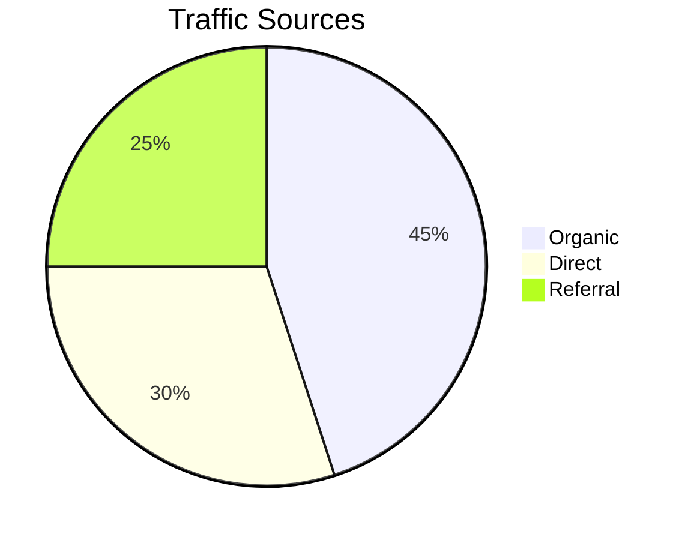
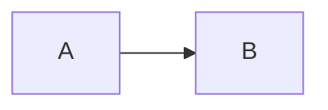
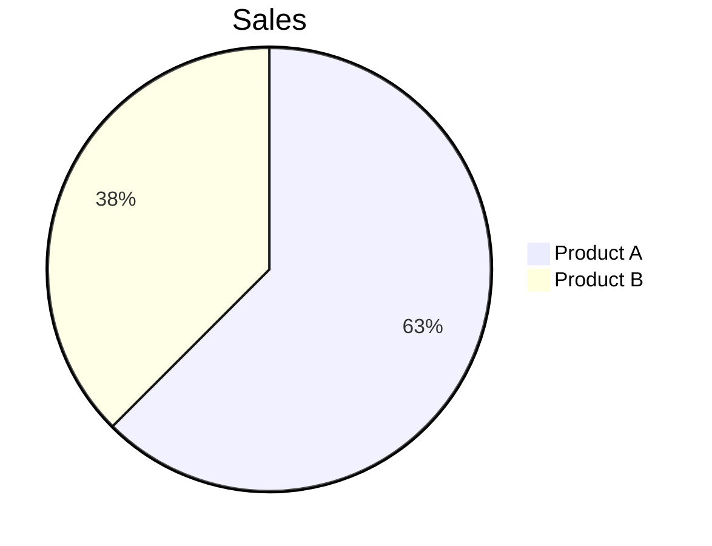
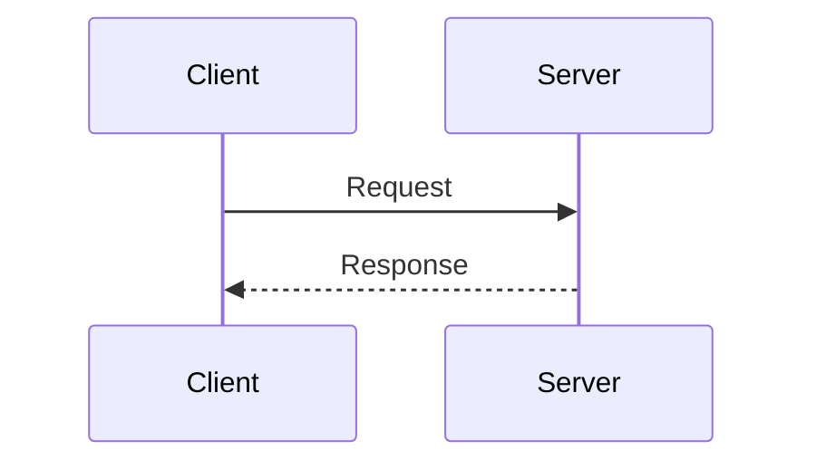

# Markdown Novel Viewer

> Universal viewer for markdown files and directories with book-like reading experience, Mermaid diagram support, and plan navigation.

## What This Skill Does

Markdown Novel Viewer is a background HTTP server that renders markdown files with a warm, book-inspired theme optimized for long-form reading. It automatically detects and renders Mermaid diagrams, provides plan navigation for multi-file documents, and supports both file viewing and directory browsing.

This skill transforms technical markdown into a pleasant reading experience with serif fonts, optimal line length, and theme-aware syntax highlighting. Perfect for reviewing plans, documentation, or any markdown content that deserves better than raw text.

## Prerequisites

**Installation Required**:
```bash
# Option 1: Install via ClaudeKit CLI (recommended)
ck init  # Runs install.sh which handles all skills

# Option 2: Manual installation
cd .claude/skills/markdown-novel-viewer
npm install
```

**Dependencies**: `marked`, `highlight.js`, `gray-matter`

**Without installation**: You'll get **Error 500: Error rendering markdown**.

## Activation

This skill activates automatically when:
- User wants to preview markdown files
- User mentions viewing plans or documentation
- User needs to browse directory structures
- User references markdown rendering or preview

Manual activation:
```bash
/preview [file-or-directory]
```

## Quick Start

```bash
# View a markdown file
node .claude/skills/markdown-novel-viewer/scripts/server.cjs \
  --file ./plans/my-plan/plan.md \
  --open

# Browse a directory
node .claude/skills/markdown-novel-viewer/scripts/server.cjs \
  --dir ./plans \
  --host 0.0.0.0 \
  --open

# Background mode
node .claude/skills/markdown-novel-viewer/scripts/server.cjs \
  --file ./README.md \
  --background

# Stop all running servers
node $HOME/.claude/skills/markdown-novel-viewer/scripts/server.cjs --stop
```

## Features

### Novel Theme

**Light mode**:
- Warm cream background (#faf8f3)
- Saddle brown accents (#8b4513)
- Optimized for daylight reading

**Dark mode**:
- Near black background (#1a1a1a)
- Warm gold accents (#d4a574)
- Reduced eye strain for night reading

**Typography**:
- Libre Baskerville serif for headings (classic, readable)
- Inter for body text (modern, clean)
- JetBrains Mono for code (optimized for programming)
- Maximum 720px content width (optimal line length)

### Mermaid.js Diagrams

Auto-renders mermaid code blocks as diagrams:

````markdown

````

**Supported diagram types**:
- Flowcharts (LR, TB, TD)
- Sequence diagrams
- Pie charts
- Gantt charts
- XY charts (bar, line)
- Mindmaps
- Quadrant charts

**Error handling**: Shows error message with source preview for debugging.

### Directory Browser

Clean file listing with:
- Emoji icons (📄 for files, 📁 for folders)
- Markdown files link to viewer
- Folders link to sub-directories
- Parent directory navigation (..)
- Light/dark mode support

### Plan Navigation

Auto-detects plan directory structure:
- Sidebar shows all phases with status indicators
- Previous/Next navigation buttons
- Keyboard shortcuts: Arrow Left/Right
- Smooth scrolling between phases

### Keyboard Shortcuts

| Key | Action |
|-----|--------|
| `T` | Toggle theme (light/dark) |
| `S` | Toggle sidebar |
| `←` `→` | Navigate phases (in plan view) |
| `Esc` | Close sidebar (mobile) |

## CLI Options

| Option | Description | Default |
|--------|-------------|---------|
| `--file <path>` | Markdown file to view | - |
| `--dir <path>` | Directory to browse | - |
| `--port <number>` | Server port | 3456 |
| `--host <addr>` | Host to bind (`0.0.0.0` for remote) | localhost |
| `--open` | Auto-open browser | false |
| `--background` | Run in background | false |
| `--stop` | Stop all servers | - |

## Architecture

```
scripts/
├── server.cjs               # Main entry point
└── lib/
    ├── port-finder.cjs      # Dynamic port allocation (3456-3500)
    ├── process-mgr.cjs      # PID file management
    ├── http-server.cjs      # Core HTTP routing
    ├── markdown-renderer.cjs # MD→HTML conversion with Mermaid
    └── plan-navigator.cjs   # Plan detection & navigation

assets/
├── template.html            # Markdown viewer template
├── novel-theme.css          # Combined light/dark theme
├── reader.js                # Client-side interactivity
└── directory-browser.css    # Directory browser styles
```

## HTTP Routes

| Route | Description |
|-------|-------------|
| `/view?file=<path>` | Markdown file viewer |
| `/browse?dir=<path>` | Directory browser |
| `/assets/*` | Static assets (CSS, JS, fonts) |
| `/file/*` | Local file serving (for images) |

## Capabilities

### Markdown Rendering with Mermaid

View technical documentation with diagrams:

````markdown
# Architecture Overview

System consists of three layers:



## Implementation Details
...
````

**When to use**: Technical docs, architecture diagrams, process flows, data visualizations.

### Directory Browsing

Navigate documentation hierarchies:

```
docs/
├── getting-started/
│   ├── installation.md
│   └── quickstart.md
├── guides/
│   ├── authentication.md
│   └── deployment.md
└── api/
    └── reference.md
```

Browser shows clickable tree structure.

**When to use**: Exploring unfamiliar codebases, navigating documentation sites, browsing plan archives.

### Plan Navigation

Multi-file plan viewing with sidebar:

```
plans/feature-x/
├── plan.md
├── phase-01-research.md
├── phase-02-design.md
└── phase-03-implement.md
```

Viewer detects plan structure, adds navigation sidebar with Previous/Next buttons.

**When to use**: Reviewing implementation plans, walking through multi-phase docs, presenting project timelines.

### Remote Access

View on any device:

```bash
node server.cjs --file ./README.md --host 0.0.0.0 --port 3456
```

Output includes network URL:

```json
{
  "success": true,
  "url": "http://localhost:3456/view?file=...",
  "networkUrl": "http://192.168.2.75:3456/view?file=...",
  "port": 3456
}
```

**When to use**: Read docs on phone/tablet, share preview with team, demo documentation.

## Examples

### Example 1: Preview Plan Before Submission

```bash
# Preview plan with all phases
/preview plans/feature-auth/plan.md

# Opens in browser with:
# - Warm reading theme
# - All Mermaid diagrams rendered
# - Phase navigation sidebar
# - Light/dark mode toggle
```

### Example 2: Browse Documentation Hierarchy

```bash
# Browse docs directory
/preview docs/

# Shows file tree:
# 📁 getting-started/
#   📄 installation.md
#   📄 quickstart.md
# 📁 guides/
#   📄 authentication.md
```

Click files to view, folders to descend.

### Example 3: Review Mermaid Diagrams

````markdown
# System Architecture




````

Both diagrams render with proper styling, theme-aware colors.

## Best Practices

**Use relative image paths**: Images load correctly when paths are relative to markdown file.

**Test Mermaid syntax**: Validate diagrams at https://mermaid.live before embedding.

**Organize plans hierarchically**: Place related markdown files in same directory for auto-detected navigation.

**Use background mode for persistence**: Keep server running while working in terminal.

**Leverage keyboard shortcuts**: Press `T` to toggle theme quickly, `S` for sidebar.

**Check port availability**: Server auto-increments (3456-3500) if port in use.

## Mermaid Diagram Tips

### Common Errors and Fixes

**Parse error - Invalid syntax**:


**Pie chart value format**:


**Sequence diagram participants**:


### Validating Mermaid

Use Mermaid Live Editor for quick validation: https://mermaid.live

Paste diagram code, verify rendering before adding to docs.

## Troubleshooting

**Problem**: Port 3456 already in use.

**Solution**: Server auto-increments to next available port (3456-3500). Check terminal output for actual port.

---

**Problem**: Images not loading in rendered markdown.

**Solution**: Ensure image paths are relative to markdown file location. Absolute paths won't work.

---

**Problem**: Mermaid diagram shows error instead of rendering.

**Solution**: Viewer displays error message with source preview. Check syntax at mermaid.live, fix diagram code, refresh page.

---

**Problem**: Server won't stop with `--stop` command.

**Solution**: Check `/tmp/md-novel-viewer-*.pid` for stale PID files. Manually delete PID files or kill process.

---

**Problem**: Can't access from phone on network.

**Solution**: Use `--host 0.0.0.0` to bind all interfaces. Use networkUrl from output. Check firewall allows port 3456.

---

**Problem**: Theme doesn't match preference.

**Solution**: Press `T` key to toggle theme. Preference saves to localStorage.

## Customization

### Theme Colors

Edit `assets/novel-theme.css`:

```css
/* Light mode */
--bg-primary: #faf8f3;      /* Warm cream */
--accent: #8b4513;          /* Saddle brown */

/* Dark mode */
--bg-primary: #1a1a1a;      /* Near black */
--accent: #d4a574;          /* Warm gold */
```

### Content Width

```css
--content-width: 720px;  /* Optimal line length for reading */
```

### Typography

Replace font families in CSS variables to match brand guidelines.

## Related Skills

- [Plans Kanban](/docs/engineer/skills/plans-kanban) - Dashboard view of multiple plans
- [AI Artist](/docs/engineer/skills/ai-artist) - Generate content for documentation
- [Frontend Design](/docs/engineer/skills/frontend-design) - Design documentation sites

## Related Commands

- `/preview` - Quick access to viewer (alias for this skill)
- `/kanban` - Dashboard view for plan directories
