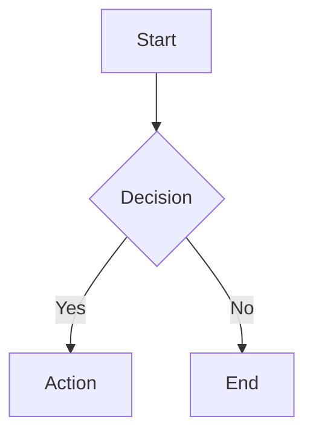
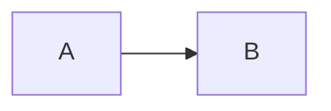

Text-based diagram creation using Mermaid.js v11 declarative syntax. Convert code to SVG/PNG/PDF or render in browsers and markdown.

## What This Skill Does

The Mermaid.js skill enables you to create professional diagrams using simple text syntax. From flowcharts to Gantt charts, sequence diagrams to entity-relationship models—all defined in code, version-controlled, and rendered beautifully.

Think of it as diagrams-as-code. No more wrestling with visual tools—describe your diagram in text and let Mermaid render it perfectly every time.

## Core Capabilities

- **24+ diagram types**: Flowcharts, sequence, class, state, ER, Gantt, journey, timeline, and more
- **CLI conversion**: Export to SVG, PNG, PDF with custom themes
- **JavaScript integration**: Embed in web apps with CDN or npm
- **Configuration**: Themes (default, dark, forest, neutral, base), fonts, security levels
- **Comments**: Add documentation with `%% ` prefix

## Common Diagram Types

- `flowchart` - Process flows, decision trees
- `sequenceDiagram` - Actor interactions, API flows
- `classDiagram` - OOP structures, data models
- `stateDiagram` - State machines, workflows
- `erDiagram` - Database relationships
- `gantt` - Project timelines
- `journey` - User experience flows

## Quick Start

**Basic Structure:**
```
{diagram-type}
  {diagram-content}
```

**Example Flowchart:**
````markdown

````

## CLI Usage

```bash
# Installation
npm install -g @mermaid-js/mermaid-cli

# Convert to image
mmdc -i diagram.mmd -o diagram.svg

# With theme and background
mmdc -i input.mmd -o output.png -t dark -b transparent
```

## Usage

Activate when needing architecture diagrams, data flow visualization, timelines, state machines, or any visual documentation.

## Example Prompts

- "Create a flowchart showing the authentication process"
- "Generate a sequence diagram for the API checkout flow"
- "Build an ER diagram for our database schema"
- "Make a Gantt chart for the Q1 roadmap"
- "Create a state diagram for the order fulfillment workflow"
- "Generate a class diagram for the user management system"

## Configuration & Theming

**Common Options:**
- `theme`: "default", "dark", "forest", "neutral", "base"
- `look`: "classic", "handDrawn"
- `fontFamily`: Custom font specification
- `securityLevel`: "strict", "loose", "antiscript"

**Frontmatter Example:**
````markdown

````

## HTML Embedding

```html
<pre class="mermaid">
  flowchart TD
    A[Client] --> B[Server]
</pre>
<script src="https://cdn.jsdelivr.net/npm/mermaid@latest/dist/mermaid.min.js"></script>
<script>mermaid.initialize({ startOnLoad: true });</script>
```

## What Makes This Different

Mermaid diagrams live in your codebase alongside the code they document. They version-control perfectly, review in PRs, and update as easily as changing a line of text. No more outdated diagrams in separate tools.

## Related Resources

- Online Editor: editor.thebookofshaders.com
- CLI tool: glslViewer
- ShaderToy compatibility
