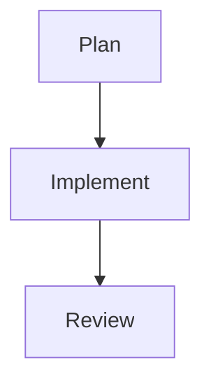

# Markdown Novel Viewer

> Open any markdown file in a beautiful, distraction-free reader with rendered Mermaid diagrams, syntax-highlighted code, and a calm typography-first design.

## What This Skill Does

**The Challenge**: Markdown files in terminal or plain text editors are hard to read for documentation, reports, and plans. Mermaid diagrams render as raw text, code blocks lack highlighting, and long documents have no navigation.

**The Solution**: Markdown Novel Viewer opens markdown in a locally-served HTML reader with novel-like typography, Mermaid.js rendering, syntax highlighting, table of contents, and dark mode — instantly in the browser from any markdown file.

## Activation

**Implicit**: Activates when previewing documentation, viewing plan files, or rendering Mermaid diagrams.

**Explicit**: Activate via prompt:
```
Activate markdown-novel-viewer to view the implementation plan
```

Or slash command:
```
/preview plans/my-plan/plan.md
```

## Capabilities

### 1. Book-Like Typography
Distraction-free reading experience optimized for long-form content.

**Typography features**:
- Comfortable line length (65-75 characters)
- Generous line height (1.6-1.8)
- Serif or readable sans-serif font selection
- Comfortable paragraph spacing
- Smooth scroll behavior

**Available themes**:
- **Light**: Warm cream background, dark ink text
- **Dark**: Deep charcoal, soft white text (One Dark inspired)
- **Sepia**: Classic book-paper feel

### 2. Mermaid.js Rendering
Render Mermaid diagrams from fenced code blocks automatically.

**Supported diagram types**:
- Flowcharts and graph diagrams
- Sequence diagrams
- Gantt charts
- Entity relationship diagrams
- All Mermaid v11 diagram types

**Usage in markdown**:
````markdown

````

Renders as a visual diagram in the viewer.

### 3. Syntax Highlighting
Code blocks with language-aware syntax highlighting.

**Supported languages**: JavaScript, TypeScript, Python, Go, Rust, SQL, Bash, YAML, JSON, and 100+ more via Prism.js or Highlight.js.

### 4. Table of Contents
Auto-generated navigation from heading structure.

**Navigation features**:
- Sidebar TOC generated from H2/H3 headings
- Smooth scroll to section on click
- Active section highlighting as you scroll
- Collapsible for narrow screens

## Prerequisites

- Node.js 18+ (for local server)
- Browser for viewing

## Configuration

**CLI usage**:
```bash
# View file in browser
npx markdown-novel-viewer path/to/file.md

# Specify port
npx markdown-novel-viewer path/to/file.md --port 4000

# Dark theme
npx markdown-novel-viewer path/to/file.md --theme dark
```

**Claude Code integration**: Skills use this to auto-open previews and diagrams during analysis.

## Best Practices

**1. Use for plan review sessions**
Opening plan files in the viewer makes structured review sessions more productive.

**2. Render diagrams before sharing**
Always preview Mermaid diagrams in viewer before sharing — catches syntax errors.

**3. Combine with `/preview` skill**
For generate-and-view workflows, `/preview` creates the markdown + opens viewer automatically.

## Common Use Cases

### Use Case 1: Implementation Plan Review
**Scenario**: Team needs to review phase plan before sprint start.

**Workflow**:
1. Open plan with viewer: `npx markdown-novel-viewer plans/current-sprint/plan.md`
2. Navigate phases via table of contents
3. Rendered Mermaid architecture diagram displays visually
4. Share localhost URL with team for synchronized review

**Output**: Browser-based plan review session with diagrams rendered.

### Use Case 2: Documentation Presentation
**Scenario**: Presenting system architecture to stakeholders without PowerPoint.

**Workflow**:
1. Author architecture doc in markdown with Mermaid diagrams
2. Open in viewer with dark theme
3. Walk through sections using TOC navigation
4. Diagrams render as professional visuals

**Output**: Polished presentation from plain markdown + Mermaid.

### Use Case 3: Code Review with Context
**Scenario**: Review large PR with accompanying technical spec.

**Workflow**:
1. Open spec doc in viewer
2. Keep viewer open in split screen alongside IDE
3. Reference spec sections while reviewing code

**Output**: Side-by-side spec + code review workflow.

## Troubleshooting

**Issue**: Mermaid diagram shows as raw text
**Solution**: Verify fenced block uses exactly ` ```mermaid ` (lowercase, no spaces). Check Mermaid syntax with `/ckm:mermaidjs-v11`.

**Issue**: Viewer not opening in browser
**Solution**: Check if port 3000 is in use. Use `--port 3001` flag. Verify Node.js 18+ installed.

**Issue**: Table of contents missing
**Solution**: Headings must use ATX style (`## Heading`) not Setext style (`Heading\n------`).

## Related Skills

- [Mermaid.js v11](/docs/marketing/skills/mermaidjs-v11) - Create Mermaid diagrams
- [Preview](/docs/marketing/skills/preview) - Generate and preview content
- [Slides](/docs/marketing/skills/slides) - Slide-based presentation alternative
- [Plan](/docs/marketing/skills/plan) - Generate plans viewable in this viewer

## Related Commands

- `/ckm:markdown-novel-viewer` — Open markdown file in viewer
- `/preview` — Generate and preview content
- `/ckm:mermaidjs-v11` — Create diagrams for the viewer
