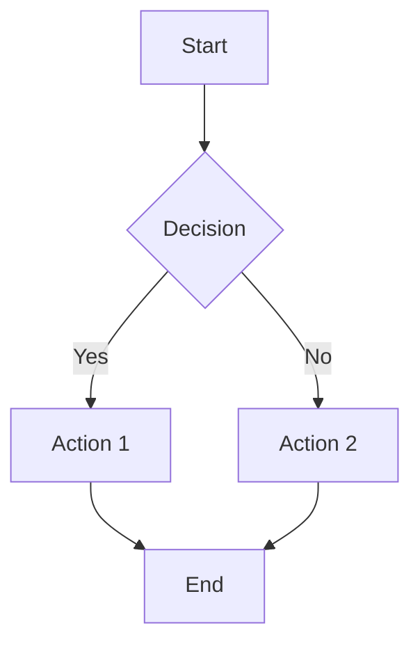
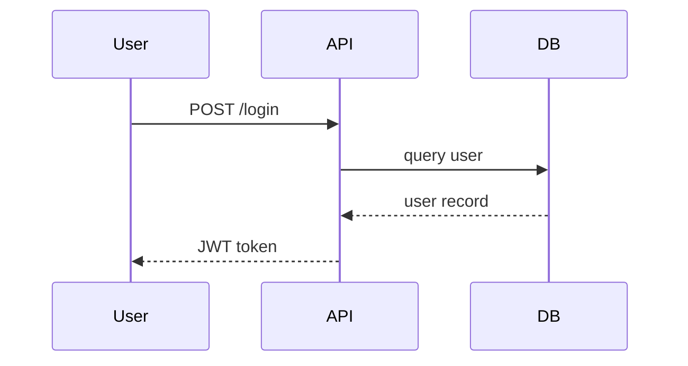
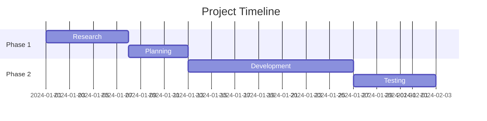
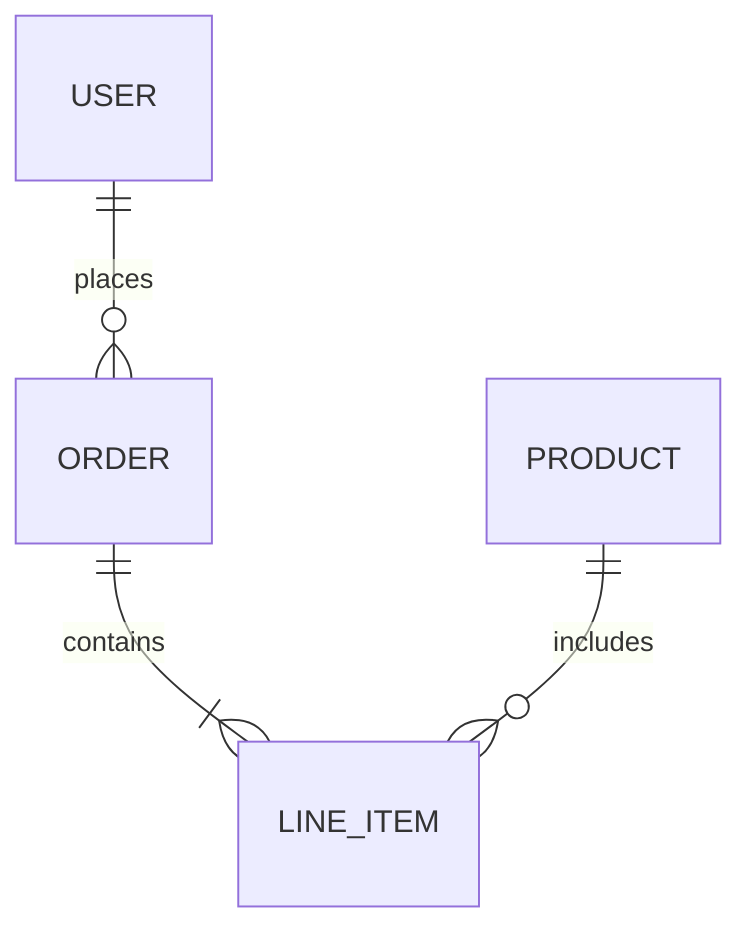
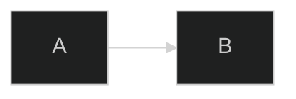

# `ckm:mermaidjs-v11`

> Generate accurate, rendereable Mermaid.js v11 diagrams with proper syntax, theme support, and advanced layout features.

## What This Skill Does

**The Challenge**: Mermaid.js v11 introduced breaking syntax changes and new diagram types. Diagrams written with older syntax or AI-hallucinated syntax fail to render, wasting time on debugging.

**The Solution**: Mermaid.js v11 skill enforces correct v11 syntax rules, covers all supported diagram types, and provides validated templates. Diagrams render correctly on first attempt.

## Activation

**Implicit**: Activates when creating Mermaid diagrams, architecture visualizations, or flowcharts.

**Explicit**: Activate via prompt:
```
Activate mermaidjs-v11 skill to create a sequence diagram for our auth flow
```

## Capabilities

### 1. Flowcharts (graph / flowchart)
Direction-controlled flowcharts with subgraphs and styling.



**v11 note**: Use `flowchart` (not `graph`) for new diagrams. Both work but `flowchart` supports more features.

### 2. Sequence Diagrams
Actor interactions with loops, alternatives, and activation boxes.



### 3. Gantt Charts
Project timelines with milestones and section grouping.



### 4. Entity Relationship Diagrams
Database schema visualization with relationship cardinality.



## Prerequisites

- Mermaid.js v11 renderer (GitHub, Notion, Obsidian, custom integration)
- For preview: `/ckm:markdown-novel-viewer` or `/ckm:preview`

## Configuration

**Diagram theme options** (v11):


**Available themes**: `default`, `dark`, `forest`, `base`, `neutral`

## Best Practices

**1. Declare diagram type on first line**
Always start with `flowchart`, `sequenceDiagram`, `gantt`, etc. Never omit.

**2. Avoid special characters in node labels**
Special chars (`<`, `>`, `&`) break parsing. Use HTML entities or avoid them.

**3. Test incrementally**
Build complex diagrams section by section to isolate syntax errors.

## Common Use Cases

### Use Case 1: User Flow Visualization
**Scenario**: Document onboarding funnel for product and marketing alignment.

**Diagram type**: Flowchart with decision nodes for each funnel step.

**Output**: Shareable diagram embedded in Notion or docs site.

### Use Case 2: System Architecture Diagram
**Scenario**: Visualize microservices and data flow for engineering onboarding.

**Diagram type**: Flowchart with subgraphs for service groupings.

**Output**: Architecture reference embedded in system documentation.

### Use Case 3: Sprint Planning Timeline
**Scenario**: Visualize sprint tasks and dependencies for project planning.

**Diagram type**: Gantt chart with sections per team.

**Output**: Sprint timeline shared in team standup.

## Troubleshooting

**Issue**: Diagram renders as text (not visual)
**Solution**: Check the platform supports Mermaid. GitHub renders fenced ` ```mermaid ` blocks automatically.

**Issue**: Parse error on arrow syntax
**Solution**: Use `-->` for solid, `-.->` for dotted, `==>` for thick. Avoid custom arrow chars.

**Issue**: Subgraph not rendering correctly
**Solution**: Close every subgraph with `end`. Nested subgraphs require careful indentation.

## Related Skills

- [Preview](/docs/marketing/skills/preview) - Render diagrams in browser
- [Slides](/docs/marketing/skills/slides) - Embed diagrams in presentations
- [Sequential Thinking](/docs/marketing/skills/sequential-thinking) - Structured analysis to diagram

## Related Commands

- `/ckm:mermaidjs-v11` - Create Mermaid v11 diagrams
- `/ckm:preview` - Preview diagrams in browser
