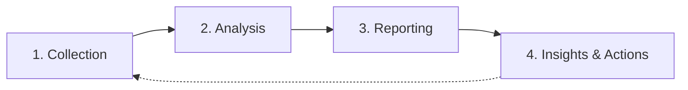

# Analytics Workflow

> **You will:** Transform marketing data into actionable insights through systematic collection, analysis, reporting, and recommendation processes that drive continuous improvement.

## Overview

The Analytics Workflow turns your marketing data into decisions. It covers data collection from multiple sources, trend analysis, report generation, and insight extraction that informs strategy.

Analytics analysts gather data from Google Analytics 4, Search Console, social platforms, email tools, and ad platforms. They identify trends, build attribution models, analyze funnels, and generate reports tailored to different audiences (executives, marketing team, sales).

This workflow is essential for data-driven marketing, performance optimization, budget allocation, and demonstrating marketing ROI.

## Metadata

- **Time Estimate:** Weekly (2-3 hours), Monthly (4-8 hours)
- **Difficulty:** Intermediate
- **Prerequisites:**
  - ClaudeKit Marketing Kit installed
  - Google Analytics 4 configured
  - Google Search Console connected
  - Marketing platforms integrated
  - UTM tracking implemented

## The Workflow



## Step-by-Step Guide

### Step 1: Data Collection

Gather performance data from all marketing platforms - analytics, search, social, email, and advertising.

```bash
"Collect analytics data for March 2025.
Sources: GA4, Google Search Console, LinkedIn, Twitter, Mailchimp, Google Ads
Metrics: traffic, conversions, engagement, ad spend, email performance
Export to: plans/reports/data/2025-03-raw-data.json"
```

**What happens:** Analytics analyst connects to each platform via API or export, extracts relevant metrics (traffic, conversions, engagement, spend), normalizes data formats, combines data into unified dataset, and exports for analysis.

**Checkpoint:** Data collection complete with:
- All platforms represented
- Date ranges consistent across sources
- Key metrics present (traffic, conversions, engagement, spend)
- Data quality checked (no obvious errors or gaps)
- Exported in analyzable format

**Time:** 1-2 hours (monthly), 30 min (weekly)

---

### Step 2: Analyze Performance

Identify trends, analyze attribution, examine funnels, compare segments, and detect anomalies.

```bash
"Analyze marketing data for March 2025.
Focus areas:
- Traffic trends by source (organic, paid, social, email, direct)
- Conversion funnel performance (landing → signup → trial → paid)
- Top/bottom performing content (by traffic and conversions)
- Attribution by channel (first touch, last touch, linear)
Identify: Trends, anomalies, opportunities"
```

**What happens:** Analyst calculates growth rates vs prior period, builds attribution models showing channel contribution, analyzes conversion funnel drop-off points, segments performance by source/campaign/content, identifies statistical anomalies, and highlights opportunities.

**Checkpoint:** Analysis includes:
- Traffic trends with % change vs previous period
- Conversion funnel with stage-by-stage rates
- Channel attribution breakdown
- Top 10 performing pages/campaigns
- Bottom 10 underperformers
- 3-5 key insights or anomalies

**Time:** 2-3 hours

---

### Step 3: Generate Reports

Create dashboards and reports tailored to different audiences - executives, marketing team, sales team.

```bash
"Generate monthly marketing report for March 2025.
Audience: Executive team
Include:
- Key metrics overview (traffic, leads, revenue, ROI)
- Trends and month-over-month comparisons
- Top 3 wins and top 3 concerns
- Channel performance breakdown
- Visual charts (describe for implementation)
Save to: plans/reports/2025-03-executive-report.md"
```

**What happens:** Analyst compiles key metrics into executive summary, creates comparison tables (actual vs target, current vs prior), highlights wins and concerns with context, breaks down performance by channel, describes visualizations needed (line charts for trends, pie charts for attribution), and formats for specified audience.

**Checkpoint:** Report should include:
- Executive summary (3-5 sentences)
- Key metrics table with targets and actuals
- Trend charts (traffic, conversions, revenue)
- Channel performance breakdown
- Top 3 wins and top 3 concerns with context
- Next steps recommendations

**Time:** 2-4 hours

---

### Step 4: Extract Insights and Actions

Identify actionable insights, prioritize recommendations, define next steps, and set optimization targets.

```bash
"Generate insights from plans/reports/2025-03-executive-report.md.
Provide:
- Top 3 data-backed insights (with supporting metrics)
- Recommended actions (prioritized by impact)
- Expected impact of each action
- Resources needed for implementation
Format as actionable tasks with owners and timelines"
```

**What happens:** Analyst extracts patterns from data, identifies what's working and why, recommends specific actions based on insights, estimates impact of recommendations, prioritizes by effort vs impact, and creates implementation plan with owners.

**Checkpoint:** Insights document includes:
- 3-5 specific, data-backed insights
- 5-10 recommended actions prioritized
- Expected impact for each (traffic lift, conversion improvement)
- Resource requirements (time, budget, tools)
- Clear owners and deadlines

**Time:** 1-2 hours

---

## Real-World Example

### Starting Point
SaaS company spending $30K/month across multiple channels needs to optimize budget allocation and improve ROI.

### Execution

```bash
# Week 1: Collect Q1 data
"Collect analytics for Q1 2025 (Jan-Mar).
Sources: GA4, Google Ads, LinkedIn Ads, Mailchimp, Intercom
Metrics: 45K sessions, 2,200 trials, 180 paid conversions, $90K ad spend"

# Week 1: Analyze trends
"Analysis reveals:
- Organic traffic: +35% QoQ, 28% of trials, $15 CAC
- Google Ads: -5% QoQ, 18% of trials, $85 CAC
- LinkedIn Ads: +62% QoQ, 32% of trials, $42 CAC
- Email: +12% QoQ, 22% of trials, $8 CAC
Anomaly: Google Ads performance dropped significantly in March"

# Week 2: Attribution analysis
"Multi-touch attribution shows:
- First touch: Organic (45%), LinkedIn (25%), Google Ads (20%)
- Last touch: Email (35%), Organic (30%), LinkedIn (20%)
- Linear: Email (28%), Organic (27%), LinkedIn (23%), Google Ads (15%)
Insight: Email nurture heavily influences conversions even when not first touch"

# Week 2: Report to exec team
"Q1 Marketing Report:
Total trials: 2,200 (110% of goal)
Paid conversions: 180 (90% of goal)
Overall CAC: $50 (target $45)
ROI: 3.2x ($90K spend → $288K ARR)

Wins: Organic growth, LinkedIn performance, email nurture effectiveness
Concerns: Google Ads efficiency dropping, overall CAC above target, trial-to-paid rate lower than expected"

# Week 2: Action plan
"Recommended actions:
1. HIGH: Shift $8K/month from Google Ads to LinkedIn (expected +25 conversions/mo)
2. HIGH: Increase organic content budget by $3K/month (best CAC, scaling)
3. MEDIUM: Improve trial-to-paid conversion (currently 8.2%, target 10%)
4. MEDIUM: A/B test email nurture sequences (already strong, optimize further)
5. LOW: Audit Google Ads campaigns to identify drop-off cause"
```

### Result
Implemented top 3 recommendations. Q2 results: CAC dropped to $43 (4% below target), conversions increased to 215/month (+19%), ROI improved to 3.8x. Shifting budget from Google Ads to LinkedIn and organic delivered $12K additional ARR while reducing spend by $5K.

---

## Common Variations

### Weekly Performance Dashboards
Quick pulse checks:
- 5-10 key metrics only
- Week-over-week comparison
- Automated generation
- Focus on anomalies requiring immediate action

### Campaign-Specific Analysis
Deep dive into single campaign:
- Complete funnel analysis
- Creative performance comparison
- Audience segment breakdown
- Hour-by-hour or day-by-day trends

### Competitive Benchmarking
Compare your performance vs market:
- Industry benchmark comparisons
- Competitor traffic estimation
- Market share analysis
- Positioning gaps

---

## Troubleshooting

### Issue: Data discrepancies across platforms

**Cause:** Different attribution windows, tracking delays, or bot filtering

**Solution:** Document each platform's methodology. Use GA4 as source of truth for website behavior. Accept 5-10% variance as normal. Focus on trends over time rather than absolute precision.

---

### Issue: Too much data, unclear insights

**Cause:** Trying to track everything instead of focusing on key metrics

**Solution:** Define 5-7 North Star metrics that matter most to business. Track others but report only key metrics. Ask "So what?" for every metric - if you can't answer, don't track it.

---

### Issue: Reports created but no action taken

**Cause:** Insights not clear or recommendations too vague

**Solution:** Every report must end with 3-5 specific, actionable recommendations with owners and deadlines. Don't just report "conversion rate down" - recommend "A/B test new landing page headline, owner: Sarah, deadline: next Friday."

---

## Best Practices

**Trends Matter More Than Point-in-Time Metrics**
A single month's traffic number is meaningless. Is it growing or shrinking? Compare to prior periods, look at 3-6 month trends, identify seasonality. Context is everything.

**Attribution Is Messy But Essential**
No attribution model is perfect. Last-touch ignores nurture, first-touch ignores closing. Use multiple models, understand their biases, make decisions based on directional trends not exact numbers.

**Report for Action Not Information**
Every report should drive decisions. If a metric doesn't lead to action, don't include it. Better to have 5 metrics with clear next steps than 50 metrics with no action.

---

## Related Workflows

- [Campaign Workflow](/docs/marketing/workflows/campaign-workflow) - Measure campaign performance
- [SEO Workflow](/docs/marketing/workflows/seo-workflow) - Track organic traffic growth
- [Sales Workflow](/docs/marketing/workflows/sales-workflow) - Analyze conversion funnels
- [Marketing Workflow](/docs/marketing/workflows/marketing-workflow) - Overall marketing measurement

---

## Agents Used

- [analytics-analyst](/docs/marketing/agents/analytics-analyst) - Data analysis and reporting
- [campaign-debugger](/docs/marketing/agents/campaign-debugger) - Campaign performance optimization

---

## Commands Used

- `/analyze traffic` - Analyze website traffic patterns
- `/analyze campaigns` - Campaign performance analysis
- `/analyze conversions` - Funnel and conversion analysis
- `/analyze:report` - Generate comprehensive reports
