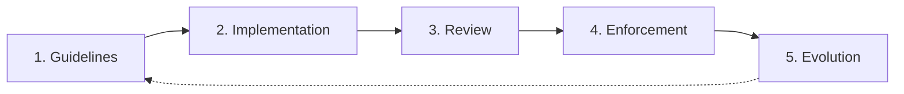

# Brand Workflow

> **You will:** Establish and maintain brand consistency across all marketing channels through clear guidelines, automated checks, and systematic review processes.

## Overview

The Brand Workflow ensures every piece of content - from social posts to landing pages - reflects your brand identity consistently. It covers guidelines creation, content review, compliance checking, and brand asset management.

This workflow prevents the brand drift that happens when multiple people create content without clear standards. Whether you're establishing brand guidelines for the first time or enforcing existing standards, this workflow keeps everything on-brand.

## Metadata

- **Time Estimate:** 1-2 weeks initial setup, ongoing enforcement
- **Difficulty:** Beginner
- **Prerequisites:**
  - ClaudeKit Marketing Kit installed
  - Basic brand identity defined (logo, colors, fonts)
  - Sample content for reference
  - Team access to guidelines

## The Workflow



## Step-by-Step Guide

### Step 1: Create Brand Guidelines

Document voice, tone, visual style, messaging, and content standards in clear, actionable guidelines.

```bash
"Create comprehensive brand guidelines for CloudTask PM software.
Include:
- Voice and tone (professional yet approachable, not corporate-stiff)
- Visual style (colors: #1E40AF primary, #F59E0B accent; fonts: Inter, Geist Mono)
- Messaging framework (positioning, key messages, value props)
- Content standards (grammar rules, formatting, terminology)
- Examples (do's and don'ts with side-by-side comparisons)
- Usage rules (logo, imagery, social media)
Save to: .claude/brand-guidelines.md"
```

**What happens:** Content team compiles existing brand elements, defines voice characteristics with examples, documents visual standards, creates messaging hierarchy, writes content standards, provides concrete examples, and formats as accessible reference document.

**Checkpoint:** Guidelines complete with voice definition (3-5 characteristics with examples), visual standards (colors, fonts, logo usage), messaging framework, content do's and don'ts, real examples.

**Time:** 1-2 weeks for comprehensive guidelines

---

### Step 2: Implement Guidelines

Integrate brand guidelines into content creation workflows and train team members.

```bash
"Implement brand guidelines in ClaudeKit workflows.
Actions:
- Add brand-guidelines-reminder hook to content creation workflows
- Configure content-reviewer agent with brand standards
- Create brand checklist for manual reviews
- Train team on guidelines (async doc + live Q&A session)
- Set up brand asset library (logos, images, templates)
Test: Create sample content and verify guideline adherence"
```

**What happens:** Guidelines are integrated into automated workflows triggering reminders before content creation, reviewer agent configured to check brand compliance, team receives training on guidelines, brand assets organized in accessible library, and test content created to verify implementation.

**Checkpoint:** Implementation complete with guidelines integrated in workflows, team trained, asset library created, sample content passing brand checks.

**Time:** 2-3 days

---

### Step 3: Review Content

Check all content against brand guidelines before publication using automated and manual review.

```bash
"Review blog post for brand compliance.
Content: content/drafts/pm-best-practices.md
Check against guidelines:
- Voice: Professional yet approachable (not too casual or corporate)
- Tone: Helpful and empowering (not condescending)
- Terminology: Use 'tasks' not 'to-dos', 'team members' not 'users'
- Formatting: Oxford comma, sentence case headers, no exclamation marks
- Messaging: Emphasize collaboration and efficiency
Report: Issues and recommendations"
```

**What happens:** Content reviewer analyzes content against documented brand standards, identifies voice and tone inconsistencies, flags incorrect terminology, checks formatting adherence, verifies messaging alignment, and provides specific fix recommendations.

**Checkpoint:** Review complete with brand compliance score, specific issues identified, fix recommendations provided, approval or revision needed.

**Time:** 15-30 minutes per piece

---

### Step 4: Enforce Standards

Use automated checks and manual oversight to maintain consistent brand application.

```bash
"Run automated brand compliance check on all content in content/Q2-campaign/.
Automatically flag:
- Off-brand terminology (blacklist words/phrases)
- Incorrect color codes in designs
- Logo misuse (stretched, wrong colors, low resolution)
- Tone violations (overly casual or formal language)
Generate report with violations and suggested fixes"
```

**What happens:** Automated system scans content for blacklisted terms, checks visual assets for correct brand colors and logo usage, analyzes tone against guidelines, flags potential violations, generates compliance report, and suggests specific fixes.

**Checkpoint:** Enforcement active with automated checks running, violations flagged, regular compliance reports generated, team aware of common issues.

**Time:** Automated ongoing, 1 hour weekly for review

---

### Step 5: Evolve Guidelines

Regularly update guidelines based on brand evolution, market changes, and team feedback.

```bash
"Review and update brand guidelines (quarterly).
Analyze:
- Common brand compliance issues (what gets flagged repeatedly?)
- New content types not covered (TikTok, podcasts, webinars)
- Market changes (competitor positioning shifts)
- Team feedback (guidelines unclear or restrictive?)
Update: Add clarity, expand coverage, refine examples
Document: What changed and why"
```

**What happens:** Brand manager reviews compliance reports identifying common issues, analyzes new content types needing guidance, monitors market and competitive changes, gathers team feedback, updates guidelines with improvements, and communicates changes to team.

**Checkpoint:** Guidelines updated with clarifications for common issues, coverage expanded for new formats, team notified of changes, changelog documented.

**Time:** 4-6 hours quarterly

---

## Real-World Example

### Starting Point
Growing startup with 5 marketing team members creating inconsistent content - some too casual, some too corporate, visual inconsistency.

### Execution

```bash
# Week 1-2: Create guidelines
"Document CloudTask brand guidelines:
Voice: Professional yet friendly (like a knowledgeable colleague, not a professor)
Tone varies: Social media more casual, website more professional, support empathetic
Visual: Primary #1E40AF (blue), Accent #F59E0B (orange), Neutral grays
Fonts: Inter (headings + body), Geist Mono (code examples)
Terminology: 'workspace' not 'dashboard', 'project' not 'folder', 'assign' not 'tag'
Grammar: Oxford comma always, sentence case headers, contractions okay
Examples: 10 before/after comparisons showing off-brand vs on-brand"

# Week 3: Implement
"Integrate guidelines:
- Add to .claude/brand-guidelines.md
- Configure content-reviewer agent with standards
- Create Notion brand hub with assets
- Run team training session (1 hour, recorded)
- Test with 5 sample pieces (blog, social, email, landing page, ad)"

# Week 3-8: Enforce
"Weekly brand compliance checks:
Week 1: 12 violations found (mostly terminology)
Week 3: 7 violations (improving)
Week 6: 3 violations (mostly edge cases)
Week 8: 1 violation (new team member onboarding)"

# Month 3: First evolution
"Update guidelines based on learnings:
- Clarify when contractions are/aren't appropriate
- Add video/podcast voice guidelines
- Expand color palette with usage rules (backgrounds, accents, CTAs)
- Add 5 new before/after examples from actual team content"
```

### Result
Brand consistency improved measurably - customer survey showed 43% increase in "brand feels consistent" score. Internal compliance violations dropped 85% in first 8 weeks. Team reported clarity reduced decision-making time and increased confidence in content creation.

---

## Common Variations

### Visual Brand Focus
For design-heavy brands:
- Extensive visual guidelines (layout grids, image styles, iconography)
- Design system with components
- Brand photography guidelines
- Illustration style guide

### Voice and Tone Emphasis
For content-driven brands:
- Detailed voice spectrum (formal to casual by context)
- Tone modulation guidelines (adjust for audience, situation)
- Writing style guide (grammar, punctuation, structure)
- Glossary of brand terms

### Multi-Brand Management
For companies with sub-brands:
- Master brand + sub-brand relationships
- Shared vs unique brand elements
- Cross-brand consistency rules
- Brand architecture documentation

---

## Troubleshooting

### Issue: Team finds guidelines too restrictive

**Cause:** Guidelines focus on rules instead of principles, lack flexibility

**Solution:** Reframe guidelines as "principles and examples" not "rules and restrictions." Show why guidelines exist (consistency builds trust) not just what to do. Allow flexibility within boundaries. Update restrictive rules based on team feedback.

---

### Issue: Guidelines ignored or forgotten

**Cause:** Not integrated into workflow, difficult to access, or too complex

**Solution:** Integrate brand reminders into content creation tools. Make guidelines easily searchable (ctrl+F for quick reference). Simplify to core principles (1-page quick reference) with detailed docs for edge cases. Automate checks where possible.

---

### Issue: Guidelines become outdated quickly

**Cause:** Market changes fast, no update process in place

**Solution:** Schedule quarterly guideline reviews. Assign brand owner to monitor trends and competitive changes. Create lightweight update process (not full redesign). Document what changed and why to build institutional knowledge.

---

## Best Practices

**Show Don't Just Tell**
Every guideline should include before/after examples. "Professional yet approachable" is vague. Show example of too casual, too corporate, and just right. Visual examples are 10x more effective than text descriptions.

**Integrate Don't Mandate**
Don't create guidelines as separate document team must remember. Integrate checks into workflows where content is created. Automated reminders and checks work better than manual compliance.

**Evolve With Purpose**
Guidelines should evolve as brand grows but not change arbitrarily. Document why changes are made. Build on what works rather than reinventing periodically. Stability enables consistency.

---

## Related Workflows

- [Content Workflow](/docs/marketing/workflows/content-workflow) - Apply brand standards to content
- [Social Workflow](/docs/marketing/workflows/social-workflow) - Brand consistency across social
- [Email Workflow](/docs/marketing/workflows/email-workflow) - Brand in email communications
- [Campaign Workflow](/docs/marketing/workflows/campaign-workflow) - Brand across campaigns

---

## Agents Used

- [content-reviewer](/docs/marketing/agents/content-reviewer) - Brand compliance checking
- [content-creator](/docs/marketing/agents/content-creator) - Guidelines-compliant content creation
- [copywriter](/docs/marketing/agents/copywriter) - Brand voice application

---

## Commands Used

- `/brand check` - Verify brand compliance
- `/brand guidelines` - Access brand standards
- `/content review` - Check content against guidelines
