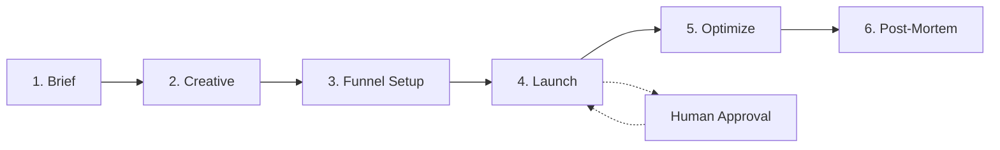

# Campaign Workflow

> **You will:** Launch and manage a complete marketing campaign from initial brief through post-mortem analysis, with AI agents handling creative development, funnel setup, optimization, and reporting.

## Overview

The Campaign Workflow guides you through the entire lifecycle of a marketing campaign. Whether you're launching a product, running a promotion, or building brand awareness, this workflow ensures nothing falls through the cracks.

You'll work with specialized agents at each stage - campaign managers create briefs, content creators develop assets, funnel architects build conversion paths, and analytics analysts measure results. Each stage includes checkpoints to verify success before moving forward.

This workflow is perfect for product launches, promotional campaigns, lead generation programs, and brand awareness initiatives. It typically runs 4-8 weeks depending on campaign complexity.

## Metadata

- **Time Estimate:** 4-8 weeks (varies by campaign type)
- **Difficulty:** Intermediate
- **Prerequisites:**
  - ClaudeKit Marketing Kit installed
  - Campaign objectives defined
  - Budget allocated
  - Target audience identified

## The Workflow



## Step-by-Step Guide

### Step 1: Create Campaign Brief

The campaign brief is your north star. It defines objectives, audience, budget, KPIs, and timeline. Getting this right prevents costly mid-campaign pivots.

```bash
# Ask the campaign-manager agent to create a brief
"Create campaign brief for Black Friday 2025.
Objective: Generate $500K revenue
Budget: $50K
Timeline: Nov 1-30, 2025
Include: audience, channels, KPIs, success criteria"
```

**What happens:** The campaign-manager agent analyzes your objectives, researches your audience, recommends channels, sets realistic KPIs, and creates a comprehensive brief document in `plans/campaigns/`.

**Checkpoint:** Review the brief for:
- Clear, measurable objectives
- Well-defined target audience
- Realistic budget allocation
- Achievable KPIs
- Detailed timeline with milestones

**Time:** 2-4 hours

---

### Step 2: Develop Creative Assets

With an approved brief, content creators and copywriters develop all campaign assets - ad copy, visuals, landing pages, and email templates.

```bash
# Generate creative assets
"Create creative assets for campaign black-friday-2025.
Channels: Facebook Ads, Google Ads, Email, Landing Page
Messaging: Limited-time 40% off, urgency-driven
Include: headlines, descriptions, CTAs, visual direction"
```

**What happens:** Content creators generate multiple variations of ad copy, design visual concepts, write landing page content, and create email templates. All assets follow your brand guidelines and messaging framework.

**Checkpoint:** Verify:
- Assets exist for all channels
- Messaging is consistent across channels
- CTAs are clear and compelling
- Visual direction aligns with brand
- Multiple variations for A/B testing

**Time:** 3-5 days

---

### Step 3: Setup Conversion Funnel

The funnel architect designs your conversion path, implements tracking, and creates test variants. This ensures you can measure performance accurately.

```bash
# Design the conversion funnel
"Design conversion funnel for black-friday-2025.
Entry points: Facebook Ads, Google Ads, Email
Goal: Purchase completion
Include: funnel stages, tracking setup, test variants"
```

**What happens:** The agent maps the entire customer journey from first click to conversion, sets up UTM parameters for tracking, configures attribution, creates A/B test variants, and documents the funnel configuration.

**Checkpoint:** Confirm:
- Funnel stages clearly defined
- Tracking pixels installed
- UTM parameters documented
- A/B test variants created
- Attribution model configured

**Time:** 1-2 days

---

### Step 4: Launch Campaign

Launch is the moment of truth. The campaign manager runs through a final checklist, publishes content, activates ad campaigns, and enables tracking.

```bash
# Launch the campaign (requires approval)
"Launch campaign black-friday-2025.
Verify: tracking, creatives, targeting, budget.
Channels: Facebook, Google, Email, Website
Start date: November 1, 2025"
```

**What happens:** The system runs a comprehensive pre-launch checklist verifying tracking, creatives, targeting, and budget. After human approval, it publishes content across all channels, activates ad campaigns, starts email sequences, and enables tracking.

**Checkpoint:** Human approval required. Verify:
- All tracking is functional
- Creatives are approved and uploaded
- Targeting parameters are correct
- Budget limits are set
- Launch date/time is accurate

**Time:** 2-4 hours

---

### Step 5: Optimize Performance

Once live, the campaign debugger and analytics analyst monitor daily performance, analyze A/B test results, adjust targeting, and optimize budget allocation.

```bash
# Daily optimization check
"Optimize campaign black-friday-2025.
Current metrics: 50K impressions, 2% CTR, $25 CPA
Issues: Low conversion rate on mobile
Recommend: targeting, budget, creative changes"
```

**What happens:** Agents analyze performance data, identify underperforming elements, recommend specific changes, adjust targeting and budgets, and pause ineffective variants. You get daily optimization reports with actionable recommendations.

**Checkpoint:** Review daily:
- Performance vs KPIs
- A/B test winners
- Budget pacing
- Conversion rate trends
- Recommendations implemented

**Time:** 30 min daily throughout campaign

---

### Step 6: Generate Post-Mortem Report

After the campaign ends, the analytics analyst creates a comprehensive post-mortem report with performance analysis, ROI calculation, key learnings, and recommendations.

```bash
# Generate final report
"Generate post-mortem for campaign black-friday-2025.
Include: performance vs KPIs, ROI, key learnings.
Recommend: improvements for next campaign"
```

**What happens:** The agent compiles all campaign data, calculates final ROI, identifies what worked and what didn't, extracts actionable learnings, and recommends improvements for future campaigns. The report is saved in `plans/reports/`.

**Checkpoint:** Post-mortem should include:
- Final performance vs KPIs
- ROI and profitability analysis
- Channel performance breakdown
- Top performing creatives
- Key learnings documented
- Recommendations for next time

**Time:** 4-6 hours

---

## Real-World Example

### Starting Point
You're launching a SaaS product with a limited budget and need to generate 500 qualified leads in 6 weeks.

### Execution

```bash
# Week 1: Brief
"Create campaign brief for CloudNote Launch.
Objective: 500 qualified leads
Budget: $15K
Timeline: 6 weeks
Target: B2B project managers, remote teams"

# Week 1-2: Creative
"Create creative assets for cloudnote-launch.
Channels: LinkedIn Ads, Content Marketing, Email
Messaging: Collaborative note-taking for remote teams
Include: ad variations, blog post, landing page, email sequence"

# Week 2: Funnel
"Design conversion funnel for cloudnote-launch.
Entry points: LinkedIn, Blog, Email
Goal: Demo request
Include: free trial option, demo booking, nurture path"

# Week 3: Launch
"Launch campaign cloudnote-launch.
Verify: LinkedIn pixel, GA4 tracking, demo booking form
Start date: March 1, 2025"

# Weeks 3-8: Daily optimization
"Optimize campaign cloudnote-launch.
Current: 2,500 clicks, 8% demo request rate, $18 CPL
Adjust: Increase blog content budget, pause low-performing ad variants"

# Week 9: Post-mortem
"Generate post-mortem for cloudnote-launch.
Final: 620 leads (124% of goal), $14.2K spent, $22.90 CPL"
```

### Result
The campaign exceeded the 500-lead goal by 24%, came in under budget, and generated actionable insights for the next campaign. The post-mortem identified that blog content drove 45% of leads at half the cost per lead of paid ads, informing future budget allocation.

---

## Common Variations

### Quick Promotional Campaign (1-2 weeks)

For time-sensitive promotions, condense the workflow:
- Combine Brief and Creative into one session
- Use pre-existing landing pages
- Skip extensive A/B testing
- Focus on single high-performing channel

```bash
"Create 48-hour flash sale campaign for summer-sale-2025.
Channels: Email + Social only
Assets: Email template, social posts
Launch: This Friday"
```

### Ongoing Lead Generation

For evergreen campaigns, adjust the workflow:
- Create initial brief once
- Develop content library over time
- Continuous optimization (no end date)
- Monthly mini post-mortems instead of one final report

```bash
"Setup evergreen lead gen campaign for webinar-series.
Ongoing optimization: weekly
Report cadence: monthly"
```

### Multi-Channel Brand Campaign

For complex awareness campaigns:
- Extended creative development (2-3 weeks)
- Separate funnels per channel
- Coordinated launch across channels
- Unified tracking and attribution

```bash
"Create brand awareness campaign for rebrand-2025.
Channels: TV, Digital, OOH, Social, PR
Coordinate: Launch events, press releases, influencer partnerships"
```

---

## Troubleshooting

### Issue: Campaign brief keeps getting revised

**Cause:** Unclear objectives or misaligned stakeholder expectations

**Solution:** Before creating brief, document:
- Specific, measurable objectives
- Stakeholder sign-off on goals
- Budget constraints
- Success criteria

Hold brief approval meeting with all stakeholders present.

---

### Issue: Low performance in first week

**Cause:** Normal learning phase for ad platforms, or targeting/creative issues

**Solution:** Don't panic or make drastic changes immediately. Ad platforms need 3-5 days to optimize. Monitor these metrics:
- Are ads being approved and serving?
- Is tracking working correctly?
- Are you reaching the right audience?

Make small adjustments, not complete overhauls.

---

### Issue: Can't meet KPIs within budget

**Cause:** Unrealistic goals, wrong channels, or poor targeting

**Solution:** Run mid-campaign analysis:
- Calculate required CPA to meet goals
- Compare to actual CPA
- If gap is >30%, recommend: extend timeline, increase budget, or adjust goals
- Shift budget to best-performing channels

Be honest about what's achievable with remaining budget.

---

## Best Practices

**Define Success Upfront**
Set clear, measurable KPIs in the brief. "Increase awareness" is vague. "Generate 10,000 impressions and 500 clicks with <$5 CPC" is measurable.

**Launch Small, Scale Fast**
Start with 20-30% of budget in week one. Test, learn, optimize. Then scale winners with remaining budget. This prevents burning through budget on underperforming campaigns.

**Trust the Data, Not Your Gut**
Your favorite ad might perform worst. Let A/B test results guide decisions, not personal preferences. Kill your darlings if they don't convert.

---

## Related Workflows

- [Content Workflow](/docs/marketing/workflows/content-workflow) - Create campaign assets with quality gates
- [Sales Workflow](/docs/marketing/workflows/sales-workflow) - Convert campaign leads to customers
- [Analytics Workflow](/docs/marketing/workflows/analytics-workflow) - Measure campaign performance
- [Marketing Workflow](/docs/marketing/workflows/marketing-workflow) - Higher-level marketing orchestration

---

## Agents Used

- [campaign-manager](/docs/marketing/agents/campaign-manager) - Brief creation and launch management
- [content-creator](/docs/marketing/agents/content-creator) - Creative asset development
- [copywriter](/docs/marketing/agents/copywriter) - Ad copy and messaging
- [funnel-architect](/docs/marketing/agents/funnel-architect) - Conversion path design
- [campaign-debugger](/docs/marketing/agents/campaign-debugger) - Performance optimization
- [analytics-analyst](/docs/marketing/agents/analytics-analyst) - Reporting and analysis

---

## Commands Used

- `/campaign create` - Initialize new campaign
- `/campaign status` - Check campaign progress
- `/campaign analyze` - Get optimization recommendations
- `/content create` - Generate creative assets
- `/funnel design` - Build conversion path
