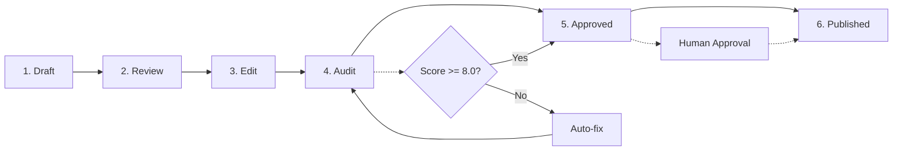

# Content Workflow

> **Bạn sẽ:** Sản xuất nội dung marketing chất lượng cao nhất quán đạt điểm 8.0 trở lên thông qua quy trình 6 giai đoạn có hệ thống với audit tự động, kiểm tra tuân thủ thương hiệu và tối ưu hóa.

## Tổng Quan

Content Workflow là hệ thống đảm bảo chất lượng của bạn cho nội dung marketing. Nó đưa nội dung từ bản nháp thô đến tài liệu được đánh bóng, xuất bản qua sáu giai đoạn: Draft, Review, Edit, Audit, Approved và Published.

Điều làm cho workflow này mạnh mẽ là các cổng chất lượng tự động. Mỗi phần nội dung được chấm điểm qua bốn chiều - Copywriting, SEO, Platform optimization và Brand compliance. Nếu điểm số dưới 8.0, hệ thống tự động đề xuất cải thiện trước khi bạn thậm chí nhìn thấy nó.

Workflow này xử lý blog posts, landing pages, emails, social posts và ad copy. Cho dù bạn đang tạo một phần hoặc quản lý lịch nội dung với hàng chục tài liệu, quy trình này đảm bảo tính nhất quán và chất lượng.

**Lợi Thế Vượt Trội**: ClaudeKit Marketing có quyền truy cập đầy đủ vào codebase của bạn, cho phép tạo nội dung nhận biết sản phẩm với ảnh chụp màn hình được trích xuất tự động, mô tả tính năng được xác minh dựa trên triển khai và tuyên bố marketing được xác thực dựa trên code thực tế. Xem [Tổng Quan Marketing](/docs/marketing/) để biết chi tiết.

## Metadata

- **Ước Tính Thời Gian:** 2-5 ngày mỗi bài (thay đổi theo loại và độ dài)
- **Độ Khó:** Cơ bản
- **Điều Kiện Tiên Quyết:**
  - ClaudeKit Marketing Kit đã cài đặt
  - Content brief đã chuẩn bị
  - Target keywords đã xác định
  - Brand guidelines đã ghi chép

## Workflow



## Hướng Dẫn Từng Bước

### Bước 1: Tạo Bản Nháp

Bắt đầu với bản nháp thô. Tập trung vào việc ghi lại ý tưởng, đừng lo lắng về sự hoàn hảo. Content-creator agent xử lý nền tảng SEO, tích hợp từ khóa và cấu trúc cơ bản.

```bash
# Tạo bản nháp ban đầu
"Create blog post draft.
Topic: How to Build a Marketing Dashboard
Keywords: marketing dashboard, analytics tracking, KPI visualization
Audience: Marketing managers at B2B SaaS companies
Word count: 2000
Save to: content/drafts/marketing-dashboard-guide.md"
```

**Điều gì xảy ra:** Content-creator agent nghiên cứu chủ đề, cấu trúc nội dung với tiêu đề H2/H3, tích hợp target keywords một cách tự nhiên, viết cho đối tượng cụ thể của bạn và lưu bản nháp vào vị trí đã chỉ định.

**Điểm Kiểm Tra:** Bản nháp nên có:
- Chủ đề và góc độ rõ ràng
- Target keywords có mặt (nhưng không nhồi nhét)
- Cấu trúc logic với tiêu đề
- Được viết cho đối tượng đã chỉ định
- Gần đúng số từ mục tiêu

**Thời Gian:** 1-2 giờ

---

### Bước 2: Xem Xét Nội Dung

Content-reviewer agent thực hiện kiểm tra chất lượng toàn diện bao gồm brand voice, độ chính xác thực tế, ngữ pháp, tối ưu SEO và các yếu tố chuyển đổi.

```bash
# Chạy content review
"Review content at content/drafts/marketing-dashboard-guide.md.
Check:
- Brand voice alignment
- Factual accuracy
- Grammar/spelling
- SEO optimization
- CTA effectiveness
Report issues and recommendations."
```

**Điều gì xảy ra:** Reviewer phân tích nội dung của bạn so với brand guidelines, kiểm tra thực tế các tuyên bố, xác định vấn đề ngữ pháp, xác thực các yếu tố SEO (title tags, headers, keyword usage) và đánh giá CTAs. Bạn nhận được báo cáo chi tiết với các vấn đề cụ thể và đề xuất.

**Điểm Kiểm Tra:** Báo cáo review nên xác định:
- Sự không nhất quán về brand voice
- Lỗi thực tế hoặc tuyên bố không được hỗ trợ
- Lỗi ngữ pháp/chính tả
- Cơ hội tối ưu SEO
- CTAs thiếu hoặc yếu

**Thời Gian:** 30 phút

---

### Bước 3: Chỉnh Sửa và Tinh Chỉnh

Sử dụng phản hồi review, content-creator sửa đổi bản nháp để giải quyết tất cả vấn đề trong khi duy trì brand voice và tối ưu SEO.

```bash
# Áp dụng phản hồi review
"Edit content at content/drafts/marketing-dashboard-guide.md.
Address feedback:
- Strengthen introduction hook
- Add data sources for statistics
- Fix passive voice in section 3
- Improve CTA specificity
Maintain: brand voice, SEO keywords
Save revised version."
```

**Điều gì xảy ra:** Content-creator có hệ thống giải quyết từng phần phản hồi, tinh chỉnh thông điệp, tối ưu cho SEO và đánh bóng copy. Phiên bản sửa đổi ghi đè bản nháp.

**Điểm Kiểm Tra:** Bản nháp sửa đổi nên:
- Giải quyết tất cả phản hồi review
- Duy trì brand voice nhất quán
- Giữ target keywords được tích hợp
- Cho thấy cải thiện có thể đo lường
- Sẵn sàng cho audit tự động

**Thời Gian:** 1-2 giờ

---

### Bước 4: Audit Tự Động

Đây là nơi phép màu xảy ra. Lệnh `/write/audit` chấm điểm nội dung của bạn qua bốn chiều và lệnh `/write/publish` tự động sửa các vấn đề nếu điểm số dưới 8.0.

```bash
# Audit tự động kích hoạt sau khi tạo nội dung
# Nhưng bạn cũng có thể chạy thủ công:
"Run /write/audit on content/drafts/marketing-dashboard-guide.md.
If score <8.0, run /write/publish to auto-fix.
Present final version with before/after scores."
```

**Điều gì xảy ra:** Lệnh audit phân tích nội dung của bạn và chấm điểm:
- **Copywriting:** Sức mạnh hook, khả năng đọc, luồng, thuyết phục
- **SEO:** Tối ưu từ khóa, meta tags, cấu trúc, links
- **Platform:** Tính phù hợp định dạng, tối ưu kỹ thuật
- **Brand:** Tính nhất quán voice, tuân thủ phong cách, thông điệp

Nếu bất kỳ chiều nào chấm điểm dưới 8.0, `/write/publish` tự động cải thiện hooks, thêm hashtags (cho social), củng cố CTAs và cải thiện khả năng đọc.

**Điểm Kiểm Tra:** Sau audit:
- Điểm tổng thể nên >= 8.0
- Tất cả bốn chiều >= 8.0
- Điểm số trước/sau được ghi chép
- Cải thiện cụ thể được liệt kê
- Nội dung sẵn sàng để phê duyệt

**Thời Gian:** 10-15 phút (tự động)

---

### Bước 5: Phê Duyệt Cuối Cùng

Content-reviewer thực hiện kiểm tra chất lượng cuối cùng và một người phê duyệt nội dung để xuất bản.

```bash
# Review cuối cùng trước khi xuất bản
"Final review of content/drafts/marketing-dashboard-guide.md.
Verify audit score >=8.0.
Confirm ready for publication.
If approved, schedule for March 15, 2025 at 9am EST."
```

**Điều gì xảy ra:** Reviewer xác nhận điểm audit, thực hiện kiểm tra chất lượng cuối cùng, xác minh tất cả các yếu tố có mặt và chuẩn bị nội dung để xuất bản. Phê duyệt của con người được yêu cầu trước khi xuất bản.

**Điểm Kiểm Tra:** Phê duyệt cuối cùng yêu cầu:
- Điểm audit >= 8.0 được xác minh
- Tất cả tiêu chí chất lượng được đáp ứng
- Ngày/giờ xuất bản đã đặt
- Các kênh phân phối được xác nhận
- Phê duyệt của con người đã nhận

**Thời Gian:** 15-30 phút

---

### Bước 6: Xuất Bản và Phân Phối

Sau khi được phê duyệt, social media managers hoặc email wizards xuất bản nội dung lên các nền tảng phù hợp, bật tracking và giám sát hiệu suất ban đầu.

```bash
# Xuất bản nội dung đã phê duyệt
"Publish approved content at content/drafts/marketing-dashboard-guide.md.
Channels: Blog, LinkedIn, Twitter, Email newsletter
Tracking: campaign-id-Q1-content
Monitor for 48 hours."
```

**Điều gì xảy ra:** Nội dung được xuất bản lên blog của bạn, phân phối đến các kênh xã hội, bao gồm trong email newsletters, các tham số tracking được thêm vào và hiệu suất ban đầu được giám sát trong 48 giờ.

**Điểm Kiểm Tra:** Sau khi xuất bản:
- Nội dung live trên tất cả các kênh
- Tracking hoạt động chính xác
- Social posts đã lên lịch
- Email đã gửi (nếu áp dụng)
- Tương tác ban đầu được giám sát

**Thời Gian:** 1-2 giờ

---

## Ví Dụ Thực Tế

### Điểm Khởi Đầu
Bạn cần tạo một blog post về "AI Marketing Automation" để thúc đẩy organic traffic và tạo leads cho sản phẩm SaaS của bạn.

### Thực Thi

```bash
# Ngày 1: Draft
"Create blog post draft.
Topic: AI Marketing Automation: Complete 2025 Guide
Keywords: AI marketing automation, marketing AI tools, automated marketing campaigns
Audience: Marketing directors at mid-size companies
Word count: 2500
Save to: content/drafts/ai-marketing-automation-guide.md"

# Ngày 1: Review
"Review content at content/drafts/ai-marketing-automation-guide.md.
Check: brand voice, accuracy, grammar, SEO, CTAs
Report issues."

# Ngày 2: Edit
"Edit content at content/drafts/ai-marketing-automation-guide.md.
Address feedback:
- Add case study examples
- Strengthen statistics with sources
- Improve introduction hook
- Add comparison table
- Enhance CTA with free trial mention"

# Ngày 2: Audit (tự động kích hoạt)
# Điểm: Copywriting 7.8, SEO 8.5, Platform 8.2, Brand 8.1
# Hệ thống tự động chạy /write/publish để sửa điểm copywriting
# Điểm mới: Copywriting 8.3, SEO 8.5, Platform 8.2, Brand 8.1

# Ngày 3: Phê duyệt cuối cùng
"Final review of content/drafts/ai-marketing-automation-guide.md.
Score: 8.3/10 overall. Approved for publishing.
Schedule: March 20, 2025, 9am EST"

# Ngày 3: Publish
"Publish content/drafts/ai-marketing-automation-guide.md.
Channels: Blog, LinkedIn (article), Twitter (thread), Newsletter
Tracking: Q1-organic-content-campaign"
```

### Kết Quả
Blog post xuất bản đạt điểm 8.3/10, live đúng lịch, thúc đẩy 2,400 organic visits trong tháng đầu tiên, tạo 47 leads qua CTA nhúng và trở thành driver traffic #3 trên website.

---

## Các Biến Thể Phổ Biến

### Social Post Nhanh (1-2 giờ)

Cho nội dung xã hội nhanh, nén workflow:

```bash
"Create LinkedIn post about our new product feature.
Topic: Real-time collaboration updates
Include: Hook, 3 benefits, CTA
Run /write/audit and /write/publish automatically.
Publish today at 2pm EST."
```

Tất cả 6 giai đoạn xảy ra trong một session với auto-audit trước khi xuất bản.

---

### Email Campaign (2-3 ngày)

Cho email sequences, xử lý nhiều phần đồng thời:

```bash
# Ngày 1: Draft tất cả emails
"Create 5-email welcome sequence.
Audience: New trial users
Topics: Welcome, Feature tour, Use case, Social proof, Conversion
Save to: content/emails/welcome-sequence/"

# Ngày 1-2: Batch review và edit
"Review all emails in content/emails/welcome-sequence/.
Apply edits to all based on feedback."

# Ngày 2: Batch audit
"Audit all emails in welcome-sequence folder.
Auto-fix any scores <8.0."

# Ngày 3: Schedule sequence
"Publish welcome sequence.
Schedule: Day 0, 2, 4, 6, 8 after signup"
```

Xử lý toàn bộ sequence như một batch để hiệu quả.

---

### Nội Dung Dài (1-2 tuần)

Cho các hướng dẫn toàn diện hoặc ebooks, thêm các chu kỳ lặp:

```bash
# Tuần 1: Cấu trúc và draft
"Create ebook outline: The Complete Marketing Automation Playbook
10 chapters, 50+ pages
Create drafts for chapters 1-3"

# Tuần 1-2: Rolling review và edit
"Review chapters 1-3, edit based on feedback
Draft chapters 4-6"

# Tuần 2: Comprehensive audit
"Audit complete ebook.
Focus: Consistency across chapters, SEO for each section, cohesive CTAs"

# Tuần 2: Design và publish
"Finalize ebook with design team.
Create landing page and promotion plan."
```

Chia các dự án lớn thành các phần quản lý được với rolling reviews.

---

## Khắc Phục Sự Cố

### Vấn Đề: Điểm audit bị kẹt dưới 8.0 sau auto-fix

**Nguyên Nhân:** Nội dung có vấn đề cấu trúc hoặc thông điệp cơ bản mà auto-fix không thể giải quyết

**Giải Pháp:** Xem xét báo cáo audit dimensions để xem cái nào thấp nhất:
- **Copywriting Thấp:** Viết lại introduction và conclusion với hooks/CTAs mạnh hơn
- **SEO Thấp:** Thêm target keywords vào title, H2s và đoạn đầu tiên; thêm internal links
- **Platform Thấp:** Điều chỉnh formatting, thêm visuals, tối ưu cho mobile
- **Brand Thấp:** Căn chỉnh tone và voice với brand guidelines; loại bỏ ngôn ngữ off-brand

Thực hiện sửa thủ công, sau đó chạy lại audit.

---

### Vấn Đề: Review feedback mâu thuẫn với brand guidelines

**Nguyên Nhân:** Content-reviewer cần brand guidelines cập nhật hoặc có ngữ cảnh không chính xác

**Giải Pháp:** Cập nhật tài liệu brand guidelines của bạn trong `.claude/brand-guidelines.md`. Bao gồm:
- Ví dụ về voice và tone
- Các cụm từ được phê duyệt/không được phê duyệt
- Sở thích phong cách
- Thuật ngữ ngành cụ thể

Chạy review lại sau khi cập nhật guidelines.

---

### Vấn Đề: Nội dung đã xuất bản hiển thị định dạng khác

**Nguyên Nhân:** Hạn chế nền tảng hoặc vấn đề HTML rendering

**Giải Pháp:** Tạo các phiên bản cụ thể cho nền tảng:
```bash
"Adapt content for LinkedIn native article format.
Adjust: Line breaks, formatting, link handling.
Test in LinkedIn preview before publishing."
```

Preview trên nền tảng thực tế trước khi lên lịch.

---

## Phương Pháp Tốt Nhất

**Không Bao Giờ Bỏ Qua Audit**
15 phút dành cho audit/auto-fix tiết kiệm hàng giờ chỉnh sửa thủ công và ngăn ngừa xuất bản nội dung chất lượng thấp. Luôn chạy `/write/audit` trước khi tuyên bố nội dung "hoàn thành."

**Batch Nội Dung Tương Tự**
Tạo 10 social posts? Draft tất cả 10, review tất cả 10, audit tất cả 10. Batching nhanh hơn 3-5 lần so với xử lý từng cái một và cải thiện tính nhất quán giữa các phần.

**Xây Dựng Thư Viện Nội Dung**
Lưu nội dung điểm cao làm templates. Một blog post đạt điểm 8.5+ trở thành template cho các chủ đề tương tự. Tái sử dụng cấu trúc, copy các mẫu thành công, duy trì chất lượng.

---

## Workflows Liên Quan

- [Campaign Workflow](/vi/docs/marketing/workflows/campaign-workflow) - Tạo nội dung như một phần của campaigns lớn hơn
- [SEO Workflow](/vi/docs/marketing/workflows/seo-workflow) - Tối ưu nội dung cho thứ hạng tìm kiếm
- [Social Workflow](/vi/docs/marketing/workflows/social-workflow) - Phân phối nội dung qua các nền tảng xã hội
- [Brand Workflow](/vi/docs/marketing/workflows/brand-workflow) - Đảm bảo tính nhất quán thương hiệu

---

## Agents Được Sử Dụng

- [content-creator](/vi/docs/marketing/agents/content-creator) - Tạo draft và chỉnh sửa
- [content-reviewer](/vi/docs/marketing/agents/content-reviewer) - Kiểm tra chất lượng và phê duyệt
- [seo-specialist](/vi/docs/marketing/agents/seo-specialist) - Tối ưu SEO
- [social-media-manager](/vi/docs/marketing/agents/social-media-manager) - Xuất bản xã hội
- [email-wizard](/vi/docs/marketing/agents/email-wizard) - Phân phối email

---

## Commands Được Sử Dụng

- `/write:blog` - Tạo blog post drafts
- `/write:cro` - Tạo landing pages tối ưu chuyển đổi
- `/write/audit` - Chấm điểm chất lượng nội dung (tự động kích hoạt)
- `/write/publish` - Tự động sửa các vấn đề nội dung (tự động kích hoạt)
- `/content:good` - Tạo nội dung chất lượng cao
- `/youtube:blog` - Chuyển đổi YouTube videos thành blog posts
- `/youtube:social` - Chuyển đổi YouTube videos thành social posts
