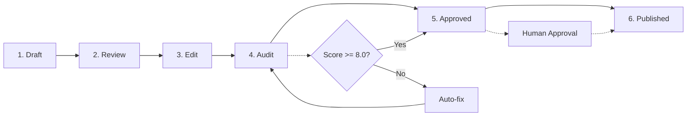

# Content Workflow

> **You will:** Produce high-quality marketing content that consistently scores 8.0 or higher through a systematic 6-stage pipeline with automated audits, brand compliance checks, and optimization.

## Overview

The Content Workflow is your quality assurance system for marketing content. It takes content from rough draft to polished, published asset through six stages: Draft, Review, Edit, Audit, Approved, and Published.

What makes this workflow powerful is the automatic quality gates. Every piece of content gets scored across four dimensions - Copywriting, SEO, Platform optimization, and Brand compliance. If the score is below 8.0, the system automatically suggests improvements before you even see it.

This workflow handles blog posts, landing pages, emails, social posts, and ad copy. Whether you're creating one piece or managing a content calendar with dozens of assets, this process ensures consistency and quality.

## Metadata

- **Time Estimate:** 2-5 days per piece (varies by type and length)
- **Difficulty:** Beginner
- **Prerequisites:**
  - ClaudeKit Marketing Kit installed
  - Content brief prepared
  - Target keywords identified
  - Brand guidelines documented

## The Workflow



## Step-by-Step Guide

### Step 1: Create Draft

Start with a rough draft. Focus on getting ideas down, don't worry about perfection. The content-creator agent handles SEO foundation, keyword integration, and basic structure.

```bash
# Create initial draft
"Create blog post draft.
Topic: How to Build a Marketing Dashboard
Keywords: marketing dashboard, analytics tracking, KPI visualization
Audience: Marketing managers at B2B SaaS companies
Word count: 2000
Save to: content/drafts/marketing-dashboard-guide.md"
```

**What happens:** The content-creator agent researches the topic, structures content with H2/H3 headers, integrates target keywords naturally, writes for your specific audience, and saves the draft to your specified location.

**Checkpoint:** Draft should have:
- Clear topic and angle
- Target keywords present (but not stuffed)
- Logical structure with headers
- Written for specified audience
- Approximately target word count

**Time:** 1-2 hours

---

### Step 2: Review Content

The content-reviewer agent performs a comprehensive quality check covering brand voice, factual accuracy, grammar, SEO optimization, and conversion elements.

```bash
# Run content review
"Review content at content/drafts/marketing-dashboard-guide.md.
Check:
- Brand voice alignment
- Factual accuracy
- Grammar/spelling
- SEO optimization
- CTA effectiveness
Report issues and recommendations."
```

**What happens:** The reviewer analyzes your content against brand guidelines, fact-checks claims, identifies grammar issues, validates SEO elements (title tags, headers, keyword usage), and evaluates CTAs. You receive a detailed report with specific issues and recommendations.

**Checkpoint:** Review report should identify:
- Brand voice inconsistencies
- Factual errors or unsupported claims
- Grammar/spelling mistakes
- SEO optimization opportunities
- Missing or weak CTAs

**Time:** 30 minutes

---

### Step 3: Edit and Refine

Using the review feedback, the content-creator revises the draft to address all issues while maintaining brand voice and SEO optimization.

```bash
# Apply review feedback
"Edit content at content/drafts/marketing-dashboard-guide.md.
Address feedback:
- Strengthen introduction hook
- Add data sources for statistics
- Fix passive voice in section 3
- Improve CTA specificity
Maintain: brand voice, SEO keywords
Save revised version."
```

**What happens:** The content-creator systematically addresses each piece of feedback, refines messaging, optimizes for SEO, and polishes copy. The revised version overwrites the draft.

**Checkpoint:** Revised draft should:
- Address all review feedback
- Maintain consistent brand voice
- Keep target keywords integrated
- Show measurable improvement
- Be ready for automated audit

**Time:** 1-2 hours

---

### Step 4: Automated Audit

This is where the magic happens. The `/write/audit` command scores your content across four dimensions and the `/write/publish` command automatically fixes issues if the score is below 8.0.

```bash
# Audit automatically triggers after content generation
# But you can also run it manually:
"Run /write/audit on content/drafts/marketing-dashboard-guide.md.
If score <8.0, run /write/publish to auto-fix.
Present final version with before/after scores."
```

**What happens:** The audit command analyzes your content and scores it:
- **Copywriting:** Hook strength, readability, flow, persuasion
- **SEO:** Keyword optimization, meta tags, structure, links
- **Platform:** Format appropriateness, technical optimization
- **Brand:** Voice consistency, style compliance, messaging

If any dimension scores below 8.0, `/write/publish` automatically improves hooks, adds hashtags (for social), strengthens CTAs, and improves readability.

**Checkpoint:** After audit:
- Overall score should be >= 8.0
- All four dimensions >= 8.0
- Before/after scores documented
- Specific improvements listed
- Content ready for approval

**Time:** 10-15 minutes (automated)

---

### Step 5: Final Approval

The content-reviewer does a final quality check and a human approves the content for publication.

```bash
# Final review before publishing
"Final review of content/drafts/marketing-dashboard-guide.md.
Verify audit score >=8.0.
Confirm ready for publication.
If approved, schedule for March 15, 2025 at 9am EST."
```

**What happens:** The reviewer confirms the audit score, does a final quality check, verifies all elements are present, and prepares the content for publication. Human approval is required before publishing.

**Checkpoint:** Final approval requires:
- Audit score >= 8.0 verified
- All quality criteria met
- Publication date/time set
- Distribution channels confirmed
- Human sign-off received

**Time:** 15-30 minutes

---

### Step 6: Publish and Distribute

Once approved, social media managers or email wizards publish content to appropriate platforms, enable tracking, and monitor initial performance.

```bash
# Publish approved content
"Publish approved content at content/drafts/marketing-dashboard-guide.md.
Channels: Blog, LinkedIn, Twitter, Email newsletter
Tracking: campaign-id-Q1-content
Monitor for 48 hours."
```

**What happens:** Content is published to your blog, distributed to social channels, included in email newsletters, tracking parameters are added, and initial performance is monitored for 48 hours.

**Checkpoint:** After publishing:
- Content live on all channels
- Tracking working correctly
- Social posts scheduled
- Email sent (if applicable)
- Initial engagement monitored

**Time:** 1-2 hours

---

## Real-World Example

### Starting Point
You need to create a blog post about "AI Marketing Automation" to drive organic traffic and generate leads for your SaaS product.

### Execution

```bash
# Day 1: Draft
"Create blog post draft.
Topic: AI Marketing Automation: Complete 2025 Guide
Keywords: AI marketing automation, marketing AI tools, automated marketing campaigns
Audience: Marketing directors at mid-size companies
Word count: 2500
Save to: content/drafts/ai-marketing-automation-guide.md"

# Day 1: Review
"Review content at content/drafts/ai-marketing-automation-guide.md.
Check: brand voice, accuracy, grammar, SEO, CTAs
Report issues."

# Day 2: Edit
"Edit content at content/drafts/ai-marketing-automation-guide.md.
Address feedback:
- Add case study examples
- Strengthen statistics with sources
- Improve introduction hook
- Add comparison table
- Enhance CTA with free trial mention"

# Day 2: Audit (auto-triggered)
# Scores: Copywriting 7.8, SEO 8.5, Platform 8.2, Brand 8.1
# System automatically runs /write/publish to fix copywriting score
# New scores: Copywriting 8.3, SEO 8.5, Platform 8.2, Brand 8.1

# Day 3: Final approval
"Final review of content/drafts/ai-marketing-automation-guide.md.
Score: 8.3/10 overall. Approved for publishing.
Schedule: March 20, 2025, 9am EST"

# Day 3: Publish
"Publish content/drafts/ai-marketing-automation-guide.md.
Channels: Blog, LinkedIn (article), Twitter (thread), Newsletter
Tracking: Q1-organic-content-campaign"
```

### Result
Published blog post scored 8.3/10, went live on schedule, drove 2,400 organic visits in first month, generated 47 leads through embedded CTA, and became the #3 traffic driver on the website.

---

## Common Variations

### Quick Social Post (1-2 hours)

For rapid social content, compress the workflow:

```bash
"Create LinkedIn post about our new product feature.
Topic: Real-time collaboration updates
Include: Hook, 3 benefits, CTA
Run /write/audit and /write/publish automatically.
Publish today at 2pm EST."
```

All 6 stages happen in one session with auto-audit before publishing.

---

### Email Campaign (2-3 days)

For email sequences, process multiple pieces simultaneously:

```bash
# Day 1: Draft all emails
"Create 5-email welcome sequence.
Audience: New trial users
Topics: Welcome, Feature tour, Use case, Social proof, Conversion
Save to: content/emails/welcome-sequence/"

# Day 1-2: Batch review and edit
"Review all emails in content/emails/welcome-sequence/.
Apply edits to all based on feedback."

# Day 2: Batch audit
"Audit all emails in welcome-sequence folder.
Auto-fix any scores <8.0."

# Day 3: Schedule sequence
"Publish welcome sequence.
Schedule: Day 0, 2, 4, 6, 8 after signup"
```

Process entire sequence as a batch for efficiency.

---

### Long-Form Content (1-2 weeks)

For comprehensive guides or ebooks, add iteration cycles:

```bash
# Week 1: Structure and draft
"Create ebook outline: The Complete Marketing Automation Playbook
10 chapters, 50+ pages
Create drafts for chapters 1-3"

# Week 1-2: Rolling review and edit
"Review chapters 1-3, edit based on feedback
Draft chapters 4-6"

# Week 2: Comprehensive audit
"Audit complete ebook.
Focus: Consistency across chapters, SEO for each section, cohesive CTAs"

# Week 2: Design and publish
"Finalize ebook with design team.
Create landing page and promotion plan."
```

Break large projects into manageable chunks with rolling reviews.

---

## Troubleshooting

### Issue: Audit score stuck below 8.0 after auto-fix

**Cause:** Content has fundamental structure or messaging issues that auto-fix can't resolve

**Solution:** Review the audit report dimensions to see which is lowest:
- **Low Copywriting:** Rewrite introduction and conclusion with stronger hooks/CTAs
- **Low SEO:** Add target keywords to title, H2s, and first paragraph; add internal links
- **Low Platform:** Adjust formatting, add visuals, optimize for mobile
- **Low Brand:** Align tone and voice with brand guidelines; remove off-brand language

Make manual fixes, then re-run audit.

---

### Issue: Review feedback contradicts brand guidelines

**Cause:** Content-reviewer needs updated brand guidelines or has incorrect context

**Solution:** Update your brand guidelines document in `.claude/brand-guidelines.md`. Include:
- Voice and tone examples
- Approved/disapproved phrases
- Style preferences
- Specific industry terminology

Run review again after updating guidelines.

---

### Issue: Published content shows different formatting

**Cause:** Platform limitations or HTML rendering issues

**Solution:** Create platform-specific versions:
```bash
"Adapt content for LinkedIn native article format.
Adjust: Line breaks, formatting, link handling.
Test in LinkedIn preview before publishing."
```

Preview on actual platform before scheduling.

---

## Best Practices

**Never Skip the Audit**
The 15 minutes spent on audit/auto-fix saves hours of manual editing and prevents publishing low-quality content. Always run `/write/audit` before claiming content is "done."

**Batch Similar Content**
Creating 10 social posts? Draft all 10, review all 10, audit all 10. Batching is 3-5x faster than one-at-a-time processing and improves consistency across pieces.

**Build a Content Library**
Save high-scoring content as templates. A blog post that scores 8.5+ becomes a template for similar topics. Reuse structure, copy successful patterns, maintain quality.

---

## Related Workflows

- [Campaign Workflow](/docs/marketing/workflows/campaign-workflow) - Create content as part of larger campaigns
- [SEO Workflow](/docs/marketing/workflows/seo-workflow) - Optimize content for search rankings
- [Social Workflow](/docs/marketing/workflows/social-workflow) - Distribute content across social platforms
- [Brand Workflow](/docs/marketing/workflows/brand-workflow) - Ensure brand consistency

---

## Agents Used

- [content-creator](/docs/marketing/agents/content-creator) - Draft creation and editing
- [content-reviewer](/docs/marketing/agents/content-reviewer) - Quality checks and approval
- [seo-specialist](/docs/marketing/agents/seo-specialist) - SEO optimization
- [social-media-manager](/docs/marketing/agents/social-media-manager) - Social publishing
- [email-wizard](/docs/marketing/agents/email-wizard) - Email distribution

---

## Commands Used

- `/write:blog` - Generate blog post drafts
- `/write:cro` - Create conversion-optimized landing pages
- `/write/audit` - Score content quality (auto-triggered)
- `/write/publish` - Auto-fix content issues (auto-triggered)
- `/content:good` - Create high-quality content
- `/youtube:blog` - Convert YouTube videos to blog posts
- `/youtube:social` - Convert YouTube videos to social posts
