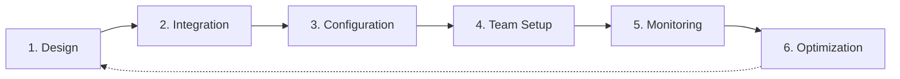

# Dashboard Workflow

> **You will:** Set up and maintain a real-time marketing dashboard that provides instant visibility into campaigns, performance, and team activities across all marketing channels.

## Overview

The Dashboard Workflow helps you create a centralized command center for marketing operations. It covers dashboard design, data source integration, metric selection, visualization setup, and team access configuration.

Instead of checking multiple tools for campaign status, traffic data, and team progress, the dashboard provides a single source of truth. Whether you're monitoring active campaigns, tracking KPIs, or coordinating team work, the dashboard keeps everyone aligned.

**Asset Management Integration**: The `/dashboard` command also serves as the visual interface for the [Asset Management](/docs/marketing/features/asset-management) system (Content Hub), providing browse, preview, and search capabilities for all marketing assets (copy, storyboards, slides, infographics, branding guidelines, social posts).

## Metadata

- **Time Estimate:** 2-4 hours setup, 5-10 minutes daily monitoring
- **Difficulty:** Beginner
- **Prerequisites:**
  - ClaudeKit Marketing Kit installed
  - Marketing tools connected (GA4, ad platforms, email, social)
  - Team roles defined
  - Key metrics identified

## The Workflow



## Step-by-Step Guide

### Step 1: Design Dashboard Structure

Define dashboard sections, key metrics, audience needs, and information hierarchy.

```bash
"Design marketing dashboard for CloudTask team.
Audience: Marketing manager (daily), Exec team (weekly), Marketing team (ongoing)
Sections:
- Campaign overview (active campaigns, status, spend vs budget)
- Traffic metrics (sessions, sources, conversions)
- Lead pipeline (MQLs, SQLs, conversion rates)
- Content performance (top pages, recent posts)
- Team activity (tasks, deliverables, blockers)
Layout: Most important metrics above fold, drill-downs below"
```

**What happens:** Dashboard designer analyzes stakeholder needs, identifies critical metrics per audience, structures information logically, designs visual hierarchy emphasizing key data, plans drill-down capabilities for details, and creates wireframe or mockup.

**Checkpoint:** Design includes defined sections, prioritized metrics list, audience-specific views, visual hierarchy, mockup or detailed specification.

**Time:** 2-3 hours

---

### Step 2: Integrate Data Sources

Connect marketing platforms to dashboard for real-time data flow.

```bash
"Integrate data sources for marketing dashboard.
Connect:
- Google Analytics 4 (traffic, conversions, behavior)
- Google Ads (campaigns, spend, conversions)
- LinkedIn Ads (B2B campaign performance)
- Mailchimp (email metrics, list growth)
- HubSpot CRM (leads, pipeline, deals)
- ClaudeKit (agent activity, task status)
Authenticate: OAuth for each platform
Sync frequency: Real-time where possible, hourly minimum"
```

**What happens:** System connects to each platform via API or native integration, authenticates with proper permissions, configures data sync frequency, tests data flow, validates metric accuracy, and sets up error monitoring.

**Checkpoint:** All platforms connected and syncing, data flowing correctly, metrics match source platforms (spot check), error monitoring active.

**Time:** 1-2 hours

---

### Step 3: Configure Metrics and Views

Set up KPIs, goals, alerts, and custom views for different team members.

```bash
"Configure dashboard metrics and views.
KPIs with targets:
- Monthly traffic: 15K sessions (target), alert if <80% by day 20
- Lead generation: 500 MQLs (target), alert if <75% by day 25
- Campaign ROI: 3.5x minimum, alert if any campaign <2x
- Email engagement: 25% open rate minimum
Custom views:
- Manager view: High-level KPIs + alerts
- Exec view: Monthly trends + ROI summary
- Team view: Campaign status + task assignments
Configure: Auto-refresh every 15 minutes, mobile responsive"
```

**What happens:** Dashboard is configured with target metrics and thresholds, alert rules set for performance issues, custom views created for different roles, auto-refresh enabled, mobile optimization applied, and notification preferences set.

**Checkpoint:** KPIs configured with targets, alerts set and tested, custom views created, dashboard auto-refreshing, mobile display verified.

**Time:** 2-3 hours

---

### Step 4: Team Setup and Training

Provide team access, configure permissions, and train on dashboard usage.

```bash
"Setup team access to marketing dashboard.
Team members:
- Marketing Manager: Full access (view + edit)
- Marketing Team (4): Campaign view (view only)
- Exec Team (3): Summary view (view only)
Training:
- Record 10-minute walkthrough video
- Create quick reference guide (1 page)
- Schedule live Q&A session
- Set up Slack alerts for critical metrics
Test: Each team member logs in and confirms their view is correct"
```

**What happens:** User accounts created with appropriate permissions, team receives access credentials, training materials prepared (video + guide), live training session conducted, Slack notifications configured, and access tested by each team member.

**Checkpoint:** All team members have access, permissions verified, training completed, Slack alerts working, team comfortable using dashboard.

**Time:** 2-3 hours

---

### Step 5: Daily Monitoring

Check dashboard for performance issues, campaign status, and anomalies requiring action.

```bash
"Daily dashboard monitoring routine (5-10 minutes).
Morning check:
- Campaign status: Any paused or out-of-budget campaigns?
- Traffic trends: Major increases or drops vs yesterday?
- Conversion rates: Any significant changes?
- Alerts: Review and triage any triggered alerts
- Team tasks: Any blockers or overdue deliverables?
Action: Address critical issues immediately, note trends for weekly review"
```

**What happens:** Manager reviews dashboard for critical alerts, checks campaign health and budget pacing, monitors traffic and conversion trends, identifies anomalies needing investigation, and triages team blockers or issues.

**Checkpoint:** Daily check complete with critical issues addressed, trends noted, team unblocked, confidence in current performance.

**Time:** 5-10 minutes daily

---

### Step 6: Optimize and Iterate

Regularly review dashboard effectiveness and adjust metrics, views, or integrations.

```bash
"Monthly dashboard optimization review.
Analyze:
- Which metrics get checked most often? (prioritize visibility)
- Which sections rarely viewed? (remove or simplify)
- New data sources needed? (added tools or channels)
- Alert accuracy? (too many false positives? missing real issues?)
- Team feedback? (what's missing or confusing?)
Implement: Top 3 improvements based on usage and feedback
Document: What changed and why"
```

**What happens:** Dashboard analytics reviewed to see usage patterns, team surveyed for feedback, underused sections simplified or removed, frequently-checked metrics given more prominence, alert rules refined, and improvements implemented based on data.

**Checkpoint:** Usage analyzed, feedback gathered, top improvements identified and implemented, team notified of changes.

**Time:** 2-3 hours monthly

---

## Real-World Example

### Starting Point
Marketing team of 5 checking 8 different tools throughout day, missing issues until too late, no shared visibility on campaign status.

### Execution

```bash
# Day 1: Design
"Design unified marketing dashboard:
Top section: Traffic today, Leads today, Active campaigns (3 metrics, large numbers)
Campaign section: 6 active campaigns with status, spend, performance vs goal
Traffic section: Sources breakdown, top pages, conversion funnel
Lead section: Pipeline by stage, recent conversions, lead score distribution
Team section: Task kanban, deliverables due this week, blockers
Mobile: Focus on top section + alerts"

# Day 1: Integration
"Connect 6 platforms:
- GA4: Traffic, behavior, conversions (real-time API)
- Google Ads: 2 campaigns, $12K/month spend (hourly sync)
- LinkedIn: 3 campaigns, $8K/month spend (hourly sync)
- Mailchimp: Weekly newsletter, 8K subscribers (hourly sync)
- HubSpot: 1,200 leads in pipeline (real-time)
- ClaudeKit: Team tasks and agent activity (real-time)"

# Day 2: Configure
"Setup KPIs and alerts:
- Traffic: 500/day target, alert if <400 by 5pm
- Leads: 25/day target, alert if <20 by 5pm
- Campaign spend: Alert if any campaign exceeds daily budget by 20%
- Campaign performance: Alert if CPA >$60 (target $50)
Created 3 views: Manager (full), Exec (summary), Team (campaigns + tasks)"

# Day 2: Team setup
"Provided access to 8 team members:
- Recorded 8-minute walkthrough showing each section
- Created 1-page quick reference with screenshots
- Held 30-minute live training with Q&A
- Configured Slack alerts to #marketing-alerts channel
All team members logged in successfully"

# Daily: Monitoring
"Daily 7-minute morning routine:
Check top metrics (traffic, leads normal ranges)
Review campaign performance (all on track)
Check alerts (1 alert: LinkedIn CPA spiked to $68 yesterday)
Action: Investigated LinkedIn campaign, paused underperforming ad variant
Team section: 2 tasks overdue, followed up in Slack"

# Month 1: Optimization
"Dashboard usage analysis:
- Campaign section viewed 12x/day (most important)
- Traffic section viewed 5x/day
- Lead pipeline viewed 3x/day
- Team tasks viewed 8x/day
- Exec summary viewed 1x/week
Changes: Made campaign section larger, moved exec summary to separate tab"
```

### Result
Team now spends 10 minutes daily on dashboard instead of 60+ minutes across 8 tools. Issues caught average 4 hours faster (campaign overspend caught by 11am instead of end of day). Exec visibility improved - weekly check-ins now data-driven instead of "how do you think it's going?" conversations.

---

## Common Variations

### Real-Time Campaign War Room
For active campaign monitoring:
- Large screen display in office
- Live refresh every 60 seconds
- Hour-by-hour performance
- Immediate alert notifications
- Team collaboration features

### Executive Summary Dashboard
For leadership visibility:
- High-level KPIs only
- Monthly/quarterly trends
- ROI and efficiency metrics
- No operational details
- PDF export for board meetings

### Agency Client Dashboard
For client reporting:
- Client-branded interface
- Campaign-specific views
- Automated weekly reports
- Client self-service access
- White-label presentation

---

## Troubleshooting

### Issue: Data not syncing or showing errors

**Cause:** API authentication expired, rate limits hit, or platform changes

**Solution:** Check API authentication status for each integration. Re-authenticate if needed. Review API usage against rate limits. Check for platform API changes or deprecations. Set up error monitoring and notifications.

---

### Issue: Dashboard too slow or timing out

**Cause:** Too many real-time queries, inefficient data fetching, or large date ranges

**Solution:** Reduce real-time queries (not everything needs live data). Cache frequently accessed data. Limit default date ranges (last 30 days instead of all time). Optimize database queries. Consider data aggregation for historical data.

---

### Issue: Team not using dashboard consistently

**Cause:** Not integrated into workflow, too complex, or missing critical information

**Solution:** Make dashboard the start of each team meeting. Add it to browser home pages. Simplify to essential metrics only. Survey team on what's missing. Integrate with tools they already use (Slack notifications, email digests).

---

## Best Practices

**Critical Metrics Above the Fold**
Most important numbers should be visible without scrolling. Team should see status in <3 seconds. If you need to scroll to see if campaigns are on track, dashboard design needs work.

**Actionable Alerts Only**
Don't alert on everything. Only alert on metrics that require immediate action. False alarms train team to ignore alerts. Better to miss 1 alert than get 10 false positives daily.

**Design for Glanceability**
Use color strategically (green=good, red=action needed). Large numbers for key metrics. Sparklines show trends at a glance. Avoid clutter - white space is feature not wasted space.

---

## Related Workflows

- [Campaign Workflow](/docs/marketing/workflows/campaign-workflow) - Monitor campaigns in dashboard
- [Analytics Workflow](/docs/marketing/workflows/analytics-workflow) - Dashboard as reporting tool
- [Marketing Workflow](/docs/marketing/workflows/marketing-workflow) - Central coordination via dashboard

---

## Agents Used

- [analytics-analyst](/docs/marketing/agents/analytics-analyst) - Dashboard setup and metric configuration
- [campaign-manager](/docs/marketing/agents/campaign-manager) - Campaign status monitoring
- [project-manager](/docs/marketing/agents/project-manager) - Team activity tracking

---

## Commands Used

- `/dashboard setup` - Initialize dashboard
- `/dashboard configure` - Add metrics and alerts
- `/dashboard view` - Access dashboard interface
- `/analyze` - Pull data into dashboard
