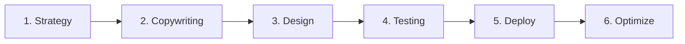

# Email Workflow

> **You will:** Create high-performing email campaigns from strategy through design, testing, and deployment with automated personalization, segmentation, and optimization.

## Overview

The Email Workflow guides you through creating email campaigns that get opened, clicked, and converted. It covers strategy, copywriting, design, testing, deployment, and optimization.

Email wizards handle everything from subject line creation to send-time optimization. Whether you're building welcome sequences, promotional campaigns, or newsletter programs, this workflow ensures consistent quality and performance.

## Metadata

- **Time Estimate:** 1-3 days per campaign
- **Difficulty:** Beginner
- **Prerequisites:**
  - ClaudeKit Marketing Kit installed
  - Email platform connected (Mailchimp, SendGrid, etc)
  - Email list segmented
  - Brand guidelines available

## The Workflow



## Step-by-Step Guide

### Step 1: Email Strategy

Define campaign objective, target audience, messaging angle, and success metrics.

```bash
"Create email campaign strategy for product launch.
Objective: Generate 500 demo requests
Audience: Trial users (days 3-7)
Campaign type: 3-email sequence
Timeline: Deploy starting March 15
Include: Key messages, CTAs, success metrics"
```

**What happens:** Email wizard defines clear campaign goal, identifies target segment, determines email sequence structure, plans key messages per email, sets CTAs and conversion goals, and establishes success metrics (open rate, click rate, conversion rate).

**Checkpoint:** Strategy includes campaign objective, audience segment, email count and timing, key message per email, primary CTA, success metrics.

**Time:** 1-2 hours

---

### Step 2: Write Email Copy

Create compelling subject lines, preview text, body copy, and clear CTAs.

```bash
"Write email copy for demo request campaign (Email 1 of 3).
Subject line: Generate 5 variations for A/B testing
Body: Highlight top 3 product benefits, address common objection, include social proof
CTA: 'Schedule Your Demo' (button + text link)
Tone: Professional but conversational
Length: 150-250 words"
```

**What happens:** Copywriter creates 5 subject line variations optimized for opens, writes engaging preview text, develops persuasive body copy following proven email formulas, integrates personalization variables, includes social proof or urgency, and crafts clear, action-oriented CTA.

**Checkpoint:** Copy complete with subject line options (5), preview text, body copy (on-brand, persuasive, scannable), CTA text, and personalization variables mapped.

**Time:** 2-3 hours per email

---

### Step 3: Design Email Template

Create mobile-responsive design that highlights key content and CTAs.

```bash
"Design email template for demo request campaign.
Layout: Single column, mobile-first
Elements: Logo, hero text, 3-benefit icons, testimonial quote, CTA button, footer
Brand: Use company colors and fonts from brand guidelines
Ensure: CTA above fold on mobile, alt text for images, plain text version"
```

**What happens:** Designer creates HTML email template following best practices, ensures mobile responsiveness, implements brand styling, optimizes CTA placement and size, adds alt text for accessibility, and generates plain text version for compatibility.

**Checkpoint:** Design ready with mobile-responsive layout, on-brand styling, prominent CTA, images with alt text, plain text version, preview tested in multiple email clients.

**Time:** 2-4 hours for new template, 30 min for existing

---

### Step 4: Test Before Sending

Validate copy, design, links, personalization, and deliverability.

```bash
"Test email campaign before deployment.
Check:
- Subject lines and preview text display correctly
- All links work and track properly
- Personalization variables populate correctly
- Images display with alt text fallbacks
- Mobile rendering on iOS and Android
- Spam score and deliverability prediction
Send test to: team@company.com"
```

**What happens:** System validates all links are working and tracked, tests personalization with sample data, checks email rendering across clients, analyzes spam score, verifies unsubscribe link present, sends test emails to team, and generates pre-send checklist.

**Checkpoint:** All tests passing - links work, personalization correct, mobile renders properly, spam score < 3, team approval received.

**Time:** 30-60 minutes

---

### Step 5: Deploy Campaign

Schedule and send emails with optimal timing and delivery settings.

```bash
"Deploy demo request email sequence.
Audience: Trial users (segment: days-3-to-7)
Schedule:
- Email 1: March 15, 10am EST
- Email 2: March 17, 10am EST
- Email 3: March 20, 2pm EST
Send-time optimization: Yes (adjust per recipient timezone)
Tracking: Enable open tracking, link tracking, conversion tracking"
```

**What happens:** Platform schedules emails per specified timing, enables send-time optimization for recipients, activates tracking pixels and UTM parameters, sets up conversion tracking, and begins sending based on schedule or triggers.

**Checkpoint:** Campaign live with emails scheduled, tracking active, audience segment confirmed, send-time optimization enabled.

**Time:** 30 minutes

---

### Step 6: Optimize Performance

Monitor metrics, identify improvements, test variations, and refine future campaigns.

```bash
"Analyze email campaign performance after 7 days.
Campaign: demo-request-sequence
Metrics: Open rate, click rate, conversion rate, unsubscribe rate
Benchmark vs: Industry average and our historical campaigns
Identify: Best performing subject lines, optimal send times, winning copy elements
Recommend: Optimizations for next campaign"
```

**What happens:** Analyst reviews campaign metrics vs benchmarks, identifies top performing variations, analyzes send-time performance, examines link click patterns, calculates conversion rates, and recommends optimizations based on learnings.

**Checkpoint:** Analysis includes campaign performance summary, A/B test winners, learnings for future campaigns, specific recommendations.

**Time:** 1-2 hours

---

## Real-World Example

### Starting Point
SaaS company needs to improve trial-to-paid conversion with automated email nurture sequence.

### Execution

```bash
# Day 1: Strategy
"Create trial nurture email sequence strategy.
Objective: Convert 12% of trials to paid (currently 8%)
Audience: New trial signups
Sequence: 5 emails over 14 days
Messages: Welcome, quick start guide, use case, social proof, conversion offer"

# Day 1-2: Write all 5 emails
"Write 5-email trial nurture sequence.
Email 1: Welcome + setup checklist
Email 2: Quick start guide (top 3 features)
Email 3: Use case story (customer success)
Email 4: Social proof (testimonials + stats)
Email 5: Conversion offer (discount expires)
Each email: 150-200 words, clear CTA, 5 subject line variations for testing"

# Day 2: Design template
"Design trial nurture email template.
Single column, mobile-first
Elements per email vary but consistent structure
Prominent CTA button (changes per email: Setup Now, Watch Tutorial, Read Story, See Pricing)"

# Day 3: Test
"Test trial nurture sequence:
All links working, personalization (name, company, signup date)
Mobile rendering tested
Spam score: 1.8 (excellent)
Team approval received"

# Day 3: Deploy
"Deploy trial nurture automation.
Trigger: New trial signup
Send schedule:
- Day 0: Welcome (immediate)
- Day 1: Quick start (10am recipient timezone)
- Day 4: Use case (10am)
- Day 7: Social proof (10am)
- Day 12: Conversion offer (2pm)
Subject line A/B test: 50/50 split first 500 sends, winner to remainder"
```

### Result
Trial-to-paid conversion improved from 8% to 13.2% (65% improvement). Email 3 (use case story) had highest engagement (45% open, 18% click). Subject line testing showed questions outperformed statements by 12%. Sequence generated additional $47K MRR in first quarter.

---

## Common Variations

### Newsletter Workflow
Regular content emails:
- Weekly/monthly cadence
- Content curation focused
- Multiple article links
- Less conversion-focused
- Long-term engagement goal

### Promotional Campaign
Time-sensitive offers:
- Urgency-driven copy
- Countdown timers
- Limited availability messaging
- Multiple reminder emails
- High-frequency (daily during promo)

### Onboarding Sequence
New customer education:
- Product education focused
- Feature adoption goals
- Tutorial content
- Long sequence (30-90 days)
- Triggered by user actions

---

## Troubleshooting

### Issue: Low open rates (<15%)

**Cause:** Poor subject lines, sender reputation issues, or wrong send timing

**Solution:** A/B test subject line styles (question vs statement, personalization, emojis). Check spam score. Verify sender authentication (SPF, DKIM). Test send times (usually 10am weekdays best for B2B).

---

### Issue: Good opens but low clicks

**Cause:** Weak copy, unclear CTA, or mobile rendering issues

**Solution:** Audit email on mobile device. Is CTA visible without scrolling? Is it obvious what action to take? Simplify copy, strengthen CTA wording, increase button size, reduce competing links.

---

### Issue: High unsubscribe rate (>0.5%)

**Cause:** Sending too frequently, irrelevant content, or expectation mismatch

**Solution:** Review send frequency - respect subscriber expectations. Segment list and personalize content. Survey unsubscribers to understand why. Implement preference center for frequency control.

---

## Best Practices

**Mobile First Always**
65%+ of emails opened on mobile. Design for small screens first. CTA must be visible and tappable without scrolling. Keep copy scannable with short paragraphs.

**Test Subject Lines Systematically**
Create 5 variations using different formulas: question, curiosity, benefit, urgency, personalization. A/B test first 500-1000 sends, winner to remainder. Document what works for your audience.

**One Email One Goal**
Every email should have ONE primary goal and ONE primary CTA. Multiple CTAs dilute focus and reduce conversion. If you need to communicate multiple things, send multiple emails.

---

## Related Workflows

- [Content Workflow](/docs/marketing/workflows/content-workflow) - Create email content with quality gates
- [Sales Workflow](/docs/marketing/workflows/sales-workflow) - Lead nurture email sequences
- [Campaign Workflow](/docs/marketing/workflows/campaign-workflow) - Email as campaign channel
- [Analytics Workflow](/docs/marketing/workflows/analytics-workflow) - Measure email performance

---

## Agents Used

- [email-wizard](/docs/marketing/agents/email-wizard) - Email strategy, copy, and optimization
- [copywriter](/docs/marketing/agents/copywriter) - Persuasive email copy
- [content-reviewer](/docs/marketing/agents/content-reviewer) - Quality assurance
- [analytics-analyst](/docs/marketing/agents/analytics-analyst) - Performance analysis

---

## Commands Used

- `/email create` - Generate email campaigns
- `/email sequence` - Build automated sequences
- `/email test` - Validate before sending
- `/email analyze` - Performance analysis
