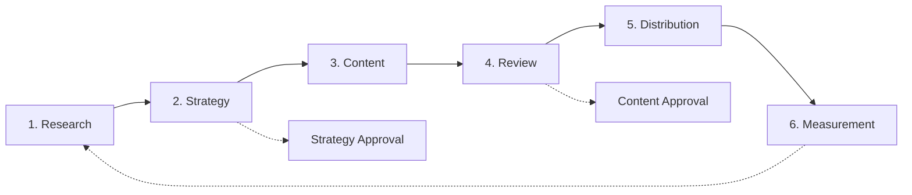

# Marketing Workflow

> **You will:** Orchestrate complete marketing operations from initial research through strategy, content creation, distribution, and performance measurement with coordinated AI agents.

## Overview

The Marketing Workflow is your command center for coordinating all marketing activities. Unlike focused workflows that handle specific tasks, this workflow orchestrates the entire marketing process across research, strategy, content, distribution, and measurement.

Think of this as the conductor's score for your marketing orchestra. Multiple agents work in harmony - researchers gather insights, planners create strategies, content creators develop assets, and analysts measure results. Each stage feeds the next with critical data and decisions.

This workflow suits comprehensive marketing programs, quarterly planning cycles, and ongoing marketing operations management.

## Metadata

- **Time Estimate:** Ongoing (with monthly/quarterly cycles)
- **Difficulty:** Advanced
- **Prerequisites:**
  - ClaudeKit Marketing Kit installed
  - Marketing objectives defined
  - Team roles assigned
  - Budget allocated

## The Workflow



## Step-by-Step Guide

### Step 1: Research and Insights

Gather competitive intelligence, audience insights, market trends, and keyword opportunities to inform strategy.

```bash
"Research B2B SaaS market for Q2 marketing campaign.
Include: competitor analysis, audience insights, trends.
Save report to plans/reports/2025-Q2-research.md"
```

**What happens:** The researcher agent analyzes competitors, researches target audience behaviors, identifies market trends, finds keyword opportunities, and compiles findings into a comprehensive report.

**Checkpoint:** Research report includes:
- 3-5 competitor profiles with strengths/weaknesses
- Target audience pain points and motivations
- 5-10 market trends relevant to your business
- High-opportunity keywords with search volume
- Actionable insights

**Time:** 4-8 hours

---

### Step 2: Strategy and Planning

Using research insights, create a marketing strategy defining objectives, channels, KPIs, and timeline.

```bash
"Create marketing strategy for Q2 2025.
Based on research: plans/reports/2025-Q2-research.md
Include: channels, KPIs, timeline.
Save to plans/2025-Q2-marketing-strategy.md"
```

**What happens:** The planner agent defines clear objectives, selects optimal channels based on research, sets measurable KPIs, creates detailed timeline, and allocates budget across activities.

**Checkpoint:** Strategy document requires human approval. Verify:
- SMART objectives (Specific, Measurable, Achievable, Relevant, Time-bound)
- Channel selection justified by research
- KPIs aligned with business goals
- Realistic timeline with milestones
- Budget allocation across channels

**Time:** 1-2 days

---

### Step 3: Content Creation

Generate all content assets needed for the strategy - blog posts, ads, landing pages, emails, and social content.

```bash
"Create content for Q2-product-launch campaign.
Target audience: Marketing managers at B2B companies
Tone: Professional yet approachable
Include: blog posts (3), landing page, email sequence (5), social posts (20)"
```

**What happens:** Content creators develop all specified assets following brand guidelines, optimize for SEO, create variations for A/B testing, and organize content by channel and timing.

**Checkpoint:** Content library should have:
- All assets listed in strategy
- Brand voice consistent across pieces
- SEO optimization applied
- Variations created for testing
- Assets organized by channel/date

**Time:** 1-2 weeks

---

### Step 4: Review and Approval

Content reviewers check all assets for brand compliance, accuracy, SEO, and conversion potential before distribution.

```bash
"Review all content in content/Q2-product-launch/.
Check: brand alignment, accuracy, SEO, conversion potential.
Report issues and recommendations."
```

**What happens:** Reviewers analyze each asset against brand guidelines, fact-check claims, validate SEO optimization, evaluate CTAs, and compile issues that need fixing.

**Checkpoint:** Human approval required after review. All content should:
- Pass brand compliance check
- Have facts verified
- Meet SEO standards
- Include clear CTAs
- Be ready for distribution

**Time:** 2-3 days

---

### Step 5: Distribution

Publish and distribute approved content across all channels - social, email, blog, and ads - according to the strategy timeline.

```bash
"Distribute approved Q2-product-launch content.
Channels: Blog, LinkedIn, Twitter, Email, Google Ads
Schedule: Per timeline in plans/2025-Q2-marketing-strategy.md
Track with campaign ID: Q2-2025-launch"
```

**What happens:** Agents schedule social posts, launch email campaigns, publish blog content, activate ad campaigns, and enable tracking across all touchpoints.

**Checkpoint:** Distribution complete when:
- All channels activated per schedule
- Tracking parameters working
- Email sequences triggered
- Ads approved and serving
- Blog posts published

**Time:** 2-4 hours for setup, ongoing automated

---

### Step 6: Measurement and Optimization

Track performance metrics, analyze attribution, generate reports, and recommend optimizations to improve results.

```bash
"Analyze Q2-2025-launch campaign performance.
Metrics: traffic, conversions, engagement, ROI.
Compare to KPIs. Recommend next steps."
```

**What happens:** Analytics analysts collect data from all sources, analyze trends and attribution, calculate ROI, identify top/bottom performers, and provide actionable recommendations.

**Checkpoint:** Weekly/monthly reports should show:
- Performance vs KPIs by channel
- Attribution analysis across touchpoints
- ROI and profitability
- Top performing content/channels
- Specific optimization recommendations

**Time:** 2-4 hours weekly, 4-8 hours monthly

---

## Real-World Example

### Starting Point
Mid-size B2B SaaS company needs to generate 500 qualified leads in Q2 while maintaining brand awareness.

### Execution

```bash
# Week 1: Research
"Research B2B marketing automation market for Q2.
Focus: Competitors, audience pain points, keyword opportunities.
Industries: SaaS, Tech, Consulting"

# Week 2: Strategy (await approval)
"Create Q2 marketing strategy.
Objectives: 500 MQLs, 50K website visitors, 5% blog growth
Channels: Content marketing, LinkedIn Ads, Email, SEO
Budget: $45K"

# Weeks 3-4: Content creation
"Create content for Q2 strategy:
- 8 blog posts (SEO-optimized)
- 2 lead magnets (ebook, template)
- 2 landing pages (trial, demo)
- 3 email sequences (welcome, nurture, promotional)
- 40 social posts (LinkedIn, Twitter)"

# Week 4: Review (await approval)
"Review all Q2 content for brand, SEO, conversion optimization."

# Week 5: Distribution launch
"Publish Q2 content schedule.
Blog: 2 posts/week
Email: Weekly newsletter + nurture sequences
Social: Daily posts
Ads: LinkedIn campaigns for both lead magnets"

# Weeks 5-18: Ongoing optimization
"Weekly: Analyze performance, optimize budget, adjust targeting.
Monthly: Comprehensive reports, strategy adjustments."
```

### Result
Generated 647 MQLs (129% of goal), drove 68K visitors (136%), grew email list by 2,400 subscribers, and maintained 42% conversion rate on lead magnets. Content library created during Q2 continued generating leads in Q3-Q4.

---

## Common Variations

### Quarterly Planning Cycle
Run Research → Strategy → Content quarterly. Distribution and Measurement ongoing.

### Always-On Marketing
Continuous research, rolling content production, ongoing optimization. Monthly strategy reviews instead of quarterly planning.

### Product Launch Focus
Condense timeline, concentrate resources, coordinate PR/events/content for single launch moment.

---

## Troubleshooting

### Issue: Strategy keeps changing mid-execution

**Cause:** Unclear objectives or external pressure to pivot

**Solution:** Lock strategy after approval. Create change management process requiring data-backed justification for pivots. Minor optimizations allowed, major changes require new planning cycle.

---

### Issue: Content production bottleneck

**Cause:** Too much content planned or review cycles too slow

**Solution:** Prioritize content by impact. Create 80/20 rule - 20% of content drives 80% of results. Focus on high-impact pieces first. Batch review cycles weekly instead of per-piece.

---

### Issue: Measurement shows poor ROI

**Cause:** Wrong channels, poor targeting, or unrealistic KPIs

**Solution:** Run attribution analysis to find which channels drive conversions. Shift budget to winners. If all channels underperform, revisit strategy and audience research.

---

## Best Practices

**Research Drives Everything**
Never skip or rush research. Invest 1-2 weeks upfront to avoid months of ineffective execution. Good research = clear strategy = successful campaigns.

**Integrate Don't Isolate**
Marketing workflow coordinates Campaign, Content, SEO, and Social workflows. Think integration not isolation. One blog post feeds social, email, and SEO simultaneously.

**Measure What Matters**
Track vanity metrics (impressions, followers) but optimize for business metrics (leads, revenue, ROI). Report both but make decisions based on business impact.

---

## Related Workflows

- [Campaign Workflow](/docs/marketing/workflows/campaign-workflow) - Individual campaign execution
- [Content Workflow](/docs/marketing/workflows/content-workflow) - Content production pipeline
- [SEO Workflow](/docs/marketing/workflows/seo-workflow) - Organic traffic growth
- [Analytics Workflow](/docs/marketing/workflows/analytics-workflow) - Performance measurement

---

## Agents Used

- [researcher](/docs/marketing/agents/researcher) - Market and audience research
- [planner](/docs/marketing/agents/planner) - Strategy and planning
- [content-creator](/docs/marketing/agents/content-creator) - Content development
- [content-reviewer](/docs/marketing/agents/content-reviewer) - Quality assurance
- [social-media-manager](/docs/marketing/agents/social-media-manager) - Social distribution
- [email-wizard](/docs/marketing/agents/email-wizard) - Email campaigns
- [analytics-analyst](/docs/marketing/agents/analytics-analyst) - Performance analysis

---

## Commands Used

- `/research` - Conduct market/competitive research
- `/strategy create` - Generate marketing plans
- `/content create` - Produce content assets
- `/campaign launch` - Activate campaigns
- `/analyze` - Measure performance
