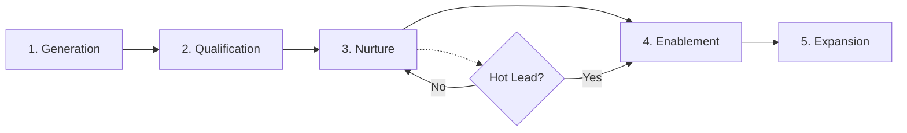

# Sales Workflow

> **You will:** Build and automate a complete lead-to-customer conversion system with AI-powered lead generation, qualification, nurture sequences, sales enablement, and upsell strategies.

## Overview

The Sales Workflow transforms strangers into customers and customers into advocates. It covers the entire journey from initial lead capture through qualification, nurturing, sales support, closing, and account expansion.

Five specialized agents work together - attraction specialists generate leads, lead qualifiers score and segment them, email wizards nurture prospects, sale enablers create collateral, and upsell maximizers identify expansion opportunities. Each stage is automated yet personalized.

This workflow is essential for B2B sales, SaaS free-to-paid conversion, high-ticket B2C, and any business with a multi-touch sales process.

## Metadata

- **Time Estimate:** Ongoing (setup 1-2 weeks, execution continuous)
- **Difficulty:** Intermediate
- **Prerequisites:**
  - ClaudeKit Marketing Kit installed
  - CRM system connected
  - Lead scoring criteria defined
  - Sales process mapped

## The Workflow



## Step-by-Step Guide

### Step 1: Lead Generation

Create lead magnets, SEO content, landing pages, and capture forms that attract and convert your ideal prospects.

```bash
"Create lead generation assets for CloudHR SaaS product.
Target: HR managers at 50-500 employee companies
Include: lead magnet concept, landing page copy, SEO keywords.
Lead magnet: '2025 HR Compliance Checklist' (downloadable PDF)"
```

**What happens:** Attraction specialist researches audience pain points, creates compelling lead magnet concept, writes high-converting landing page copy, identifies SEO keywords for organic traffic, and designs the lead capture form.

**Checkpoint:** Lead gen assets complete when:
- Lead magnet addresses real pain point
- Landing page has clear value proposition
- Form asks only essential questions
- Thank you page with next steps
- Tracking pixels installed

**Time:** 2-3 days for setup

---

### Step 2: Lead Qualification

Score leads based on demographic and behavioral signals, segment by intent level, and identify sales-ready prospects.

```bash
"Qualify leads from CloudHR-landing source.
Scoring criteria: Company size (0-30 pts), Role (0-25 pts), Engagement (0-45 pts)
Segment into: cold (0-30), warm (31-60), hot (61-100)
Flag high-value prospects for immediate human follow-up."
```

**What happens:** Lead qualifier analyzes each lead against scoring criteria, calculates total score, assigns segment (cold/warm/hot), identifies high-value prospects based on company fit, and routes hot leads to sales team immediately.

**Checkpoint:** Qualification working when:
- Every lead gets scored within 5 minutes
- Segments align with conversion rates (hot leads convert 10x+ better)
- High-value leads trigger notifications
- Scoring reflects both fit and intent

**Time:** 1 day for setup, automated after

---

### Step 3: Nurture Sequences

Design and deploy personalized drip campaigns that educate prospects, build trust, and move them toward purchase decisions.

```bash
"Create nurture sequence for warm segment leads.
Journey: awareness → consideration → decision
Length: 6 emails over 21 days
Topics: Problem education, solution overview, case study, objection handling, demo offer, trial incentive
Include: subject lines, body copy, CTAs"
```

**What happens:** Email wizard creates 6-email sequence with personalized content for each stage, writes compelling subject lines, includes relevant content/resources, adds clear CTAs, sets optimal send timing, and builds automation triggers.

**Checkpoint:** Nurture sequence ready when:
- Each email has one clear goal
- Content progresses logically through journey
- CTAs match prospect's stage
- A/B test variants created
- Automation triggers configured

**Time:** 2-3 days for setup

---

### Step 4: Sales Enablement

Create pitch decks, objection handlers, case studies, and proposals that help sales team close deals effectively.

```bash
"Create sales materials for CloudHR enterprise prospects.
Include: pitch deck, objection responses for top 5 objections, 2 relevant case studies (tech industry).
Customize for: Data security concerns, integration complexity, ROI timeframe"
```

**What happens:** Sale enabler builds comprehensive pitch deck highlighting value props, documents proven responses to common objections, writes case studies showcasing relevant success stories, creates proposal template, and prepares demo script.

**Checkpoint:** Sales collateral complete with:
- Pitch deck (10-15 slides) covering problem/solution/proof
- Objection responses for 5-10 common concerns
- 3-5 case studies across industries
- Customizable proposal template
- ROI calculator or demo environment

**Time:** 3-5 days for initial library

---

### Step 5: Upsell and Expansion

Identify expansion opportunities in existing customer base, recommend additional products/features, and create upgrade campaigns.

```bash
"Create upsell strategy for CloudHR basic plan customers.
Current product: Basic (1-50 employees)
Expansion targets: Professional (51-200 employees), Enterprise features
Analyze: Usage patterns, company growth signals, engagement scores
Include: messaging, offers, timing, success metrics"
```

**What happens:** Upsell maximizer analyzes customer data for expansion signals, identifies customers ready for upgrade, creates personalized upgrade messaging, designs incentive offers, sets optimal outreach timing, and builds upsell campaign.

**Checkpoint:** Expansion program includes:
- Segmented customer list (upgrade-ready vs nurture)
- Personalized messaging for each segment
- Compelling incentive offers
- Timing strategy (usage milestones, renewal dates)
- Success metrics (upgrade rate, expansion revenue)

**Time:** 1-2 days for strategy, ongoing execution

---

## Real-World Example

### Starting Point
B2B SaaS company selling project management tool needs to generate 200 qualified leads per month and convert 10% to paying customers.

### Execution

```bash
# Week 1: Lead generation setup
"Create lead gen system for TaskFlow PM tool.
Lead magnet: 'Project Management Templates Library' (15 templates)
Landing page targeting: Project managers, team leads, startup founders
SEO keywords: project management templates, task tracking tools, team collaboration"

# Week 1: Qualification rules
"Setup lead scoring for TaskFlow.
Fit signals: Company size 10-200 employees (20 pts), PM/Leadership role (25 pts), Tech industry (15 pts)
Intent signals: Downloaded templates (20 pts), Visited pricing (30 pts), Watched demo video (25 pts), Returned 3+ times (20 pts)
Hot threshold: 80+ points = immediate sales alert"

# Week 2: Nurture sequences
"Create 3 nurture tracks:
1. Cold (0-30 pts): 8 emails, 6 weeks - Education focused
2. Warm (31-79 pts): 6 emails, 3 weeks - Solution + social proof
3. Hot (80+ pts): 3 emails, 1 week - Demo + trial offers"

# Week 2: Sales materials
"Build sales enablement library:
- Demo script showcasing top 3 features
- Case studies: Startup (2-week ROI), Agency (team efficiency), Tech company (scaling)
- Objection responses: Price, switching cost, learning curve, integration
- ROI calculator showing time saved vs cost"

# Ongoing: Expansion
"Monthly analysis of customers on Basic plan showing:
- Team size growth (upgrade signal)
- Storage usage >80% (upgrade need)
- Advanced feature attempts (upgrade intent)
Auto-send personalized upgrade offers to high-signal accounts"
```

### Result
Generated 245 qualified leads per month (123% of goal), achieved 14% trial-to-paid conversion rate, 22% of paying customers upgraded to higher plans within 6 months, and reduced sales cycle from 45 to 28 days with better enablement materials.

---

## Common Variations

### High-Touch Enterprise Sales
- Focus on Stage 4 (Enablement) with custom materials per prospect
- Longer nurture sequences (3-6 months)
- Human qualification replacing automated scoring
- Account-based marketing approach

### Self-Service SaaS
- Automated Stages 1-3, minimal Stage 4
- Product-led growth focus (free trial → paid)
- In-app nurture replacing email sequences
- Usage-based qualification scores

### E-commerce High-Ticket
- Short nurture cycles (7-14 days)
- Strong focus on social proof and urgency
- Retargeting campaigns instead of email nurture
- Abandoned cart recovery at Stage 3

---

## Troubleshooting

### Issue: High lead volume but low qualification scores

**Cause:** Wrong traffic sources or lead magnet attracting wrong audience

**Solution:** Audit traffic sources. Check lead magnet positioning - is it too broad? Tighten targeting to attract better-fit leads. Better to get 50 quality leads than 200 poor-fit leads.

---

### Issue: Leads not engaging with nurture emails

**Cause:** Irrelevant content, poor timing, or deliverability issues

**Solution:** Check open rates (deliverability), click rates (relevance), unsubscribe rates (frequency). A/B test subject lines, send times, and content topics. Segment further based on job role or pain points.

---

### Issue: Sales team not using enablement materials

**Cause:** Materials don't match real sales conversations or too complex to use

**Solution:** Interview sales team about actual objections and questions. Create materials that directly address real conversations. Make materials easy to find and share (naming, organization, CRM integration).

---

## Best Practices

**Score on Fit AND Intent**
Demographic fit (company size, role, industry) + behavioral intent (downloads, visits, engagement) = accurate qualification. Don't score on just one dimension.

**Nurture Provides Value First**
Every email should educate, solve a problem, or provide a resource. Don't just "check in" or pitch. Give before you ask.

**Enablement Reflects Reality**
Sales materials should address actual objections from real prospects, not imagined concerns. Update quarterly based on win/loss analysis.

---

## Related Workflows

- [Campaign Workflow](/docs/marketing/workflows/campaign-workflow) - Generate leads via campaigns
- [Email Workflow](/docs/marketing/workflows/email-workflow) - Build nurture sequences
- [Content Workflow](/docs/marketing/workflows/content-workflow) - Create enablement content
- [Analytics Workflow](/docs/marketing/workflows/analytics-workflow) - Track conversion metrics

---

## Agents Used

- [attraction-specialist](/docs/marketing/agents/attraction-specialist) - Lead generation
- [lead-qualifier](/docs/marketing/agents/lead-qualifier) - Lead scoring and segmentation
- [email-wizard](/docs/marketing/agents/email-wizard) - Nurture campaigns
- [sale-enabler](/docs/marketing/agents/sale-enabler) - Sales collateral
- [upsell-maximizer](/docs/marketing/agents/upsell-maximizer) - Expansion strategies

---

## Commands Used

- `/funnel design` - Build conversion funnels
- `/lead score` - Setup qualification rules
- `/email create` - Build nurture sequences
- `/sales materials` - Generate enablement content
- `/upsell analyze` - Find expansion opportunities
