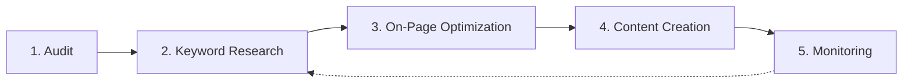

# SEO Workflow

> **You will:** Build sustainable organic traffic growth through systematic SEO audits, strategic keyword research, on-page optimization, content creation, and continuous performance monitoring.

## Overview

The SEO Workflow is your roadmap to dominating search rankings. It covers everything from technical foundation through content strategy and ongoing optimization.

Unlike quick SEO fixes that fade quickly, this workflow builds long-term organic traffic through systematic improvement. SEO specialists audit your site, identify opportunities, optimize pages, create strategic content, and monitor rankings continuously.

This workflow suits businesses wanting to reduce paid advertising dependence, build long-term traffic assets, and establish authority in their market.

## Metadata

- **Time Estimate:** 2-4 weeks initial setup, ongoing optimization
- **Difficulty:** Intermediate
- **Prerequisites:**
  - ClaudeKit Marketing Kit installed
  - Website access for technical changes
  - Google Search Console connected
  - Google Analytics 4 installed
  - Baseline keyword research completed

## The Workflow



## Step-by-Step Guide

### Step 1: Comprehensive SEO Audit

Analyze technical SEO health, content quality, competitive landscape, and current rankings to identify improvement opportunities.

```bash
"Perform SEO audit for cloudsoftware.com.
Include:
- Technical issues (crawl errors, speed, mobile, Core Web Vitals)
- Content gaps vs competitors
- Top 3 competitor comparison (features they rank for, we don't)
- Current keyword rankings (top 20 keywords)
Save to: plans/reports/2025-03-seo-audit.md"
```

**What happens:** SEO specialist crawls your site for technical issues, analyzes page speed and mobile usability, identifies crawl errors and broken links, compares your content to top competitors, checks current keyword rankings, and compiles comprehensive audit report with prioritized fixes.

**Checkpoint:** Audit report should include:
- 10-20 specific technical issues with severity levels
- Content gap analysis (topics competitors cover, you don't)
- Competitor keyword comparison matrix
- Current ranking baseline for tracking
- Prioritized recommendation list

**Time:** 4-8 hours

---

### Step 2: Strategic Keyword Research

Identify high-opportunity keywords based on search volume, difficulty, intent, and competitive gaps.

```bash
"Research keywords for B2B project management SaaS.
Include:
- Primary keywords (high intent, competitive)
- Long-tail opportunities (lower competition)
- Question-based keywords (for blog content)
- Competitor keyword gaps (they rank, we don't)
Prioritize by: search volume, difficulty, business intent
Target: 50-100 keywords across topic clusters"
```

**What happens:** Agents analyze search volume and trends, assess keyword difficulty scores, map search intent (informational vs transactional), identify competitor gaps, organize keywords into topic clusters, and prioritize based on opportunity score.

**Checkpoint:** Keyword strategy document includes:
- 5-10 primary keywords (high volume, high intent)
- 20-30 secondary keywords (supporting topics)
- 30-50 long-tail keywords (easier wins)
- Keywords organized by topic cluster
- Priority ranking with rationale

**Time:** 1-2 days

---

### Step 3: On-Page Optimization

Optimize existing pages with better titles, meta descriptions, header structure, internal linking, and schema markup.

```bash
"Optimize on-page SEO for /product/features page.
Target keyword: project management features
Include:
- Title tag suggestion (50-60 chars, keyword-optimized)
- Meta description (150-160 chars, compelling + keyword)
- Header optimization (H1, H2s with keyword variations)
- Internal link opportunities (3-5 relevant pages)
- Schema markup (JSON-LD for SoftwareApplication)"
```

**What happens:** SEO specialist analyzes current page, writes optimized title tag including target keyword, crafts compelling meta description, restructures headers logically with keywords, identifies internal linking opportunities, generates schema markup code, and provides implementation instructions.

**Checkpoint:** Optimized page should have:
- Title tag with primary keyword (position 1-3)
- Meta description with keyword + call to action
- H1 with primary keyword
- H2-H3 with keyword variations and related terms
- 3-5 internal links to relevant content
- Appropriate schema markup implemented

**Time:** 30 minutes per page

---

### Step 4: Create SEO-Optimized Content

Develop new content targeting priority keywords with comprehensive coverage, natural optimization, and strong user value.

```bash
"Create SEO content for keyword 'agile project management tools'.
Search intent: Informational + commercial comparison
Include:
- Optimized title with keyword
- Comprehensive header structure (H2-H3) with keyword variations
- Target and related keywords (natural integration)
- Internal links to product pages and related guides
- Schema markup (Article + HowTo)
Word count: 2500-3000 (based on top 3 competitor length)"
```

**What happens:** Content creator researches top-ranking content for the keyword, structures comprehensive outline covering all subtopics, writes in-depth content (matching or exceeding competitor depth), integrates keywords naturally throughout, adds internal links to relevant pages, includes schema markup, and optimizes for featured snippets.

**Checkpoint:** SEO content complete with:
- Keyword in title, first paragraph, and 2-3 H2s
- Comprehensive coverage matching top competitor depth
- Natural keyword density (1-2%, not stuffed)
- 5-10 internal links to relevant content
- Images with alt text including keywords
- Schema markup for rich results

**Time:** 4-8 hours per piece

---

### Step 5: Monitor and Iterate

Track keyword rankings, analyze organic traffic trends, identify new opportunities, and continuously optimize based on data.

```bash
"Monitor SEO performance for cloudsoftware.com.
Metrics:
- Keyword ranking changes (track 50 priority keywords)
- Organic traffic trends (sessions, users, top pages)
- Top performing pages (traffic + conversions)
- CTR improvements (impressions vs clicks)
Period: Last 30 days vs previous 30 days
Recommend: Next optimizations based on data"
```

**What happens:** Analytics analyst pulls ranking data for tracked keywords, analyzes organic traffic in Google Analytics, identifies top traffic-driving pages, calculates CTR from Search Console, spots ranking improvements or drops, identifies new keyword opportunities, and recommends next optimization priorities.

**Checkpoint:** Monthly SEO report includes:
- Keyword ranking changes (wins and losses)
- Organic traffic trend (up/down/flat)
- Top 10 pages by organic traffic
- Pages with improved rankings
- Specific recommendations for next month

**Time:** 2-3 hours monthly

---

## Real-World Example

### Starting Point
B2B SaaS company getting 500 organic visits/month wants to reach 5,000/month in 6 months.

### Execution

```bash
# Month 1: Foundation
"SEO audit for projecthub.io identifying:
- 23 technical issues (slow mobile speed, missing alt text, broken links)
- Content gaps: Missing comparison pages, no how-to guides, thin product pages
- Top 3 competitors ranking for 15 keywords we don't"

"Keyword research generating:
- 8 primary keywords (project management, task tracking, team collaboration)
- 25 secondary keywords (specific features and use cases)
- 45 long-tail keywords (how to, best practices, comparisons)"

# Month 1-2: Technical + quick wins
"Fix critical technical issues: Mobile speed, broken links, missing meta descriptions
Optimize 10 existing pages with new keywords"

# Month 2-4: Content creation
"Create 12 SEO blog posts targeting:
- 4 how-to guides (long-tail keywords)
- 4 comparison articles (vs competitors)
- 4 best practices guides (question keywords)
Each 2000-2500 words, fully optimized"

# Month 4-6: Advanced content
"Create 4 comprehensive guides (3500-5000 words):
- Complete Project Management Guide
- Agile vs Waterfall Comparison
- Remote Team Collaboration Best Practices
- Project Management Tools Buyer's Guide"

# Ongoing: Monthly monitoring
"Month 1: 500 visits, Month 2: 750, Month 3: 1,200, Month 4: 2,100, Month 5: 3,500, Month 6: 5,200"
```

### Result
Exceeded 5,000 visits goal, reaching 5,200 organic visits by month 6. 3 blog posts reached page 1 rankings, driving 40% of organic traffic. Technical improvements increased mobile speed score from 45 to 82, reducing bounce rate by 25%.

---

## Common Variations

### Local SEO Focus
Add local optimization:
- Google Business Profile optimization
- Local citation building
- Location-specific landing pages
- Local schema markup (LocalBusiness)
- NAP consistency across web

### E-commerce SEO
Add product-specific optimization:
- Product schema markup
- Category page optimization
- Product review aggregation
- FAQ schema for product pages
- Internal linking from blog to products

### Programmatic SEO (pSEO)
Scale with templates:
- Create page templates for patterns (city pages, comparison pages, alternatives)
- Automate content generation with variables
- Build internal linking structure programmatically
- Manage thousands of pages systematically

---

## Troubleshooting

### Issue: Rankings dropped suddenly

**Cause:** Google algorithm update, technical issue, or competitor improvement

**Solution:** Check Search Console for manual actions or security issues. Review recent site changes (did you break something?). Analyze competitor pages that outrank you - what changed? If algorithm update, wait 2-4 weeks before major changes.

---

### Issue: Creating content but no ranking improvement

**Cause:** Content doesn't match search intent, lacks depth, or poor on-page SEO

**Solution:** Analyze top 3 results for your target keyword. What format are they (list, guide, comparison)? How long are they? What do they cover that you don't? Match or exceed their depth and format. Ensure on-page optimization is solid.

---

### Issue: High rankings but low traffic

**Cause:** Low search volume keywords or poor CTR from search results

**Solution:** Verify search volume for ranked keywords - might be ranking for wrong terms. If volume is good but CTR is low, optimize title tags and meta descriptions to be more compelling. Add numbers, questions, or power words to increase clicks.

---

## Best Practices

**Match Search Intent First, Optimize Second**
Ranking is useless if you don't match what searchers want. If top results are comparison articles, don't write a how-to guide. Match format and intent first, then optimize.

**Build Topic Clusters Not Isolated Posts**
Create pillar content (comprehensive guides) linked to cluster content (specific subtopics). This internal linking structure signals topical authority to Google and provides better user experience.

**Quality Over Quantity Always**
One 3,000-word comprehensive guide beats five 500-word shallow posts. Google rewards depth, comprehensiveness, and expertise. Better to publish 2 amazing pieces per month than 10 mediocre ones.

---

## Related Workflows

- [Content Workflow](/docs/marketing/workflows/content-workflow) - Create SEO content with quality gates
- [Marketing Workflow](/docs/marketing/workflows/marketing-workflow) - Integrate SEO into overall strategy
- [Analytics Workflow](/docs/marketing/workflows/analytics-workflow) - Track SEO performance

---

## Agents Used

- [seo-specialist](/docs/marketing/agents/seo-specialist) - Audits, optimization, monitoring
- [content-creator](/docs/marketing/agents/content-creator) - SEO content creation
- [attraction-specialist](/docs/marketing/agents/attraction-specialist) - Keyword research and strategy
- [analytics-analyst](/docs/marketing/agents/analytics-analyst) - Performance tracking

---

## Commands Used

- `/seo:audit` - Comprehensive SEO analysis
- `/seo keywords` - Keyword research
- `/seo optimize` - On-page optimization
- Use `copywriting` skill for SEO-optimized content creation
- `/analyze traffic` - Monitor organic performance
