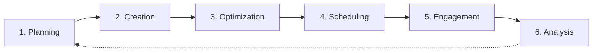

# Social Workflow

> **You will:** Create and distribute engaging social media content across platforms with systematic planning, batched creation, optimized scheduling, and performance-based optimization.

## Overview

The Social Workflow helps you maintain consistent, engaging social presence without spending hours daily on social media. It covers content planning, batch creation, platform optimization, scheduling, and performance analysis.

Social media managers create platform-specific content, optimize for each network's algorithms, schedule for optimal timing, and analyze what resonates with your audience. The workflow supports LinkedIn, Twitter, Facebook, Instagram, and TikTok.

## Metadata

- **Time Estimate:** 2-4 hours weekly (batch creation), 15 min daily (engagement)
- **Difficulty:** Beginner
- **Prerequisites:**
  - ClaudeKit Marketing Kit installed
  - Social accounts connected
  - Content calendar template
  - Brand voice guidelines

## The Workflow



## Step-by-Step Guide

### Step 1: Content Planning

Plan weekly/monthly social content calendar aligned with marketing goals and campaigns.

```bash
"Create social content calendar for April 2025.
Platforms: LinkedIn, Twitter
Posting frequency: LinkedIn 5x/week, Twitter 3x/day
Content mix:
- 40% educational (tips, how-tos, insights)
- 30% promotional (product features, offers)
- 20% engagement (questions, polls, discussions)
- 10% company (culture, team, behind-scenes)
Include: Key campaigns, product launches, industry events"
```

**What happens:** Social media manager creates content calendar structure, allocates posts across content types, aligns with marketing campaigns and product launches, identifies key dates and events, and balances promotional vs value content.

**Checkpoint:** Calendar includes post dates and times, content themes/topics, content type mix, campaign alignment, platform assignments.

**Time:** 2-3 hours monthly

---

### Step 2: Batch Content Creation

Create 1-2 weeks of social posts in single session for efficiency.

```bash
"Create 2 weeks of social content (20 posts total).
Platforms: 10 LinkedIn, 10 Twitter
Topics from content calendar: Project management tips, product features, customer success stories, industry trends
For each post:
- Hook (first line must grab attention)
- Value/insight (educational or entertaining)
- CTA (engage, click, comment)
- Relevant hashtags (3-5 per platform)
Tone: Professional yet approachable"
```

**What happens:** Content creator drafts all posts following calendar themes, writes platform-specific hooks, creates engaging content, adds appropriate CTAs, includes relevant hashtags, and organizes by publish date.

**Checkpoint:** All posts created with strong hooks, clear value, platform-appropriate length, CTAs, hashtags, organized by date.

**Time:** 3-4 hours per batch (10-15 posts)

---

### Step 3: Platform Optimization

Adapt content for each platform's format, audience, and algorithm preferences.

```bash
"Optimize social posts for platform-specific best practices.
LinkedIn posts: Add line breaks for readability, use 3-5 hashtags, tag relevant people/companies
Twitter posts: Keep under 280 chars, use 2-3 hashtags, consider thread format for longer content
Ensure: Native content (no links in initial posts), first-person voice, conversation starters"
```

**What happens:** Agent reformats posts for platform specifications, adjusts length and style, optimizes hashtag usage, adds platform-specific features (LinkedIn polls, Twitter threads), and ensures best practices followed.

**Checkpoint:** Each post optimized with platform format (line breaks, length), appropriate hashtags, engagement features, native content approach.

**Time:** 1-2 hours per batch

---

### Step 4: Schedule Posts

Queue posts for optimal timing based on audience activity patterns.

```bash
"Schedule social content for next 2 weeks.
LinkedIn: Mon-Fri at 9am, 12pm EST (peak B2B engagement times)
Twitter: Daily at 9am, 1pm, 5pm EST (catch multiple time zones)
Use: Social media scheduling tool (Buffer, Hootsuite, or native)
Enable: First comment with link (for LinkedIn), thread continuation (for Twitter)"
```

**What happens:** Social media manager loads posts into scheduling tool, sets publish times based on optimal engagement windows, queues first comments with links, sets up thread posts, and activates schedule.

**Checkpoint:** All posts scheduled with optimal timing, first comments queued, preview checked, analytics tracking enabled.

**Time:** 30-60 minutes per batch

---

### Step 5: Daily Engagement

Respond to comments, engage with audience, and monitor brand mentions.

```bash
"Daily social engagement routine (15 minutes):
1. Respond to comments on our posts (within 1-2 hours)
2. Engage with target audience posts (like, comment on 5-10 relevant posts)
3. Monitor brand mentions and respond
4. Identify trending topics relevant to our brand
5. Note high-performing content for analysis"
```

**What happens:** Community manager responds to comments and messages, engages authentically with audience content, monitors brand mentions, identifies trending conversations, and documents engagement patterns.

**Checkpoint:** Daily engagement complete with comments answered, proactive engagement done, mentions monitored, trends noted.

**Time:** 15-30 minutes daily

---

### Step 6: Performance Analysis

Analyze post performance, identify winning content patterns, and optimize future content.

```bash
"Analyze social media performance for April 2025.
Metrics by platform: Impressions, engagement rate, clicks, follower growth
Identify:
- Top 5 performing posts (by engagement rate)
- Content types that resonate (educational vs promotional)
- Optimal posting times (actual engagement vs scheduled times)
- Hashtag effectiveness
Recommend: Content adjustments for May calendar"
```

**What happens:** Analytics analyst reviews performance data across platforms, identifies top performing content types and topics, analyzes optimal posting times, evaluates hashtag performance, and recommends optimizations for next period.

**Checkpoint:** Analysis includes top performing posts, content type insights, timing optimization, specific recommendations for next month.

**Time:** 1-2 hours monthly

---

## Real-World Example

### Starting Point
B2B SaaS company posting sporadically on LinkedIn, wants consistent presence driving website traffic and brand awareness.

### Execution

```bash
# Week 1: Plan Q2 content
"Create LinkedIn content calendar Q2 2025.
Goal: Build thought leadership, drive 500 monthly clicks to website
Frequency: 5 posts/week (M, Tu, W, Th, F)
Content pillars:
- Product management tips (educational)
- Platform feature highlights (promotional)
- Customer success stories (social proof)
- Industry trends and commentary (thought leadership)"

# Week 1: Batch create Month 1
"Create 20 LinkedIn posts for April:
- 8 PM tips (carousel posts with actionable advice)
- 5 feature highlights (video demos + text explanation)
- 4 customer stories (quote + results)
- 3 industry trends (hot takes + discussion prompts)
Each with hook, value, CTA, 3-5 relevant hashtags"

# Week 1: Optimize and schedule
"Optimize all posts for LinkedIn algorithm:
- Line breaks every 1-2 sentences for readability
- Native video uploads (not YouTube links)
- First comment with article link (not in main post)
- Tag customers in their success stories
Schedule: Mon-Fri, 9am EST (peak engagement time for our audience)"

# Daily: 15-minute engagement
"Respond to all comments within 2 hours
Engage with 10 posts from target audience (project managers, product leaders)
Document which posts generate most discussion"

# Month end: Analysis
"April LinkedIn analysis:
- 22 posts published, 45K impressions, 3.8% engagement rate (above 2.5% avg)
- Top performers: PM tips carousels (5.2% engagement), customer stories (4.9%)
- Worst performers: Direct feature promotions (1.8%)
- Optimal time: 9am posts perform 30% better than 12pm
- Follower growth: +240 (15% month over month)"
```

### Result
Consistent posting increased followers by 35% in 3 months, engagement rate improved from 1.2% to 3.8%, website clicks increased to 680/month (136% of goal). Educational carousel posts became signature format driving 60% of engagement.

---

## Common Variations

### Multi-Platform Strategy
Adapt content across platforms:
- Create master content
- Adapt for each platform (LinkedIn post → Twitter thread → Instagram carousel)
- Optimize timing per platform
- Track performance separately

### Video-First Approach
Focus on video content:
- Short-form video (TikTok, Reels, YouTube Shorts)
- Repurpose long-form to short clips
- Platform-specific formats and features
- Captions for accessibility

### Community Building Focus
Engagement over broadcasting:
- Fewer promotional posts
- More conversation starters
- Regular Q&A sessions
- User-generated content campaigns

---

## Troubleshooting

### Issue: Low engagement despite posting regularly

**Cause:** Content not resonating, wrong timing, or lack of engagement behavior

**Solution:** Analyze top performing competitors - what formats and topics work? Test different content types (text vs video vs carousel). Engage proactively with others' content before expecting engagement on yours. Ask questions, use polls, create discussion.

---

### Issue: Posts reach few people (low impressions)

**Cause:** Algorithm deprioritizing content, wrong hashtags, or posting at low-activity times

**Solution:** Use platform-native features (LinkedIn polls, Twitter threads). Avoid external links in initial posts. Test posting times. Use hashtags with 10K-100K posts (sweet spot - discoverable but not too competitive). Engage within first hour of posting.

---

### Issue: Clicks but no conversions

**Cause:** Disconnect between social content and landing page

**Solution:** Ensure landing page matches promise of social post. If post talks about "10 PM tips," link to article with those tips, not generic homepage. Use UTM tracking to see which posts drive quality traffic.

---

## Best Practices

**Batch Create But Post Natively**
Create 2 weeks of content in one session for efficiency, but schedule to look natural and timely. Reference current events, engage with trending topics, don't look robotic.

**Hook First Always**
First line determines if people read more. Make it grab attention - question, bold statement, surprising fact, relatable pain point. Generic intros get skipped.

**Engagement Is Two-Way**
Want comments on your posts? Comment on others' posts first. Want shares? Share others' content. Social media rewards reciprocity. Spend 50% of time engaging, 50% posting.

---

## Related Workflows

- [Content Workflow](/docs/marketing/workflows/content-workflow) - Create social content with quality gates
- [Campaign Workflow](/docs/marketing/workflows/campaign-workflow) - Social as campaign channel
- [Brand Workflow](/docs/marketing/workflows/brand-workflow) - Ensure brand consistency
- [Analytics Workflow](/docs/marketing/workflows/analytics-workflow) - Track social performance

---

## Agents Used

- [social-media-manager](/docs/marketing/agents/social-media-manager) - Content planning and scheduling
- [content-creator](/docs/marketing/agents/content-creator) - Post creation
- [community-manager](/docs/marketing/agents/community-manager) - Engagement and responses
- [analytics-analyst](/docs/marketing/agents/analytics-analyst) - Performance analysis

---

## Commands Used

- `/social create` - Generate social posts
- `/social schedule` - Queue posts for publishing
- `/social analyze` - Performance analysis
- `/youtube:social` - Convert videos to social content
